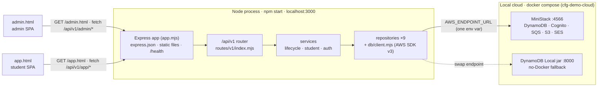
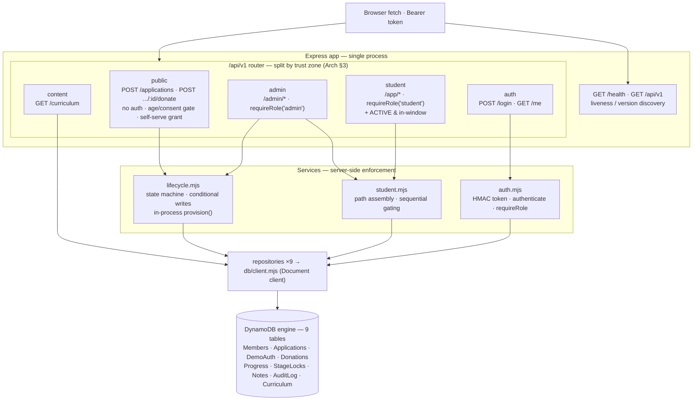
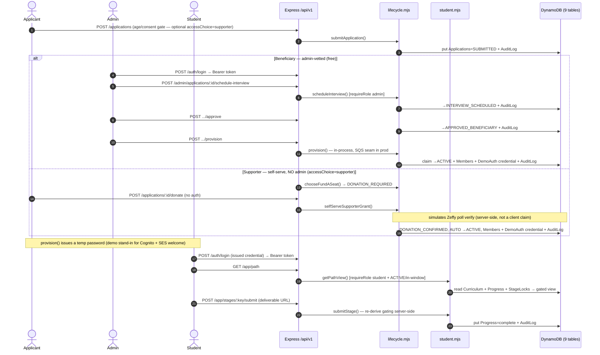

# Demo Architecture — how the CFG V2 demo works

How the runnable local demo in [`demo/`](../) is wired, and how each moving part maps
onto the production AWS serverless design. The demo deliberately mirrors that design so
its data-access code is the **same code the future Lambdas run** — only the endpoint URL
differs (see [ADR-001](ADR-001-demo-tech-stack.md) and [ADR-002](ADR-002-local-cloud-emulator.md)).

**Source of truth:** [`../../docs/Architecture-Design.md`](../../docs/Architecture-Design.md) (Rev. 4) ·
[`../../docs/Customer-Journey.md`](../../docs/Customer-Journey.md) (state machine) ·
[`../README.md`](../README.md) (run instructions).

---

## 1. Runtime topology — what is actually running

One Node process (`npm start`, port 3000) serves both SPAs and the versioned API, and talks
to a **local cloud** through the AWS SDK. The endpoint is the only thing that changes between
the DynamoDB Local jar, MiniStack, and real AWS (`config.mjs` reads `AWS_ENDPOINT_URL`).

---

## 2. Layered request flow — one process, zones split in code

Production splits the API across three Lambdas by trust boundary; the demo keeps that split
**legible in the router**: `/api/v1` mounts one sub-router per zone, and the guards
(`authenticate`, `requireRole`, ACTIVE/in-window) run server-side — the client is never
trusted about role, eligibility, or which stage is open.

---

## 3. Access lifecycle — the server-enforced state machine

The heart of the demo (`services/lifecycle.mjs`). No path reaches `ACTIVE` without an admin
grant (beneficiary) or a verified donation (supporter). Every transition is a **conditional
write** keyed on the expected current status — so retries, double-clicks, and redeliveries
cannot double-provision — and every transition appends a PII-free `AuditLog` event.

There are **two ways to reach `ACTIVE`**: a *beneficiary* is admin-granted after an interview;
a *supporter* **self-serves** — choosing to fund a seat at `/apply` skips the interview entirely,
and a verified donation auto-provisions access with **no admin interview and no manual approval**.

```mermaid
stateDiagram-v2
  [*] --> SUBMITTED: POST /applications (applicant)
  SUBMITTED --> INTERVIEW_SCHEDULED: admin schedule-interview (beneficiary)
  SUBMITTED --> DONATION_REQUIRED: choose to fund a seat (self-serve, no interview)
  INTERVIEW_SCHEDULED --> APPROVED_BENEFICIARY: admin approve (eligible)
  INTERVIEW_SCHEDULED --> DONATION_REQUIRED: not eligible
  INTERVIEW_SCHEDULED --> REJECTED: admin reject
  DONATION_REQUIRED --> DONATION_CONFIRMED: donation verified (system; admin fallback)
  APPROVED_BENEFICIARY --> ACTIVE: provision() creates Member
  DONATION_CONFIRMED --> ACTIVE: AUTO-provision (no admin)
  ACTIVE --> EXPIRED: window ends (expiry sweep)
  ACTIVE --> REVOKED: admin revoke
  REJECTED --> [*]
  EXPIRED --> [*]
  REVOKED --> [*]

  note right of ACTIVE
    Each transition = conditional write on
    expected status (idempotent) + PII-free
    AuditLog event. Supporter ACTIVE follows a
    server-verified payment, never a client claim.
    provision() runs in-process here; SQS to
    system-fn in production.
  end note
```

---

## 4. End-to-end: apply → vet → provision → learn

How the two dashboards drive the system. `provision()` now **issues each new member's login
credential** — a `DemoAuth` row with a generated temp password (the demo's stand-in for Cognito
`AdminCreateUser` + the SES welcome email), returned to the caller so a self-serve supporter can
sign in immediately after donating. In production Cognito holds credentials and `provision()`
runs in `system-fn` off an SQS message. (The seeded demo students keep fixed passwords for
convenience.)

---

## 5. Demo ↔ production AWS — component mapping

Each demo part and the production service it stands in for. The data layer is faithful (a real
DynamoDB engine, same SDK v3 Document client, same conditional-write semantics); the demo
**fakes auth, the provisioning seam, gated-byte delivery, and payments**, all documented below.

| Concern | Demo implementation (this repo) | Production AWS (Arch Rev. 4) | Fidelity / what differs |
| --- | --- | --- | --- |
| Compute & API | Express single process; `/api/v1` sub-routers split by zone (`routes/v1/`) | API Gateway HTTP API + 3 Lambdas `public-fn` / `app-fn` / `system-fn` (arm64) | Same route table and zone split; one process vs. three trust-isolated functions |
| Data store | DynamoDB Local jar (`:8000`) **or** MiniStack DynamoDB (`:4566`), via `db/client.mjs` | DynamoDB on-demand — PITR, deletion protection, TTL | Real DynamoDB engine; GSIs + conditional writes identical; **endpoint-swap only** |
| Identity & auth | `auth.mjs` HMAC/JWT-shaped token + `DemoAuth` table (scrypt hashes) | Cognito User Pool — groups `student`/`admin`, MFA required, no self-signup | Same server-side role-claim guard; **no MFA, refresh, or rotation**; `DemoAuth` has no prod counterpart |
| Account issuance | `provision()` mints a `DemoAuth` credential (temp password); `/donate` returns it as `demoLogin` | Cognito `AdminCreateUser` (temp password, force-change) + SES welcome email | Credential is really issued so the member can sign in; **demo returns the password in the response** (prod emails it, never returns it) |
| Role / zone enforcement | `authenticate` + `requireRole` middleware + ACTIVE/in-window check | Cognito JWT authorizer + in-handler group check | Same server-side trust boundary; never trusts the client |
| Account creation (provisioning) | In-process `provision()` in `lifecycle.mjs` | SQS + DLQ → `system-fn` (sole holder of `AdminCreateUser`) | Conditional-write idempotency preserved; **SQS trust seam documented, not built** |
| Self-serve supporter grant | `POST /applications/:id/donate` → `selfServeSupporterGrant()`: simulated Zeffy verify → **auto-provision, no admin** | Applicant donates on Zeffy → `system-fn` poll verifies → auto-grant within minutes | Auto-grant flow (no interview/approval) is real; **donation is simulated in-process** (no real Zeffy poll/webhook) |
| Scheduled jobs | `runExpirySweep()` invoked directly (`byStatusAccessEnds` GSI query) | EventBridge Scheduler → `system-fn` (expiry sweep + Zeffy poll + SES) | Same query; **no scheduler wired** |
| Gated curriculum | `Curriculum` table read + server-side sequential stage gating | Private S3 + dedicated CloudFront (OAC, short-TTL signed cookies) | Gating logic is real; **bytes not CloudFront-gated** |
| Stage completion | Self-attested: `submitStage()` marks `complete` on a deliverable URL | `submitted → admin verify → complete` (deliverable verification) | **No admin-verify step** in demo |
| Payments | `confirmDonation()` stamps `zeffyPaymentId` (no real money) | Zeffy hosted + read-only Payments API poll (PCI SAQ-A, no card data) | `zeffyPaymentId` idempotency key modeled; **no real Zeffy poll/webhook** |
| Audit trail | `AuditLog` table — append-only, PII-free (IDs + status codes only) | DynamoDB AuditLog + CloudTrail data events + S3 Object Lock (WORM) | Same event shape; **no CloudTrail/WORM export** |
| Email | Not sent (MiniStack can supply SES later) | Amazon SES — SPF/DKIM/DMARC | demo does not send mail |
| Frontend hosting | Express static serving of `public/` | Amplify Hosting (managed CDN) | Same SPA shell, different host |
| Secrets | `.env` (`DEMO_AUTH_SECRET`, dummy `test`/`test` creds) | SSM Param Store SecureString | demo-local only |
| Config switch | `AWS_ENDPOINT_URL` (one var in `config.mjs`) | default provider chain → regional endpoint | The single switch: jar ↔ MiniStack ↔ AWS |
| Provisioning IaC | `scripts/create-tables.mjs` | AWS SAM — one stack per env, canary deploy + alarm rollback | demo uses scripts, not SAM |

**Demo-only deviations (intentional — see ADRs):** auth is a shim, not Cognito; provisioning
runs in-process rather than across the SQS trust seam; the self-serve `/donate` endpoint stands in
for donating on Zeffy plus the `system-fn` verification poll (the demo simulates the payment
check in-process, but — by design — still never treats a raw client "I paid" as proof); curriculum
is a DB read and completion is self-attested rather than CloudFront-gated bytes with admin
verification; list endpoints use scans (fine at pilot scale). MiniStack can supply the real
Cognito/SQS/S3/SES later with **no application-code change** — only the endpoint differs.
