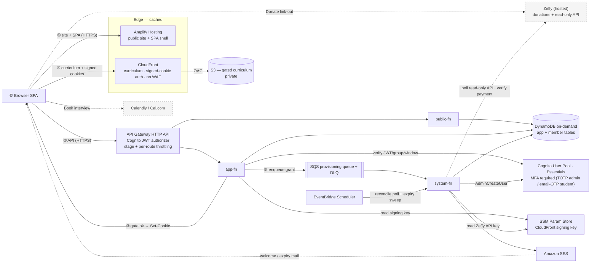
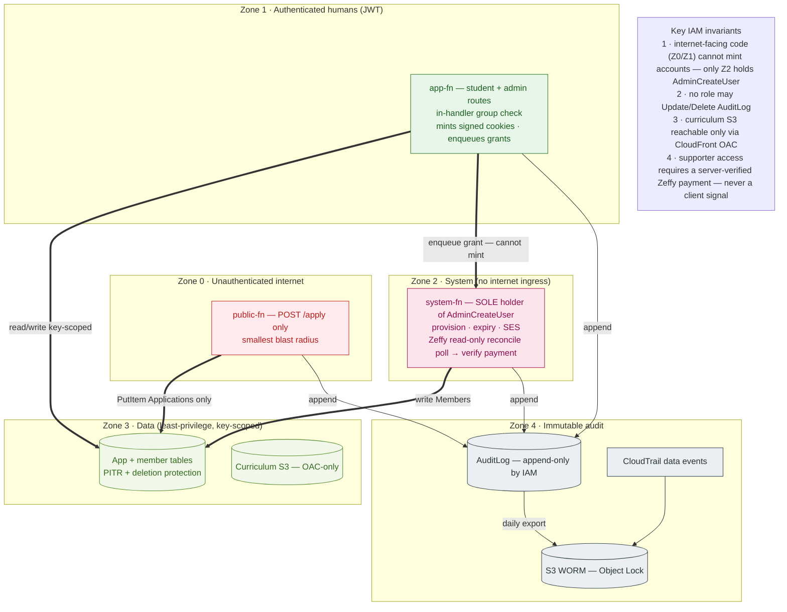
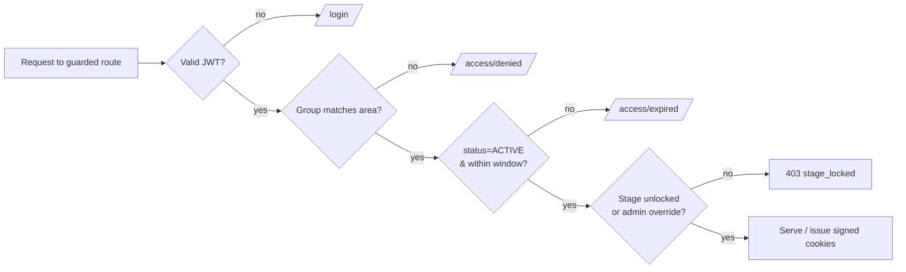
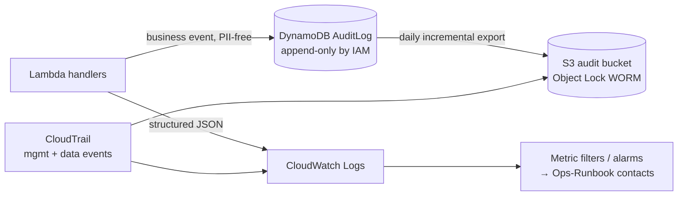

# Architecture Design — STEM Career Path (AI Era)

**Project:** STEM Graduates Career Path — AI Era (Code For Good)
**Doc type:** Build-ready architecture & security design (AWS serverless)
**Owner:** Tinh Cao
**Status:** Rev. 4 — AWS Well-Architected review findings applied (`docs/Well-Architected-Review.md`); self-serve supporter access (Zeffy read-only poll) added in Rev. 3
**Source of truth:** `docs/Platform-SRS.md` (platform) · `docs/Project SRS.md` (Phase-0 landing page)
**Companion docs:** `docs/Sitemap-and-Wireframes.md` · `docs/Customer-Journey.md` ·
`docs/Service-Tradeoff-Analysis.md` · `docs/Ops-Runbook.md`
**Focus areas:** audit trail, role separation, server-side gating, **lowest-cost launch on
Amplify + AWS serverless**, single-maintainer operability

> **Rev. 2 changes at a glance.** This revision applies every fix from the senior architecture
> review: launch-state architecture with **no Stripe machinery** (moved to Appendix A); **3-function**
> compute split; gated curriculum served from a **private-S3 origin behind a CloudFront key group
> via short-TTL signed cookies** issued after the gating check (closing the §9.2/§9A.3 contradiction
> while keeping edge-cached read economics); hash chain **dropped** in favor of IAM append-only + CloudTrail data events +
> WORM exports; **mandatory admin MFA**; PITR + deletion protection on all tables; PII-free audit
> events with per-table retention TTLs; **WAF and Cognito Plus deferred to phase-2 triggers**
> (aligning with `Service-Tradeoff-Analysis.md`); the **\$1,000 nonprofit credit target** as the
> single canonical figure; and §6.3 split into Day-1 actual vs. target governance.

> **Rev. 3 change — self-serve supporter access without an interview.** Supporters now donate on
> Zeffy and are **auto-provisioned within minutes**: `system-fn` polls Zeffy's **read-only Payments
> API** on a schedule, verifies the payment, matches it to the application **by email** (idempotent
> on the Zeffy payment ID), and grants access — `DONATION_REQUIRED` → `DONATION_CONFIRMED`
> (set by **system**) → `ACTIVE`; admin dashboard-confirm remains a fallback. First sign-in uses a
> Cognito **temporary password** (force-change) + MFA setup — **no password is stored in our
> database** (Cognito holds the credential). The age/consent gate moves **before** the donate step;
> refunds/chargebacks trigger an audited auto-`REVOKED`. Still **$0 fees, no webhook, no card
> data** — the only addition is a **read-only Zeffy API key** in SSM. Stripe (seconds-level
> activation) stays the Appendix A upgrade.

> **Rev. 4 change — Well-Architected hardening.** Applied the review's prose corrections:
> **MFA REQUIRED pool-wide** (TOTP admins / email-OTP students — corrects the per-group phrasing),
> **signed-cookie cross-domain topology** (§9.2), **explicit CloudWatch log-retention**, **SAM** as
> the IaC tool with **canary deploy + alarm rollback**, **arm64/Graviton** Lambdas, a
> **customer-managed KMS CMK** on `AuditLog` + the WORM bucket (pending board cost sign-off),
> **CORS lockdown + `public-fn` input validation**, **Object Lock set at bucket creation**, a
> **`system-fn` async on-failure DLQ**, a stated **single-region DR posture**, **Cost Anomaly
> Detection**, and an explicit **Sustainability** section (§12.1). Findings + status:
> `docs/Well-Architected-Review.md`.

---

## 1. Goals, principles & constraints

The platform is a **vetted-access learning app**: only Admin-provisioned emails become accounts,
free seats are gated by a human interview, and a donation path (Zeffy, fully external) self-funds
the rest. It must be **cheap at rest** (a nonprofit running near-zero traffic between cohorts),
**operable by one volunteer** (see `Platform-SRS.md` §3 — team of one, no cohort yet), and
**accountable** (every privileged action traceable).

Design principles:

1. **Serverless monolith** — one codebase, deployed as **three** thin Lambda entrypoints split
   along trust boundaries (§3). Monolith simplicity, infrastructure role separation where it
   actually matters.
2. **Scale-to-zero, pay-per-use** — Lambda + DynamoDB on-demand + Cognito Essentials; no idle
   servers, no fixed-cost add-ons without a documented trigger (§14).
3. **Stateless app** — all session state in JWTs (Cognito); any instance serves any request.
4. **Server-side enforcement** — roles, access windows, and **content gating** are enforced in
   the backend on every request, never trusted from the client (§9.2 — including the curriculum
   bytes themselves).
5. **Least privilege everywhere** — scoped IAM per function; only the system function can mint
   accounts.
6. **Everything privileged is audited** — two audit layers (platform + application), append-only
   by IAM, tamper-evident via WORM export (§7).
7. **Card data never touches the app; access is granted only on a verified basis** — donations run
   on **Zeffy's hosted platform** (the site links out; Zeffy holds donor and card data, PCI
   SAQ-A). **Beneficiaries** are admin-granted after the interview; **supporters self-serve** —
   `system-fn` **polls Zeffy's read-only Payments API** to *verify* the donation, then
   auto-provisions (matched by email, idempotent on the Zeffy payment ID). There is **no payment
   webhook and no card data** in the stack; the only payment secret is a **read-only Zeffy API
   key** (SSM SecureString) used solely to verify donations. Automated Stripe Checkout + signed
   webhooks remains a documented future phase (**Appendix A**) for seconds-level activation.
8. **Idempotent state transitions** — conditional writes so retries, double-clicks, or duplicate
   async messages can't double-provision or skip the gate (§9, §9A).
9. **Sized for the real team** — one maintainer, zero current users. Anything that exists only to
   serve a hypothetical future (extra functions, WAF rules, payment plumbing, multi-account
   governance) is deferred behind an explicit trigger (§14) rather than built now.

> **Cost note.** Cognito's free tier is **10,000 MAU** on the **Essentials** tier (default for
> new user pools); threat protection lives in the **Plus** tier at ~\$0.02/MAU and is a phase-2
> item. The canonical credit figure is the **\$1,000 AWS nonprofit credit target** from
> `Service-Tradeoff-Analysis.md` §4.2 (the previous "\$2,000/yr" claim in this doc was wrong and
> is withdrawn). Full cost posture: §12.

---

## 2. Architecture at a glance (launch state)

These two views show **what is actually deployed at launch** — nothing else (the future
automated-payment ingress lives in Appendix A only): **(A)** the runtime **request & data flow**,
and **(B)** the **trust zones** and the IAM seams between them. Colour groups nodes by trust /
function; numbered edges ①–⑤ trace a member session. The AWS Well-Architected review of this
design lives in `docs/Well-Architected-Review.md`.

**Figure 2A — request & data flow.**



**Figure 2B — trust zones & IAM seams.** The same components, grouped by trust boundary, with the
three IAM invariants that hold the security model together.



**Read path:** the browser loads the public site and SPA shell from Amplify Hosting's managed CDN.
**Gated content path:** curriculum lives in a **private S3 bucket** reachable only through a
**dedicated CloudFront distribution** locked to a CloudFront **key group**; `app-fn` checks the
member's status, window, and `StageLocks`, then issues **short-TTL CloudFront signed cookies**
scoped to that member's permitted path. The browser then reads curriculum **directly from
CloudFront edge caches** — no Lambda per asset (§9.2, §9A.3). **Write/API path:** the SPA calls API Gateway, which routes by trust boundary. **Donations:** a link-out to
Zeffy; an admin confirms in the Zeffy dashboard and clicks *Grant*, which enqueues to SQS;
`system-fn` — the only holder of `AdminCreateUser` — provisions the account.

---

## 3. Compute & application topology

A single repository compiles to **three** Lambda functions, partitioned by trust boundary so each
gets a least-privilege execution role (§6.2). Shared domain logic lives in common modules; each
function is a thin adapter. (Open decision §15.4 is **resolved**: the previous 6-function split
is the *target* shape if a second maintainer joins — kept in Appendix B — but launch ships three.)

| Function | Trigger | Trust boundary | Job |
|----------|---------|----------------|-----|
| `public-fn` | `POST /apply`, public reads | Unauthenticated internet | Application intake only; smallest blast radius |
| `app-fn` | `/app/*`, `/admin/*` (JWT-authorized) | Authenticated humans | Student + admin routes; the **group claim check** (`student` vs `admin`) is enforced in the handler on every request (§6.1); enqueues grants; **cannot** create Cognito users |
| `system-fn` | SQS (provisioning) + EventBridge Scheduler (reconcile poll + expiry) | System, no internet ingress | **Sole holder of `cognito-idp:AdminCreateUser`**; provisioning; **Zeffy read-only reconcile poll → verify donation → auto-provision supporters** (matched by email, idempotent on Zeffy payment ID); expiry sweep; SES sends |

> **Why this split and not six.** The one security-critical separation is that **internet-facing
> code cannot mint accounts** — that's preserved: `app-fn` can only enqueue, `system-fn` has no
> route. Splitting student/admin handlers into separate functions adds IAM surface a single
> maintainer must keep coherent, for marginal gain over the in-handler group check that would be
> required anyway. Six functions return when there are two maintainers (§14 trigger, Appendix B).

Stateless: no in-memory sessions; concurrent invocations are safe. Frontend is a static SPA on
**Amplify Hosting** (resolved — it is Code For Good's existing platform; see
`Service-Tradeoff-Analysis.md` §6.2), using relative asset paths.

**Runtime & consumers:** functions run on a **pinned arm64/Graviton runtime** (~20% cheaper and
faster; small bundles bound cold starts — provisioned concurrency stays deferred, §9A.4).
`system-fn`'s SQS consumer uses **partial batch response** (`ReportBatchItemFailures`) and a
sensible **reserved concurrency** so one poison message can't re-drive a whole batch and a burst
can't throttle it into redelivery storms. Its **async (EventBridge) invocations have an on-failure
destination/DLQ** so a failed expiry/reconcile run is visible, not silent (§11).

---

## 4. AWS service mapping (launch)

| Need | Service | Notes |
|------|---------|-------|
| Static frontend hosting | **Amplify Hosting** | Resolved; managed CDN included; no S3+CloudFront migration unless §14 trigger fires |
| Edge protection | **No WAF at launch** — API Gateway throttling + Cognito lockout + app limits (§8); the curriculum CloudFront distribution also carries no WAF | AWS WAF is a **phase-2 trigger** (§14); avoids the \$15/mo Amplify-WAF fee + rule costs |
| API / routing | **API Gateway HTTP API** | Cognito JWT authorizer; stage + per-route throttling; **CORS locked to the Amplify origin(s)**; HTTP API has **no built-in request validation** — `public-fn` validates `/apply` input in code; **access logging on** |
| Compute | **AWS Lambda** ×3 (§3) — pinned runtime, **arm64/Graviton** | scale-to-zero; ~20% cheaper + faster; small bundles bound cold starts |
| Identity, sessions, roles | **Cognito User Pool — Essentials** | groups `student`/`admin`; **MFA REQUIRED pool-wide** (TOTP admins / email-OTP students; no SMS); no self-sign-up |
| App / member data | **DynamoDB on-demand** | conditional writes; **PITR + deletion protection on every table**; TTL retention (§5) |
| Application audit log | **DynamoDB `AuditLog`** | append-only by IAM; PII-free events; daily incremental export to WORM bucket (§7) |
| Gated curriculum | **S3 (private) + dedicated CloudFront (key group)** | bucket reachable only via CloudFront OAC; `app-fn` issues short-TTL **CloudFront signed cookies** after the gating check; reads are edge-cached, zero Lambda per asset (§9.2) |
| Async provisioning | **SQS + DLQ** | see rationale below |
| Transactional email | **Amazon SES** | production access + SPF/DKIM/DMARC are launch checklist items (§16) |
| Payment / access verification | **Zeffy (external, hosted) + read-only Payments API** | Card entry on Zeffy (SAQ-A); `system-fn` **polls the read-only API to verify supporter donations** and auto-provision (matched by email, idempotent on Zeffy payment ID). **No webhook, no card data.** Read-only API key in SSM SecureString |
| Scheduling | **Calendly or Cal.com free tier** | decide at setup; no architectural impact (matches `Service-Tradeoff-Analysis.md`) |
| Expiry / reminders / donation reconcile | **EventBridge Scheduler → `system-fn`** | one schedule drives the Zeffy reconcile poll (verify donations) + expiry sweep + SES reminders |
| Secrets | **Two keys** — CloudFront signing key (first-party) + **Zeffy read-only API key** (third-party) | Both in **SSM Parameter Store SecureString** (free, KMS-encrypted): signing key read-scoped to `app-fn`; Zeffy key read-scoped to `system-fn`. The Zeffy key is **read-only** (low blast radius, manual quarterly rotation — `Ops-Runbook.md`), so **Secrets Manager** is still not needed; it enters only with the Stripe phase (Appendix A) |
| Platform audit trail | **CloudTrail** (multi-region, log validation) → **S3 Object Lock** | data events on `AuditLog` + `Members` (§7.1) |
| Encryption (KMS) | **AWS-managed keys** for most stores; **customer-managed CMK** for `AuditLog` + the WORM bucket | the CMK key policy denies the maintainer key-administration, completing the "ultimate authority controls *access*, never the ability to erase the record" SoD (§6.3, §7). ~\$1/mo per CMK — the one item needing **board cost sign-off** |
| Logs / metrics / alarms | **CloudWatch** | structured JSON; **explicit log-group retention set in IaC** (≈30–90 d app logs; longer for trail) — never the default never-expire; **Cost Anomaly Detection** alongside the budget alarm; destinations in `Ops-Runbook.md` |
| Tracing | **None at launch** | X-Ray is enable-when-investigating, not a standing cost |
| IaC | **AWS SAM** (chosen; §13) | one stack per environment; templated PITR / deletion-protection / TTL / log-retention; canary deploy with alarm rollback |

> **Why keep SQS at launch (decided, not assumed).** The producer is one admin clicking *Grant* a
> few dozen times per cohort, so a synchronous call would work. SQS stays because it costs
> effectively \$0 at this volume and buys three things: durable retry if Cognito/SES hiccups
> mid-provision, a DLQ that turns a failed grant into a visible queue item instead of a silent
> error, and the IAM seam that keeps `AdminCreateUser` out of every internet-facing role. It is
> also the seam the future payment phase plugs into without rework (Appendix A).

---

## 5. Data model

DynamoDB, on-demand, purpose tables. **Every table: PITR enabled + deletion protection on.** All
state-machine writes use conditional expressions (idempotency + optimistic locking).

### 5.1 Tables

**`Applications`** — one row per access request.

| Attribute | Type | Notes |
|-----------|------|-------|
| `applicationId` (PK) | string (ULID) | |
| `email` | string | applicant email (login identity later) |
| `fullName`, `stage`, `preferredTrack`, `background`, `links` | string | from `/apply` form |
| `ageBracket`, `guardianConsentAt` | string | **consent gate** (`Platform-SRS.md` §6): under-13 not accepted; 13–17 require guardian acknowledgment |
| `status` | string | state machine value (Customer-Journey §4) |
| `accessBasis` | string | `beneficiary` \| `supporter` (set at decision) |
| `version` | number | optimistic-lock counter |
| `interviewAt`, `decidedBy`, `decidedAt`, `rejectReason` | string | vetting metadata |
| `expiresAt` | number (epoch) | **DynamoDB TTL** — set to final-state + 12 months for `REJECTED`/lapsed applications so PII auto-purges (`Platform-SRS.md` §6) |
| `createdAt`, `updatedAt` | string (ISO-8601) | |
| GSI `byStatus` | PK `status`, SK `createdAt` | admin queue |
| GSI `byEmail` | PK `email` | dedupe / re-application lookup |

**`Members`** — one row per provisioned account.

| Attribute | Type | Notes |
|-----------|------|-------|
| `memberId` (PK) | string = Cognito `sub` | |
| `email`, `fullName`, `track` | string | |
| `role` | string | `student` \| `admin` (mirrors Cognito group) |
| `accessBasis` | string | `beneficiary` \| `supporter` |
| `status` | string | `ACTIVE` \| `EXPIRED` \| `REVOKED` |
| `accessStartsAt`, `accessEndsAt` | string | access window (null end = no expiry) |
| `path`, `specializationTrack` | string | `A_full_roadmap` \| `B_fast_track` (+ optional tag) |
| `grantedBy`, `grantedAt` | string | audit linkage |
| GSI `byStatusAccessEnds` | **PK `status`, SK `accessEndsAt`** | expiry sweep queries `status = ACTIVE AND accessEndsAt <= now` — a real key-condition query, not a scan (fixes review finding 12) |

**`Donations`** — payment references only; **never** card data. At launch records are written by
the **Zeffy reconcile poll** (or by an admin via the dashboard fallback); **no Stripe fields** (the
`stripeEventId` idempotency design stays in Appendix A).

| Attribute | Type | Notes |
|-----------|------|-------|
| `donationId` (PK) | string (ULID) | |
| `applicationId` | string | links to the access request (matched by email at reconcile) |
| `provider` | string | `zeffy` \| `manual` |
| `zeffyPaymentId` | string | Zeffy's payment ID — **idempotency key**; dedupes repeated poll cycles |
| `reference` | string | Zeffy transaction reference (auto-captured by the poll, or admin-entered) |
| `amount`, `currency` | | verified ≥ access threshold before grant; also impact reporting |
| `status` | string | `confirmed` \| `refunded` (a `refunded` poll result triggers auto-`REVOKED`) |
| `confirmedBy`, `confirmedAt` | string | `system` (poll) or the admin (fallback) |
| GSI `byZeffyPaymentId` | PK `zeffyPaymentId` | dedupe / refund lookup |

**`Progress`** — proof-of-work submissions (deliverables = external links).

| Attribute | Type | Notes |
|-----------|------|-------|
| `memberId` (PK), `stageKey` (SK) | | e.g. `A#pillar2#unit3`, `B#wk1#day1` |
| `state` | string | `locked` \| `active` \| `submitted` \| `complete` |
| `deliverableUrl`, `verifiedBy`, `verifiedAt`, `badge` | string | |

**`StageLocks`** — explicit gating + override flags (server-side enforced, §9.2).

| Attribute | Type | Notes |
|-----------|------|-------|
| `memberId` (PK), `stageKey` (SK) | | |
| `locked` | bool | computed from prerequisites |
| `overrideBy`, `overrideAt`, `overrideReason` | string | Admin override (audited) |

**`Notes`** — `/app/notes`, member-private.

**`AuditLog`** — append-only business audit (§7.2). Separate table, separate IAM.

> **Receipt uploads: removed from launch.** The prior design let unauthenticated `public-fn`
> mint presigned PUTs to a receipts bucket (review finding 14: an anonymous upload surface that
> also contradicted the state machine's ordering). At launch the admin's confirmation source is
> the **Zeffy dashboard**, so no upload path is needed at all — the receipts bucket, its
> lifecycle rules, and the public-fn S3 write permission are deleted from the build. If a manual
> receipt path is ever needed, it returns as a per-application tokened upload available only in
> `DONATION_REQUIRED` (Appendix A).

### 5.2 Key access patterns

- Admin queue → `Applications.byStatus = SUBMITTED | …`.
- Sign-in eligibility → `Members.get(sub)`: `status=ACTIVE` and `now < accessEndsAt`.
- Expiry sweep → query `Members.byStatusAccessEnds`: `status = ACTIVE AND accessEndsAt <= now`.
- Gating check → `StageLocks.get(memberId, stageKey)` + prerequisite eval on **every** learning
  read/write, including curriculum fetches (§9.2).
- Re-application → `Applications.byEmail`.

---

## 6. Identity & role separation

### 6.1 End-user roles (application RBAC)

- **Source of truth:** Cognito User Pool **groups** — `student`, `admin`. Group membership is set
  at provisioning and is the only thing that grants role.
- **MFA is mandatory for every account.** Cognito MFA is a **pool-level** setting (`REQUIRED`)
  with no per-group mode, so requiring it pool-wide is both the buildable option and a security
  upgrade over admin-only MFA (corrects the earlier "admin-group MFA" phrasing — Well-Architected
  review §2.1). **Admins** enrol **TOTP**; **students** use **email-OTP** (Cognito email-message
  MFA via the in-stack SES domain — low friction, ≈\$0; fall back to TOTP if email-OTP is
  unavailable on the chosen tier/region). **SMS MFA is not used** (toll-fraud + per-message cost).
  Admin-created users complete MFA enrolment (an `MFA_SETUP` challenge) on first sign-in alongside
  setting their password. The admin credential never gets to be single-factor while we budget for
  anything else.
- **Token:** API Gateway HTTP API uses a **Cognito JWT authorizer**; the access token carries
  `cognito:groups`. `app-fn` re-verifies the group claim per route (defense in depth — and the
  mechanism that lets one function serve both areas safely, §3).
- **Route guards (server-side):** unauthenticated → `/login`; wrong group → `/access/denied`;
  `Members.status != ACTIVE` or window lapsed → `/access/expired`; stage locked → **`403` with a
  machine-readable `reason: "stage_locked"` body** (was `423` — a WebDAV code; finding 15).
- **`accessBasis` is not a permission** — beneficiary vs supporter see the identical app.
- **Admin override** (unlock/re-lock) is admin-only and always audited (§7.4).



### 6.2 Infrastructure roles (IAM least privilege & separation of duties)

Each Lambda gets its own execution role. The critical separation-of-duties rule survives the
3-function collapse: **no internet-facing code can create accounts.**

| Function | Can do | Cannot do |
|----------|--------|-----------|
| `public-fn` | `PutItem` Applications; append AuditLog | read Members; touch Cognito or SQS; any S3 access |
| `app-fn` | read/write Applications, Members, Progress, StageLocks, Notes, Donations (key-scoped for student routes); **enqueue** to the provisioning queue; **mint CloudFront signed cookies** for the curriculum distribution (read the signing key from SSM Parameter Store); append AuditLog | `AdminCreateUser` or any Cognito admin write; consume from SQS; delete or update AuditLog items; read curriculum S3 directly (only CloudFront's OAC can) |
| `system-fn` | consume SQS; `cognito-idp:AdminCreateUser` / `AdminAddUserToGroup`; write Members & Donations; **read the Zeffy read-only API key from SSM**; send SES; append AuditLog; run the expiry query + **Zeffy reconcile poll** | serve any API route; delete audit data; read Notes; read the CloudFront signing key |

Cross-cutting IAM rules:

- **No `*` resources** — per table/index, per bucket+prefix, per key.
- **AuditLog is append-only by policy** — every role may `dynamodb:PutItem` to `AuditLog`;
  **no role anywhere** has `UpdateItem`/`DeleteItem` on it (§7.3).
- **Two secrets at launch, both in SSM SecureString** — the CloudFront signing key (first-party,
  read-scoped to `app-fn`) and the **Zeffy read-only API key** (third-party, read-scoped to
  `system-fn`). Both KMS-encrypted. The Zeffy key is **read-only** (low blast radius, manual
  rotation per `Ops-Runbook.md`), so **Secrets Manager is still not deployed** — it returns only
  with the Stripe phase (Appendix A), whose write-capable, rotated keys justify it.
- **Human AWS access** — see §6.3.

### 6.3 Governance & access hierarchy

The review (finding 4) was right: the previous version of this section described a multi-account,
multi-custodian control structure that a one-person team cannot operate, presented as if it
existed. It is now split honestly.

#### Day-1 actual (what the board is approving now)

| Control | Implementation |
|---------|----------------|
| AWS account | **One** account; the platform is its only workload |
| Root credentials | Sealed: hardware/TOTP MFA on root, credentials + MFA recovery lodged with a **named board custodian** (not the website admin). Root is never used for operations. This single step gives the board real, revocable ultimate authority today |
| Website admin (the maintainer) | A dedicated IAM identity (or Identity Center user) with **MFA required**, scoped to the app's resources; **no ability to disable CloudTrail, delete the audit buckets, or administer the audit KMS CMK key policy** (explicit deny) |
| Application admin | Cognito `admin` group, acting only through `app-fn`, MFA mandatory, every action audited |
| Machine | Per-function least-privilege roles (§6.2) |
| Billing | Billing alerts (budget threshold) delivered to **both** the maintainer and the board contact (`Ops-Runbook.md`) |
| Separation-of-duties honesty | With one human, Tiers 1–2 are the same person. The compensating controls are: sealed root held by the board, the explicit-deny on audit infrastructure, CloudTrail on everything the admin does, and the board's standing ability to rotate the admin's access |

#### Target state (adopt when the trigger fires — see §14)

AWS Organizations with a board-held management account, SCPs (deny CloudTrail tampering, deny
audit-bucket deletion, region restriction), IAM Identity Center permission sets, and an alarmed
break-glass role — the full hierarchy preserved in Appendix B. **Trigger:** a second maintainer
or board custodian is named, or the program graduates from pilot. Audit immutability (append-only
IAM + Object Lock) holds in both states: ultimate authority means control over *access*, never
the ability to erase the record.

---

## 7. Audit trail & audit logging

Two complementary layers. **CloudTrail** answers "what happened to the AWS resources"; the
**application AuditLog** answers "what happened to a member/application, and who decided it."



### 7.1 Layer 1 — platform audit trail (CloudTrail)

- **Multi-region trail**, management events + **data events on `AuditLog` and `Members`** (the
  two tables whose silent modification would matter most; per-event cost is negligible at pilot
  volume).
- **Log-file integrity validation ON**; delivered to a dedicated S3 bucket with **Object Lock
  (WORM) + versioning set at bucket creation** (Object Lock cannot be retrofit), **SSE-KMS using a
  customer-managed CMK whose key policy the maintainer cannot administer** (so the audit record
  can't be silently re-encrypted or destroyed), block-public, restrictive bucket policy; lifecycle
  to Glacier. The `AuditLog` table uses the same CMK.
- **Streamed to CloudWatch Logs** for metric filters/alarms (root usage, IAM changes, any
  `AuditLog` delete attempt, trail delivery failure).

### 7.2 Layer 2 — application audit log (business events)

Every privileged or state-changing action appends one event. **Events carry IDs and state codes
only — never names, emails, free text, or form contents** (review finding 6: PII inside an
immutable log can never be deleted, so it never goes in). Canonical schema:

```json
{
  "eventId":   "01J9...ULID",
  "ts":        "2026-06-09T12:00:00.000Z",
  "actorId":   "cognito-sub | system",
  "actorRole": "admin | student | system",
  "action":    "APPLICATION_APPROVED",
  "targetType":"application | member | donation | stage",
  "targetId":  "01J8...",
  "before":    { "status": "INTERVIEW_SCHEDULED" },
  "after":     { "status": "APPROVED_BENEFICIARY" },
  "reasonCode":"ELIGIBLE",
  "requestId": "apigw-request-id"
}
```

PK = `targetType#targetId`, SK = `ts#eventId` (per-entity history); GSI `byActor` and `byAction`.
`before`/`after` are **status fields only**. Free-text reasons (e.g., reject rationale) live on
the entity row (where retention TTLs apply), referenced by ID — not in the immutable log.
`sourceIp` is recorded **only** on authentication-security events, nowhere else.

### 7.3 Tamper-evidence (hash chain dropped — finding 5)

The previous design specified a `prevHash`/`hash` chain. It is **removed**: under concurrent
appends a chain needs a serialization point DynamoDB doesn't naturally give (two writers reading
the same tail fork the chain), and the design named a "verifier job" that existed nowhere else —
write-path complexity with no realized assurance. The controls that actually carry the
tamper-evidence requirement, all already in the design:

1. **Append-only by IAM** — no role can update or delete AuditLog items; a compromised function
   can add events but cannot rewrite history.
2. **CloudTrail data events on the table** — an independent, integrity-validated record of every
   item-level operation, written to WORM storage outside the application's control.
3. **Daily incremental PITR export to the Object-Lock bucket** — yesterday's log becomes
   physically immutable; any later divergence between table and export is detectable with a diff.
4. **PITR** on the table for recovery.

### 7.4 What is audited (minimum set)

Access lifecycle transitions (`SUBMITTED → … → ACTIVE → EXPIRED/REVOKED`, `REJECTED`); admin
decisions (approve, reject, request-info, provision, extend, revoke, stage override/re-lock) with
actor + target + before/after status + reason code; auth events (sign-in success/failure, resets,
lockouts, MFA changes); donation confirmations (`confirmedBy`, reference ID); and admin
PII reads/exports (recommended).

### 7.5 Retention, access & query

AuditLog ≥ 2 years (raise to match donor/grant obligations; the PII-free schema makes long
retention safe); CloudTrail to Glacier long-term. Admins read audit views in-app (read-only); raw
table/CloudTrail access requires the MFA-gated AWS identity (§6.3). Athena over the WORM bucket
remains available for investigations — run ad hoc, not provisioned.

---

## 8. Rate limiting & abuse protection (lean launch)

The review confirmed what `Service-Tradeoff-Analysis.md` already recommended: **no WAF at
launch.** Against a \$25–200/year total run cost, Amplify-attached WAF (~\$15/mo integration +
\$1/rule/mo + request fees) would be the largest line item in the entire stack, bought before any
user exists to abuse anything. Launch protection is two layers, with WAF as a triggered phase-2
addition (§14):

### 8.1 Layer 1 — API Gateway (per-API throughput)

HTTP API **stage-level throttling**: steady rate/burst sized from expected cohort concurrency
(e.g., 50 rps / 100 burst for the pilot — revisit per §9A.2), well under account defaults. This
caps total spend and shields Lambda concurrency no matter what the internet does. Tighter
**per-route throttles** on the abuse-prone routes: `POST /apply` and the auth-adjacent routes.
**API Gateway access logging** is enabled to CloudWatch (separate from Lambda logs) — the cleanest
source of the abuse evidence the §8.3/§14 WAF trigger relies on.

### 8.2 Layer 2 — application level (per-user / per-action)

- **Sign-in:** Cognito's built-in lockout on repeated failures (Essentials), feeding the audit
  log. Risk-based adaptive auth (Plus tier) is a §14 trigger.
- **Per-user action limits:** a DynamoDB fixed-window counter keyed `userId#action#window` for
  abusable writes (deliverable submission, note spam). 429 over budget. Reads need no per-user
  limit (§9A.3).
- **`/apply` abuse:** server-side dedupe via `Applications.byEmail` + the per-route throttle +
  a honeypot field + **strict input validation in `public-fn`** (size/shape/age-gate — HTTP API
  has no built-in request validation). Worst case, junk applications cost one DynamoDB write each
  and sit in a human-reviewed queue — annoying, not dangerous, and TTL-purged. **Residual risk
  (explicitly accepted):** `/apply` is the sole unauthenticated write path and holds minors' PII;
  with no WAF at launch this is accepted under the compensating controls above, and `/apply` + the
  donate funnel are **first in line** for the §14 WAF trigger.

### 8.3 Phase 2 — AWS WAF (when triggered)

When the §14 trigger fires (observed credential-stuffing, scraping, or sustained junk traffic in
CloudWatch — or cohort > 250), attach WAF with the rule set preserved from rev. 1: blanket
rate rule, login protection keyed on **IP + UA** (not IP alone — shared campus NAT, §9A.2),
`/apply` rule, managed Common/Known-Bad-Inputs/IP-reputation groups, sensitive rules starting in
Count mode. If WAF becomes necessary, also re-evaluate Amplify vs S3+CloudFront hosting purely on
the integration-fee math (`Service-Tradeoff-Analysis.md` §4.3).

---

## 9. Access enforcement (state machine + gating)

The Customer-Journey state machine is enforced **server-side** with conditional writes; the
client never decides eligibility.

### 9.1 Idempotent transitions

Each transition is a conditional `UpdateItem`. Two security-critical grants exist at launch:

- **Beneficiary grant** (`APPROVED_BENEFICIARY → ACTIVE`) — admin-initiated, runs only
  `if status = 'APPROVED_BENEFICIARY'`. A double-click, retry, or duplicate SQS message fails the
  condition harmlessly.
- **Supporter auto-grant** (`DONATION_REQUIRED → DONATION_CONFIRMED → ACTIVE`) — driven by the
  **Zeffy reconcile poll**, never by a client. `system-fn` verifies the payment against Zeffy's
  read-only API, matches it to the application **by email**, and writes the `Donations` row with a
  **conditional put on `zeffyPaymentId`** (`attribute_not_exists`) so repeated poll cycles and
  redeliveries are no-ops. Provisioning is the same idempotent `PutItem Members` with
  `attribute_not_exists(memberId)` used everywhere. A **refunded** payment seen on a later poll
  transitions `ACTIVE → REVOKED` conditionally.

`version` gives optimistic locking on concurrent admin edits. (`PAID_AUTO → ACTIVE` via signed
webhook remains a future-phase transition — Appendix A.)

### 9.2 Content gating — server-side via CloudFront signed cookies (finding 2 resolved)

Rev. 1 contradicted itself: §9.2 promised a server-side check on every learning read while §9A.3
served the curriculum as public static CDN content — meaning locked stages were only hidden in
the UI. Resolved with **CloudFront signed cookies**, the option the review flagged as most
consistent with the §9A.3 read-scaling strategy: it keeps the edge-cached economics *and* makes
the gate a real server-side control.

- **Public content** (marketing site, SPA shell, program overview) stays static on Amplify
  Hosting's CDN — cacheable, zero backend cost.
- **Gated curriculum** (stage content, templates, walkthroughs) lives in a **private S3 bucket**
  reachable only through a **dedicated CloudFront distribution** (origin access control; the
  bucket itself is never publicly readable), and that distribution is locked to a **CloudFront
  key group** — CloudFront serves an object only when the request carries valid **signed cookies**.
- **Issuance is the gate.** When a member opens the app (and again on stage unlock / navigation),
  `app-fn` verifies JWT → group → `Members.status` + window → `StageLocks` + prerequisites, and
  only then **sets short-TTL CloudFront signed cookies**
  (`CloudFront-Policy` / `-Signature` / `-Key-Pair-Id`) whose policy is **scoped to that member's
  permitted curriculum path** (unlocked stages only). The signing key is a first-party CloudFront
  key held in **SSM Parameter Store SecureString**, read-scoped to `app-fn` (§4, §6.2).
- **Reads are then edge-cached with zero Lambda per asset.** The browser fetches curriculum
  directly from CloudFront with the cookies attached; `app-fn` is touched only at cookie issuance,
  not per object — restoring the read-scaling economics §9A.3 wanted, which a per-object
  presigned-GET design would have surrendered (every asset read would hit Lambda).
- **Revocation latency = cookie TTL (stated trade-off).** A member revoked or expired mid-session
  keeps access until the cookies lapse, so the TTL is kept **short (15–30 min)** and cookies are
  **re-issued on navigation / stage change**, where `app-fn` re-checks `Members.status` — bounding
  revocation to one TTL window. Cookies are path-scoped per member, so a leaked cookie exposes only
  that member's already-unlocked stages, and only until it expires.
- **Domain & cookie topology (required).** Signed cookies reach the curriculum distribution only
  if they share a registrable parent domain. Deploy Amplify, API Gateway, and the curriculum
  CloudFront under **one parent** — e.g. `app.` / `api.` / `cdn.example.org` — and set cookies
  `Domain=.example.org; Secure; SameSite=None; HttpOnly; Path=<scoped prefix>`. `SameSite=None` is
  required because the curriculum host differs from the app host; without it the gate **silently
  fails in the browser** (every gated fetch 403s) while passing unit tests. Verify with a real
  cross-host browser fetch (§16).

A stage stays **visible but not enterable (🔒)** until prerequisites are met — its path sits
outside the issued cookie's policy, so CloudFront refuses it; it is not merely a UI affordance.
Admin override sets `overrideBy/At/Reason`, is audited, widens the cookie policy on the next
issuance, and can re-lock.

### 9.3 Expiry, reminders & donation reconcile

`system-fn` on EventBridge Scheduler queries `Members.byStatusAccessEnds`
(`status = ACTIVE AND accessEndsAt <= now` — a key-condition query, finding 12), transitions due
members to `EXPIRED` (conditional), and sends SES reminders ahead of window close. Expired
sessions land on `/access/expired`. **On the same schedule**, `system-fn` runs the **Zeffy
reconcile poll** (§9.1): it verifies new donations against the read-only API and auto-provisions
matched supporters, and auto-`REVOKED`s any donation it finds refunded or charged back.

---

## 9A. Stress test & scaling posture

Dominant traffic: students signing in and reading during an active cohort. Writes are rare;
donations are entirely external. Three failure modes, re-validated for rev. 2:

### 9A.1 Idempotency — can a retry double-act?

| Operation | Duplicate trigger | Guard |
|-----------|-------------------|-------|
| Admin grant | Double-click, two admins, retry | Conditional `APPROVED → ACTIVE`; `version` lock. Second attempt no-ops |
| Supporter auto-grant (Zeffy poll) | Overlapping poll cycles, re-seen payment | `Donations` conditional put on `zeffyPaymentId` (`attribute_not_exists`); then `PutItem Members` with `attribute_not_exists(memberId)`; refund seen later → conditional `ACTIVE → REVOKED` |
| SQS → `system-fn` | At-least-once redelivery | `PutItem` Members with `attribute_not_exists(memberId)`; `UsernameExistsException` treated as success; dedupe key = `applicationId` |
| Deliverable submit / stage advance | Resubmit, retry | Conditional writes on `Progress`/`StageLocks`; advancing twice no-ops |
| Audit append | Worker retry | `eventId` derived deterministically from `action+targetId+requestId`, conditional-put |
| SES email | At-least-once retry | `notificationSentAt` flag set by conditional update before send |
| Expiry sweep | Scheduler overlap | `ACTIVE → EXPIRED` only `if status='ACTIVE' and accessEndsAt<=now` |

**Principle:** every state transition is a conditional write; every async consumer tolerates
at-least-once delivery. Retries are safe by construction, and there is no money-moving automation
to replay.

### 9A.2 Rate limiting — what throttles first under a synchronized cohort login?

1. **Cognito sign-in throttling** — most likely first limit. Mitigate: client backoff with
   jitter, staggered start comms, monitor `ThrottledRequests`, request a quota increase before a
   large cohort. Sign-in is once per session, so the burst is brief.
2. **API Gateway stage throttle sizing** — size rate/burst from cohort concurrency with headroom.
3. **Shared campus NAT** — the reason any future WAF login rule must key on IP + UA, never IP
   alone (§8.3). At launch, with no WAF, there is nothing to mis-tune here.
4. **Per-user app limits** stay on writes only.

### 9A.3 Read-heavy scaling

- **Public content** is edge-cached on Amplify's CDN — zero backend.
- **Gated curriculum is edge-cached on CloudFront** — after `app-fn` issues signed cookies once
  per session/stage, asset reads are served from CloudFront edge with **zero Lambda per object**
  (§9.2). This closes the rev. 1 static-content bypass *without* giving up read-scaling.
- **Auth is stateless after login** — the JWT authorizer validates against cached JWKS; Cognito is
  touched only at login/refresh. Access-token TTL ~1 h. Revocation latency: **API access** is
  bounded per-request by `app-fn`'s `Members.status` check; **curriculum access** is bounded by the
  signed-cookie TTL (kept short, re-checked at each cookie re-issuance — §9.2).
- **`app-fn` is hit at cookie issuance, not per asset** — at pilot scale a handful of issuances per
  member per session, free-tier Lambda volume; per-student data keys (`memberId`) spread DynamoDB
  load — no hot partition. Eventually-consistent reads for learning data.
- **Lambda autoscales** to the few-hundred-concurrent range trivially; reserved concurrency caps
  blast radius. Provisioned concurrency deferred.

**Bottleneck ranking:** (1) Cognito sign-in burst; (2) API GW throttle sizing; (3) DynamoDB hot
key only if shared content is mis-placed in Dynamo — keep shared content in S3/CloudFront, not
Dynamo. Signed-cookie issuance is once per session/stage (not per object), so it is not a
read-path bottleneck. Every one is configuration, not architecture.

### 9A.4 Add only if scale demands it

DAX/ElastiCache, a Cognito quota increase, provisioned concurrency, and CloudFront cache-policy /
response-header tuning for the curriculum distribution — all deferred behind §11 metrics.
(Signed-cookie curriculum delivery is already the launch design, §9.2, not a deferred item.)

---

## 10. Security controls summary

| Property | How it's enforced |
|----------|-------------------|
| Allowlist + verified entry | No public sign-up; accounts only via `system-fn` — beneficiaries after an **admin grant**, supporters after a **server-verified Zeffy donation** (read-only API poll). Every account ties to an application (+ payment for supporters) |
| Two-path integrity | Conditional transitions; `ACTIVE` reachable **only** via (a) admin grant after the interview [beneficiary] or (b) **server-side payment verification** against Zeffy's read-only API [supporter] — never from an unverified client signal |
| Payment isolation | Card entry only on Zeffy (PCI SAQ-A); in-stack holds **no card data, no webhook** — only a **read-only API key** (SSM) to verify donations + a payment reference |
| Refund/chargeback safety | Reconcile poll detects a refunded/charged-back payment → **audited auto-`REVOKED`** if access was granted (§9.1, §9.3) |
| Protected routes **and content** | Cognito JWT authorizer + server-side group/window/gating checks; curriculum in private S3 behind a **CloudFront key group**, reachable only with short-TTL **signed cookies** that `app-fn` issues after the gating check (§9.2) |
| Least privilege + separation of duties | Per-function IAM; internet-facing code cannot mint accounts (§6.2) |
| Account hardening | **MFA REQUIRED for every account** (TOTP admins / email-OTP students) and on all human AWS identities (§6.1, §6.3) |
| Gated progression | Server-side `StageLocks`; overrides audited (§9.2) |
| Comprehensive audit | CloudTrail (validated, WORM) + append-only PII-free AuditLog + daily WORM export (§7) |
| Abuse limiting | API GW throttling + Cognito lockout + per-user write limits; WAF on trigger (§8) |
| Revocable & expiring | Admin revoke + scheduled expiry; revocation reaches API access on the next request and content access within the signed-cookie TTL (kept short; re-checked at each cookie re-issuance, §9.2) |
| Data protection & privacy | SSE at rest, TLS in transit, private buckets, retention TTLs, PII-free audit events, minors' consent gate (§5.1, `Platform-SRS.md` §6) |
| Durability | PITR + deletion protection on all tables; tested restore procedure (`Ops-Runbook.md`) |

---

## 11. Observability & alerting (owned, not aspirational)

- **Structured JSON logs** to CloudWatch (one event per line). X-Ray off by default.
- **Alarms — each with a named destination** (full routing table in `Ops-Runbook.md`):
  - *Maintainer (ops alias):* 5xx rate, Lambda errors/throttles, **SQS DLQ depth > 0**, **`system-fn`
    async on-failure DLQ depth > 0** (expiry/reconcile), **Zeffy reconcile-poll errors /
    unmatched-donation backlog**, login-failure spikes, SES bounce-rate.
  - *Maintainer + board contact:* root-account usage, CloudTrail delivery failure or tampering,
    any `AuditLog` delete attempt, **billing over budget threshold**.
- **Operating cadence:** this is a one-person, best-effort program — response is the **weekly
  15-minute checklist** in `Ops-Runbook.md` (DLQ empty, trail delivering, budget on track), with
  the severe-alarm subset escalating to the board contact. No 24/7 pretense.
- **Dashboards:** applications by status, active members, expiring-soon.

---

## 12. Cost posture (launch — optimal lean structure)

Near-zero at rest, no fixed-cost line items. Canonical credit figure: the **\$1,000 AWS nonprofit
credit target** (`Service-Tradeoff-Analysis.md` §4.2/§5 — incl. the \$95-per-\$1,000 program fee,
max \$5,000). At launch there is **no per-donation processing fee** (Zeffy is \$0 to the
nonprofit).

| Service | Driver | Pilot expectation |
|---------|--------|-------------------|
| Amplify Hosting | build minutes + GB served | \$0–25/yr |
| Lambda ×3 | invocations + ms | free tier |
| API Gateway HTTP API | per-million requests | \$0–25/yr |
| DynamoDB on-demand (+PITR) | requests + GB-month | \$0–15/yr |
| S3 (curriculum, WORM exports, trail) | GB + requests | \$0–10/yr |
| CloudFront (curriculum dist.) | GB served + requests | \$0–10/yr (free-tier egress; **no WAF**) |
| Cognito Essentials | MAU | \$0 (≤10k MAU free) |
| SES | per-1k emails | \$1–10/yr |
| CloudTrail + CloudWatch | data events (~\$0.10/100k) + alarms + logs | \$5–50/yr |
| SQS / EventBridge | volume | ~\$0 |
| **Gross total** | | **≈ \$25–200/yr** — matching `Service-Tradeoff-Analysis.md` §4.2 |
| **Net after credit target** | | **\$0** |

**Removed from rev. 1's launch bill:** AWS WAF (~\$300/yr — was the largest single line item,
now phase-2), Cognito Plus (~\$0.02/MAU, phase-2), Secrets Manager (the one launch secret — the
CloudFront signing key — lives in free SSM Parameter Store instead), X-Ray
(enable-when-investigating), and the receipts bucket + lifecycle (path deleted). Note the
curriculum CloudFront distribution added in §9.2 is **not** the WAF-fronting, whole-site
CloudFront rev. 1 implied: it is a small **curriculum-only** distribution with a key group, **no
WAF attached**, inside the free-tier egress band (~\$0). The public site still uses Amplify's
managed CDN.

**Cost guardrails.** Beyond the \$10/mo budget alarm (`Ops-Runbook.md`), **AWS Cost Anomaly
Detection** (free) runs on the account to catch a runaway-retry or misconfig spike days before a
monthly threshold would. Explicit CloudWatch log-group retention (§13) closes the one realistic
unplanned-cost leak.

### 12.1 Sustainability (Well-Architected pillar 6)

The architecture scores well on sustainability almost by construction — worth stating explicitly:
**scale-to-zero serverless** means no idle compute drawing power between cohorts; **managed
services at high multi-tenant utilisation** (Lambda, DynamoDB on-demand, Cognito, SES) are more
carbon-efficient per unit of work than an always-on server; **edge caching** of curriculum avoids
redundant origin compute and data movement; **data-minimisation + retention TTLs** keep the
stored-data footprint small. The one concrete lever is **arm64/Graviton** (§3/§4) — more
performance per watt than x86 — already adopted.

---

## 13. Environments, IaC & deployment

- **IaC:** **AWS SAM** (chosen over CDK for a single maintainer — less abstraction, first-class
  serverless deploy/rollback); one stack per environment (`dev`, `prod`); no click-ops in prod.
  Templated: **PITR + deletion protection + TTL** on tables; **explicit CloudWatch log-group
  retention** (≈30–90 d app logs, longer for trail) so nothing defaults to never-expire; the
  **WORM audit bucket created with Object Lock + versioning at creation** (Object Lock cannot be
  retrofit); **Lambda runtime pinned, arm64/Graviton**; a **`system-fn` async on-failure
  destination/DLQ**.
- **CI/CD:** GitHub → build → deploy; least-privilege deploy role; manual approval to prod;
  **canary/linear Lambda deployment with automatic rollback on a CloudWatch alarm** (SAM
  `DeploymentPreference`) — cheap blast-radius insurance for a solo maintainer.
- **Frontend:** SPA build → Amplify Hosting; relative asset paths; **custom domain under the
  shared parent** (§9.2 cookie topology).
- **Disaster recovery (stated posture):** **single-region** deployment; PITR is **in-region**
  (RPO ≤ 24 h, RTO ≤ 1 business day, board-accepted). A regional outage waits on AWS recovery; an
  optional **cross-region copy of the WORM export + periodic DynamoDB backup** buys true
  off-region durability if the board later wants it.
- **Single-maintainer friendliness:** one repo, clear module boundaries; the 3-function split
  lives in the deploy template, not the day-to-day editing experience. Operations live in
  `Ops-Runbook.md`, written for a student volunteer.

---

## 14. Phase triggers & migration path

Deferred items return only when their trigger fires — this table is the contract that keeps the
launch lean without losing the roadmap:

| Deferred item | Trigger to adopt |
|---------------|------------------|
| **AWS WAF** (rule set preserved in §8.3) | Observed credential-stuffing / scraping / sustained junk traffic in CloudWatch, or cohort > 250 |
| **Cognito Plus** (adaptive auth) | Same evidence class as WAF, or board mandate |
| **6-function split** (Appendix B) | Second maintainer joins |
| **AWS Organizations + SCPs** (§6.3 target) | Second board custodian named, or program exits pilot |
| **Stripe hosted Checkout + webhooks** (Appendix A) | Seconds-level activation becomes a hard requirement, **the Zeffy read-only poll proves brittle** (missed/late payments, Beta-API changes), recurring billing is introduced, or the board approves the fee trade-off (`Service-Tradeoff-Analysis.md` §6.7.1) |
| **App Runner / Fargate + Aurora** | Always-warm or relational needs; same codebase migrates — trust boundaries, audit layers, and throttling carry over unchanged |

---

## 15. Open decisions & risks

1. ~~Credential type~~ — **resolved:** email + password (Cognito), `/auth/*` flows.
2. ~~Cognito Plus from day one~~ — **resolved:** no; §14 trigger.
3. ~~WAF at launch~~ — **resolved:** no; §8.3/§14 trigger (also resolves the rev. 1 conflict with
   `Service-Tradeoff-Analysis.md`).
4. ~~Function split granularity~~ — **resolved:** 3 functions at launch; 6 on trigger.
5. ~~Admin MFA~~ — **resolved:** mandatory (§6.1).
6. **Audit retention window** — ≥ 2 years adopted; confirm against donor/grant reporting
   obligations and record in `/admin/settings`.
7. ~~Refund/chargeback at launch~~ — **resolved:** the Zeffy reconcile poll triggers an audited
   auto-`REVOKED` on a detected refund/chargeback; manual admin revoke remains. Revisit automation
   depth with the Stripe phase.
8. **Admin "view as student"** — if built, it is an audited, read-only mode.
9. ~~Interview always-required vs donor-only~~ — **resolved:** supporters self-serve with **no
   interview** (gated on a server-verified donation); the interview remains the beneficiary gate.
10. **Minors policy** — `Platform-SRS.md` §6 sets under-13 exclusion + 13–17 guardian consent;
    awaiting board ratification.

---

## 16. Build checklist (acceptance criteria — launch state)

- [ ] Cognito user pool, Essentials tier; groups `student`/`admin`; **no self-sign-up**;
      **MFA REQUIRED pool-wide** (TOTP admins / email-OTP students; no SMS); admin-created users
      complete MFA enrolment on first sign-in.
- [ ] API Gateway HTTP API with Cognito JWT authorizer; stage throttling + per-route throttles on
      `/apply` and auth routes.
- [ ] **Three** Lambda functions (`public-fn`, `app-fn`, `system-fn`), each with a least-privilege
      execution role; only `system-fn` holds `AdminCreateUser`.
- [ ] Donations on **Zeffy hosted** (link-out; **no webhook, no card data**); supporter grants
      flow via the **`system-fn` Zeffy read-only reconcile poll → verify → auto-provision**
      (admin → SQS → `system-fn` remains the beneficiary/fallback path).
- [ ] **Self-serve supporter path:** `/apply` runs the **age/consent gate before** the Donate
      (Zeffy) link-out; the **reconcile poll** verifies donations against Zeffy's read-only API,
      **matches by email**, writes `Donations` with a **conditional put on `zeffyPaymentId`**, and
      **auto-provisions** within minutes; **admin dashboard-confirm** is the email-mismatch
      fallback. Verified by tests: (a) a matching paid donation auto-grants `ACTIVE`; (b) repeated
      poll cycles for the same payment are no-ops; (c) a refunded payment auto-`REVOKED`s.
- [ ] **First-login credential:** `system-fn` creates the Cognito user with a **temporary
      password** (`AdminCreateUser`, `FORCE_CHANGE_PASSWORD`), delivered by the SES welcome email;
      first sign-in forces **password change + MFA setup**. **No password is stored in any
      DynamoDB table** (Cognito holds the credential; `Members` holds the account record).
- [ ] **Zeffy read-only API key** in SSM SecureString, **read-scoped to `system-fn`** only;
      rotation procedure in `Ops-Runbook.md`.
- [ ] DynamoDB tables with conditional-write transitions; idempotent admin grant
      (`APPROVED → ACTIVE` conditional); **PITR + deletion protection + TTL retention on every
      table**; `Members.byStatusAccessEnds` GSI (PK `status`, SK `accessEndsAt`).
- [ ] **Gated curriculum in a private S3 bucket fronted by a dedicated CloudFront distribution**
      (OAC; bucket not publicly readable) locked to a **CloudFront key group**; `app-fn` issues
      short-TTL **signed cookies** scoped to the member's permitted path only after the gating
      check, with the signing key in **SSM Parameter Store SecureString**. Verified by integration
      tests: (a) a `locked` stage and an `EXPIRED` member are **refused cookies** (`403` + reason);
      (b) curriculum is **not fetchable from CloudFront without valid signed cookies**; (c) the S3
      origin is **not reachable directly** (only via CloudFront OAC).
- [ ] **Custom domains under one parent** for Amplify / API Gateway / curriculum CloudFront
      (e.g. `app.` / `api.` / `cdn.<parent>`); signed cookies set `Domain=.<parent>; Secure;
      SameSite=None; HttpOnly`. Integration test: a real cross-host browser fetch of a curriculum
      object succeeds with cookies and 403s without them.
- [ ] Server-side enforcement of role, window, and stage gating (client never decides); `403` +
      reason body for locked stages.
- [ ] **AuditLog** append-only (no Update/Delete in any IAM policy), **PII-free event schema**,
      PITR on, **daily incremental export to the Object-Lock bucket**.
- [ ] **CloudTrail** multi-region, log validation on, data events on `AuditLog` + `Members`,
      delivered to the Object-Lock bucket.
- [ ] `/apply` includes the **age/consent gate** (`Platform-SRS.md` §6) + honeypot + email dedupe
      + **strict server-side input validation**; HTTP API **CORS locked to the Amplify origin**.
- [ ] **SES production access approved; SPF + DKIM + DMARC configured** on the sending domain;
      bounce/complaint notifications routed to the ops alias.
- [ ] EventBridge-scheduled expiry + SES reminders; `/access/expired` reached on lapse.
- [ ] CloudWatch alarms wired to the `Ops-Runbook.md` routing table, incl. SQS DLQ depth,
      **`system-fn` async on-failure DLQ depth**, **reconcile-poll errors / unmatched-donation
      backlog**, login-failure spikes, AuditLog delete attempts, billing budget (+ **Cost Anomaly
      Detection**); billing alert reaches the **board contact**.
- [ ] Day-1 governance in place: root sealed (MFA, board custodian), maintainer identity
      MFA-required with explicit deny on CloudTrail/audit-bucket tampering (§6.3).
- [ ] IaC (**SAM**) per environment; least-privilege deploy role; prod approval gate; **canary
      deploy with alarm rollback**. Templated: **explicit log-group retention**, **arm64 runtime**,
      **`system-fn` async on-failure DLQ**, **WORM bucket Object Lock + versioning at creation**,
      **customer-managed KMS CMK on `AuditLog` + WORM bucket**.
- [ ] **Restore procedure tested once** (table → PITR restore → verify) and recorded in
      `Ops-Runbook.md`.
- [ ] Dry-run cohort passes the end-to-end acceptance flow (`Platform-SRS.md` §10).

---

## Appendix A — Future phase: automated payments (Stripe)

**Not in the launch build.** Launch self-serve supporters are handled by the **Zeffy read-only
reconcile poll** (§9.1) — $0 fees, near-instant (minutes). Everything in this appendix (Stripe,
**seconds-level** webhook activation) activates only on the §14 trigger and a board decision on
processing fees (`Service-Tradeoff-Analysis.md` §6.7.1).

Design (preserved from rev. 1, unchanged in substance): Stripe hosted Checkout (PCI SAQ-A);
`POST /webhooks/stripe` handled by a dedicated `webhook-fn` that verifies the **Stripe
signature**, then performs a **conditional create** on `Donations.byStripeEventId` (a GSI added
in this phase) so duplicate webhook deliveries are no-ops; on first delivery it marks the
application `PAID_AUTO` and **enqueues to the same SQS provisioning queue** — `webhook-fn` can
update payment status but **cannot create accounts** (the separation the launch design already
enforces). `PAID_AUTO → ACTIVE` becomes a valid automated transition in the state machine.
Additions in this phase: Secrets Manager (Stripe keys, rotated, read-scoped to `webhook-fn`), a
WAF rate rule scoped to the webhook route (with Stripe IP allow-listing), refund/chargeback
handling (auto-revoke vs. admin review — open decision), and the optional per-application tokened
receipt-upload path for manual payments (short-TTL presigned PUT, content-type/length limits,
available only in `DONATION_REQUIRED`).

## Appendix B — Target shapes (adopt on §14 triggers)

**6-function split** (two maintainers+): `public-fn` / `student-fn` / `admin-fn` /
`webhook-fn` / `provisioning-fn` / `expiry-scheduler-fn`, per the rev. 1 trust-boundary and IAM
tables — the security-critical property (payment path and internet-facing code cannot mint
accounts) is identical; the split adds per-boundary blast-radius reduction at the cost of more
IAM/deploy surface.

**Organizations governance** (second custodian+): board-held management account; workload in a
member account; SCPs denying CloudTrail tampering, audit-bucket deletion, region sprawl, and IAM
changes that would remove board access; IAM Identity Center permission sets for humans; alarmed
break-glass role. Root remains sealed in both states; audit immutability holds across every tier.

