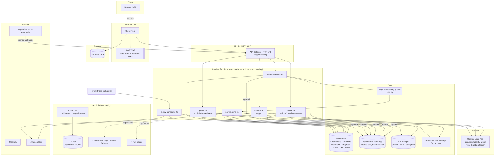
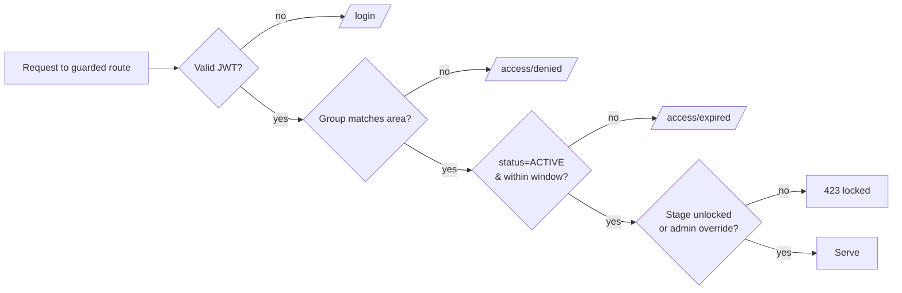
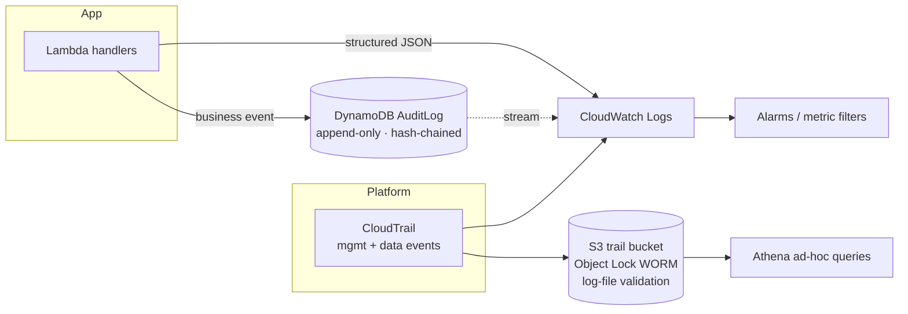
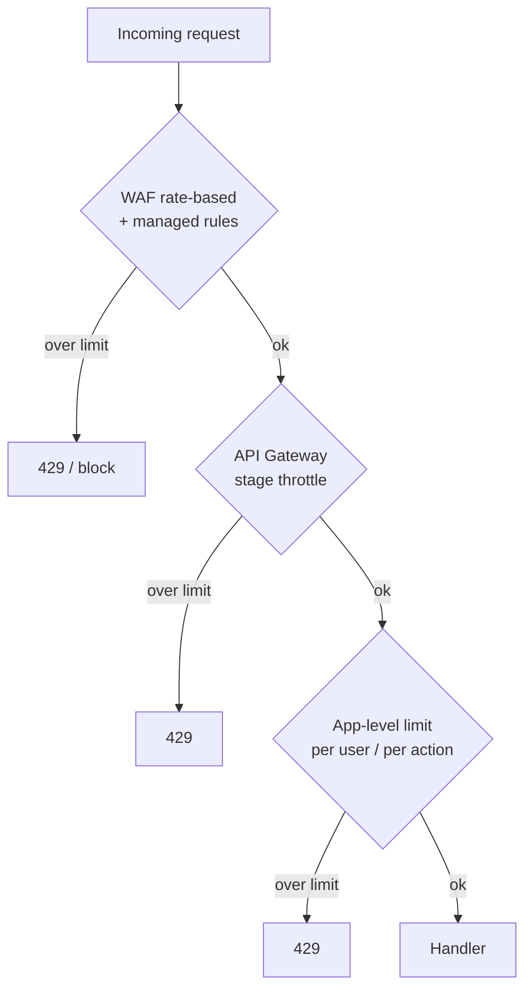

# Architecture Design — STEM Career Path (AI Era)

**Project:** STEM Graduates Career Path — AI Era (Code For Good)
**Doc type:** Build-ready architecture & security design (AWS serverless)
**Owner:** Tinh Cao
**Status:** Draft for review
**Source of truth:** `docs/Project SRS.md`
**Companion docs:** `docs/Sitemap-and-Wireframes.md` · `docs/Customer-Journey.md` · `docs/Service-Tradeoff-Analysis.md`
**Focus areas:** comprehensive **audit trail**, **rate limiting**, **audit logging**, **role separation**, on the **AWS cloud stack**

---

## 1. Goals, principles & constraints

The platform is a **vetted-access learning app**: only Admin-provisioned emails become accounts,
free seats are gated by a human interview, and a donation path self-funds the rest. It must be
**cheap at rest** (a nonprofit running near-zero traffic between cohorts), **simple enough for
student maintainers**, and **accountable** (every privileged action traceable).

Design principles:

1. **Serverless monolith** — one codebase, deployed as a few thin Lambda entrypoints split along
   trust boundaries. Monolith simplicity, but **infrastructure role separation** where it matters.
2. **Scale-to-zero, pay-per-use** — Lambda + DynamoDB on-demand + Cognito; no idle servers.
3. **Stateless app** — all session state in JWTs (Cognito); any instance can serve any request.
4. **Server-side enforcement** — roles, access windows, and content gating are enforced in the
   backend, never trusted from the client.
5. **Least privilege everywhere** — scoped IAM per function; the payment path cannot mint accounts.
6. **Everything privileged is audited** — two audit layers (platform + application), tamper-evident.
7. **Payment & card data never touch the app** — hosted Stripe Checkout (PCI SAQ-A).
8. **Idempotent state transitions** — conditional writes so retries/duplicate webhooks can't
   double-provision or skip the gate.

> **Cost note / correction.** The sprint doc cited a "Cognito 50k MAU free tier." As of 2026,
> Cognito's free tier is **10,000 MAU** on the **Essentials** tier (default for new user pools);
> **threat protection** (adaptive auth, compromised-credential detection, auth-event export) lives
> in the **Plus** tier at ~\$0.02/MAU. Plan accordingly (§14 cost posture).

---

## 2. Architecture at a glance



**Read path:** the browser loads the static SPA from CloudFront (S3 origin). **Write/API path:**
the SPA calls API Gateway (HTTP API), which routes to the Lambda for that trust boundary. WAF sits
at the edge for rate limiting and managed protections. Provisioning is decoupled from the webhook
via SQS so the payment path cannot directly create accounts.

---

## 3. Compute & application topology

A single repository (the "monolith") compiles to a handful of Lambda functions, **partitioned by
trust boundary** so each gets a least-privilege execution role (§6.2). Shared domain logic lives in
common modules; each function is a thin adapter (AWS Lambda Web Adapter / `serverless-http`).

| Function | Routes / trigger | Trust boundary | Why separate |
|----------|------------------|----------------|--------------|
| `public-fn` | `POST /apply`, `POST /donate-intent`, public reads | Unauthenticated | Internet-facing; smallest blast radius |
| `student-fn` | `/app/*` (authed, role=student) | Student JWT | Can read/write own data only |
| `admin-fn` | `/admin/*` (authed, role=admin) | Admin JWT | Holds the privileged write surface |
| `stripe-webhook-fn` | `POST /webhooks/stripe` | Signature-verified, no human | Can update payment status, **cannot** mint accounts |
| `provisioning-fn` | SQS consumer | System | Sole holder of `cognito-idp:AdminCreateUser` |
| `expiry-scheduler-fn` | EventBridge Scheduler | System | Expiry/reminders only |

> **Why split a "monolith."** A single Lambda with one fat role means a bug in the public handler
> can do anything the app can do — including create admin accounts. Splitting along the trust
> boundaries above keeps the codebase monolithic while giving real **infrastructure role
> separation** at deploy time. If even this is too much ops overhead for v1, collapse to
> `public-fn` + `app-fn` + `webhook-fn` + `provisioning-fn` and keep the webhook→SQS→provisioning
> separation, which is the security-critical one.

Stateless: no in-memory session; concurrent invocations run in parallel safely. Frontend is a
static SPA (Amplify Hosting **or** S3 + CloudFront) using relative asset paths (SRS §16.1).

---

## 4. AWS service mapping

| Need | Service | Notes |
|------|---------|-------|
| Static frontend hosting | **Amplify Hosting** or **S3 + CloudFront** | CloudFront required for WAF attachment |
| Edge protection / rate limiting | **AWS WAF** (web ACL on CloudFront) | rate-based rules + managed rule groups (§8) |
| API / routing | **API Gateway HTTP API** | stage throttling; JWT authorizer via Cognito |
| Compute | **AWS Lambda** (per §3) | web adapter; scale-to-zero |
| Identity, sessions, roles | **Cognito User Pool**, groups `student`/`admin` | **Plus tier** for threat protection (§8.4) |
| Admin-only sign-up | Admin-created Cognito users | no self-service sign-up; allowlist by provisioning |
| App / member / donation data | **DynamoDB** (on-demand) | conditional writes = optimistic locking (§5, §9) |
| Application audit log | **DynamoDB AuditLog** (append-only) | hash-chained, IAM-locked (§7) |
| Receipt files | **S3** (private, SSE-KMS, presigned, lifecycle) | no public access; auto-delete after verify window |
| Async provisioning | **SQS** + **DLQ** | absorb webhook spikes; safe retries |
| Transactional email | **Amazon SES** | approval/decline/expiry notices |
| Payment | **Stripe** (external) + signed webhooks | hosted Checkout; PCI SAQ-A |
| Scheduling (interview) | **Calendly** (external, free tier) | scheduling data only; no program PII |
| Access expiry / reminders | **EventBridge Scheduler** | drives `expiry-scheduler-fn` |
| Secrets (Stripe keys, signing secret) | **Secrets Manager** / **SSM Parameter Store** | rotated; per-function read scope |
| Platform audit trail | **CloudTrail** (multi-region) → **S3** (Object Lock) | log-file validation on (§7.1) |
| Logs / metrics / alarms | **CloudWatch** | structured JSON logs, alarms (§12) |
| Tracing | **AWS X-Ray** | request correlation across functions |
| IaC | **AWS SAM** or **CDK** | one template per environment (§14) |

> Direction, not a hard commitment — confirms the model is buildable cheaply on AWS. No infra is
> built until §16 decisions are locked.

---

## 5. Data model

DynamoDB, on-demand. Purpose tables (clearer for student maintainers than single-table; a
single-table design is a valid later optimization). All writes that drive the access state machine
use **conditional expressions** for idempotency and optimistic locking.

### 5.1 Tables

**`Applications`** — one row per access request.

| Attribute | Type | Notes |
|-----------|------|-------|
| `applicationId` (PK) | string (ULID) | |
| `email` | string | applicant email (login identity later) |
| `fullName`, `stage`, `preferredTrack`, `background`, `links` | string | from `/apply` form |
| `status` | string | state machine value (Customer-Journey §4) |
| `accessBasis` | string | `beneficiary` \| `supporter` (set at decision) |
| `version` | number | optimistic-lock counter |
| `interviewAt`, `decidedBy`, `decidedAt`, `rejectReason` | string | vetting metadata |
| `createdAt`, `updatedAt` | string (ISO-8601) | |
| GSI `byStatus` | status → createdAt | admin queue ("pending apps") |
| GSI `byEmail` | email | dedupe / re-application lookup |

**`Members`** — one row per provisioned account.

| Attribute | Type | Notes |
|-----------|------|-------|
| `memberId` (PK) | string = Cognito `sub` | |
| `email`, `fullName`, `track` | string | |
| `role` | string | `student` \| `admin` (mirrors Cognito group) |
| `accessBasis` | string | `beneficiary` \| `supporter` |
| `status` | string | `ACTIVE` \| `EXPIRED` \| `REVOKED` |
| `accessStartsAt`, `accessEndsAt` | string | the access window (null end = no expiry) |
| `path` | string | `A_full_roadmap` \| `B_fast_track` |
| `specializationTrack` | string | Path A tag (optional) |
| `grantedBy`, `grantedAt` | string | audit linkage |
| GSI `byAccessEndsAt` | for expiry sweep | EventBridge job (§9.3) |

**`Donations`** — payment references only; **never** card data.

| Attribute | Type | Notes |
|-----------|------|-------|
| `donationId` (PK) | string | |
| `applicationId` | string | links to access request |
| `provider` | string | `stripe` \| `manual` |
| `stripeEventId` | string | **idempotency key** for webhook dedupe |
| `amount`, `currency`, `status` | | `paid` \| `receipt_review` \| `refunded` |
| `receiptS3Key` | string | manual path; private bucket |
| GSI `byStripeEventId` | dedupe | conditional create on first webhook |

**`Progress`** — proof-of-work submissions (deliverables = external links).

| Attribute | Type | Notes |
|-----------|------|-------|
| `memberId` (PK) | | |
| `stageKey` (SK) | string | e.g. `A#pillar2#unit3` or `B#wk1#day1` |
| `state` | string | `locked` \| `active` \| `submitted` \| `complete` |
| `deliverableUrl` | string | GitHub / URL / Loom / LinkedIn |
| `verifiedBy`, `verifiedAt` | string | when applicable |
| `badge` | string | gig-ladder badge earned at this stage |

**`StageLocks`** — explicit gating + override flags (server-side enforced, §9.2).

| Attribute | Type | Notes |
|-----------|------|-------|
| `memberId` (PK) | | |
| `stageKey` (SK) | | |
| `locked` | bool | computed from prerequisites |
| `overrideBy`, `overrideAt`, `overrideReason` | string | Admin override (audited) |

**`Notes`** — `/app/notes` (member-private).

**`AuditLog`** — append-only business audit (§7.2). Separate table, separate IAM.

### 5.2 Key access patterns

- Admin queue → `Applications.byStatus = SUBMITTED|RECEIPT_REVIEW`.
- Member sign-in eligibility → `Members.get(sub)`, check `status=ACTIVE` and `now < accessEndsAt`.
- Webhook dedupe → conditional `PutItem` on `Donations.byStripeEventId` (fails on duplicate).
- Expiry sweep → query `Members.byAccessEndsAt <= today`.
- Gating check → `StageLocks.get(memberId, stageKey)` (+ prerequisite eval) on every learning read/write.

---

## 6. Identity & role separation

Role separation exists on **two planes**, and the doc treats them as distinct requirements.

### 6.1 End-user roles (application RBAC)

- **Source of truth:** Cognito User Pool **groups** — `student`, `admin`. Group membership is set
  at provisioning and is the *only* thing that grants role.
- **Token:** API Gateway HTTP API uses a **Cognito JWT authorizer**; the access token carries
  `cognito:groups`. Functions also re-verify the claim server-side (defense in depth).
- **Route guards (server-side):**
  - unauthenticated → `/login`
  - authenticated, wrong group for the area → `/access/denied`
  - valid session but `Members.status != ACTIVE` or window lapsed → `/access/expired`
- **`accessBasis` is not a permission.** Beneficiary vs supporter is recorded for impact/donor
  reporting only; both see the identical Student app (Customer-Journey §2).
- **Admin override** privilege (unlock/re-lock a student's stage) is an admin-only capability and is
  always audited (§7.4).



### 6.2 Infrastructure roles (IAM least privilege & separation of duties)

Each Lambda gets its **own execution role** with the minimum policy for its job. The critical
separation-of-duties rule: **the payment path cannot create accounts.**

| Function | Can do | Cannot do |
|----------|--------|-----------|
| `public-fn` | `PutItem` Applications; presigned `PutObject` to receipts prefix; append AuditLog | read Members; touch Cognito; read other prefixes |
| `student-fn` | read/write own `Members`/`Progress`/`Notes` (key-scoped); append AuditLog | read other members; admin tables; Cognito admin APIs |
| `admin-fn` | read/write Applications, Members, StageLocks; **enqueue** provisioning; read receipts; append AuditLog | direct `AdminCreateUser` (goes through queue); delete AuditLog |
| `stripe-webhook-fn` | conditional write Donations; update Application→`PAID_AUTO`; enqueue provisioning; read Stripe signing secret; append AuditLog | create Cognito users; read Members PII; write Members |
| `provisioning-fn` | `cognito-idp:AdminCreateUser`/`AdminAddUserToGroup`; write Members→`ACTIVE`; send SES; append AuditLog | internet-facing routes; delete data |
| `expiry-scheduler-fn` | scan `Members.byAccessEndsAt`; set `EXPIRED`; send SES reminders; append AuditLog | create users; write Applications |

Cross-cutting IAM rules:

- **No `*` resources** — DynamoDB policies are scoped per table/index; S3 to specific
  bucket+prefix; KMS to the specific key; Cognito admin actions only on `provisioning-fn`.
- **AuditLog is append-only by policy** — every role may `dynamodb:PutItem` to `AuditLog`; **no
  role** has `UpdateItem`/`DeleteItem` on it (enforced in IAM, §7.3).
- **Secrets scoped per function** — only `admin-fn`/`webhook-fn`/`provisioning-fn` read the Stripe
  keys; rotation via Secrets Manager.
- **Human admins** authenticate as Cognito `admin` users; AWS-console access to prod is separate and
  limited (break-glass role, MFA, CloudTrail-logged). No shared admin credentials.

---

## 7. Audit trail & audit logging

Two complementary layers. **CloudTrail** answers "what happened to the AWS resources." The
**application AuditLog** answers "what happened to a member/application, and who decided it."
Neither alone is sufficient for nonprofit accountability; together they're comprehensive.



### 7.1 Layer 1 — platform audit trail (CloudTrail)

- **Multi-region trail**, management events **and** DynamoDB **data events** (item-level on
  `Members`, `Donations`, `AuditLog`) so console/SDK changes are captured.
- **Log-file integrity validation ON** — CloudTrail signs digests (SHA-256, SHA-256/RSA), making
  tampering or deletion detectable.
- **Delivered to a dedicated S3 trail bucket** with **Object Lock (WORM)** + SSE-KMS + block-public
  + a restrictive bucket policy; lifecycle to Glacier for long retention.
- **Streamed to CloudWatch Logs** for real-time metric filters/alarms (root usage, IAM policy
  changes, `AuditLog` delete attempts).

### 7.2 Layer 2 — application audit log (business events)

Every privileged or state-changing business action appends one immutable event. Canonical schema:

```json
{
  "eventId":   "01J9...ULID",
  "ts":        "2026-06-04T12:00:00.000Z",
  "actorId":   "cognito-sub | system | stripe",
  "actorRole": "admin | student | system",
  "action":    "APPLICATION_APPROVED",
  "targetType":"application | member | donation | stage",
  "targetId":  "01J8...",
  "before":    { "status": "INTERVIEW_SCHEDULED" },
  "after":     { "status": "APPROVED_BENEFICIARY", "accessBasis": "beneficiary" },
  "reason":    "Met eligibility criteria",
  "sourceIp":  "203.0.113.7",
  "userAgent": "...",
  "requestId": "x-ray-trace-id",
  "prevHash":  "sha256:...",
  "hash":      "sha256(prevHash + canonicalJSON(event_without_hash))"
}
```

PK = `targetType#targetId`, SK = `ts#eventId` (per-entity history); GSI `byActor` and `byAction`
for cross-cutting queries. `requestId` ties an app event to its CloudTrail/X-Ray trace.

### 7.3 Tamper-evidence

- **Append-only by IAM** — no role has `UpdateItem`/`DeleteItem` on `AuditLog` (§6.2). A compromised
  function can add events but cannot rewrite history.
- **Hash chain** — each event stores `prevHash`; `hash` covers the event + previous hash. Any
  edit/deletion breaks the chain and is detectable by a verifier job. (CloudTrail data events on the
  table provide a second, independent record.)
- **PITR** enabled on `AuditLog` for recovery; optional periodic export to the Object-Lock S3 bucket.

### 7.4 What is audited (minimum set)

- **Access lifecycle:** every transition `SUBMITTED → … → ACTIVE → EXPIRED/REVOKED` (and `REJECTED`).
- **Admin decisions:** approve, reject, request-info, **provision**, extend, **revoke**,
  **unlock-stage / re-lock** override — with actor, target, before/after, reason.
- **Auth events:** sign-in success/failure, password reset, Cognito lockouts, MFA changes.
- **Payment:** webhook received, `PAID_AUTO`, receipt uploaded, receipt verified, refund/chargeback.
- **Sensitive reads (optional but recommended):** admin viewing/exporting applicant PII.

### 7.5 Retention, access & query

- **Retention:** AuditLog ≥ 2 years (raise to match any grant/donor-reporting obligation);
  CloudTrail S3 long-term in Glacier. Document the chosen window in `/admin/settings`.
- **Who can read:** admins read audit views in-app (read-only); raw table/CloudTrail access is a
  separate, MFA-gated AWS role. **No one** gets write/delete on history.
- **Query:** in-app timeline per member/application; Athena over the CloudTrail bucket and exported
  AuditLog for investigations and impact reports.

---

## 8. Rate limiting & abuse protection

Defense in depth — **three layers**, each catching what the others can't. (Per AWS guidance:
WAF for per-IP/pattern, API Gateway for per-API, application logic for per-user/per-action.)



### 8.1 Layer 1 — AWS WAF (edge, per-IP / pattern)

Web ACL on CloudFront. **Rate-based rules** (eval windows 60/120/300/600s; min limit 10; action
Block with custom 429; custom aggregation keys IP / header / cookie / URI path / JA3/JA4):

| Rule | Scope (aggregation key) | Suggested limit | Action |
|------|------------------------|-----------------|--------|
| Global blanket | source IP | 2,000 / 5 min | Block |
| Login protection | IP + User-Agent, scoped to `POST /login`, `/auth/*` | 50 / 5 min | Block + Challenge |
| Application spam | source IP, scoped to `POST /apply` | 10 / 5 min | Block |
| Receipt/donate | source IP, scoped to upload routes | 20 / 5 min | Block |
| Webhook flood | source IP, scoped to `/webhooks/stripe` | 300 / 5 min | Count→Block (allow Stripe IP ranges) |

Plus **managed rule groups** (AWS Common, Known-Bad-Inputs, IP reputation, optional bot control).
Start sensitive rules in **Count** mode, observe, then switch to **Block** to avoid false positives.

### 8.2 Layer 2 — API Gateway (per-API throughput)

HTTP API **stage-level throttling** (token bucket): set a steady **rate** and **burst** appropriate
to a small program (e.g. 50 rps / 100 burst) well under the account default 10,000 rps/region.
Caps total spend and shields Lambda concurrency. (Per-API-key usage plans are a REST-API feature;
HTTP API does per-route/stage throttling — per-user limits are handled in Layer 3.)

### 8.3 Layer 3 — application level (per-user / per-action)

- **Sign-in:** Cognito **Plus-tier threat protection** — risk-based adaptive auth and
  compromised-credential detection — plus account lockout after N failed attempts. Both feed the
  audit log.
- **Per-user action limits:** a DynamoDB **fixed-window / token-bucket** counter keyed by
  `userId#action#window` for expensive or abusable actions (deliverable submission, note spam,
  receipt re-upload). Reject with 429 over budget.
- **Webhook idempotency:** verify Stripe **signature**, then conditional-write the `stripeEventId`
  — a duplicate event is a no-op (not a second grant). This is abuse + correctness protection.
- **Presigned-URL scoping:** receipt uploads use short-TTL presigned PUTs to a fixed key prefix and
  content-length/type limits, so the upload surface can't be abused.

---

## 9. Access enforcement (state machine + gating)

The Customer-Journey state machine is enforced **server-side** with conditional writes; the client
never decides eligibility.

### 9.1 Idempotent transitions

Each transition is a conditional `UpdateItem`: e.g. `PAID_AUTO → ACTIVE` runs only
`if status = 'PAID_AUTO'`. A retry or duplicate webhook fails the condition harmlessly — no
double-provision, no skipped gate. `version` gives optimistic locking on concurrent admin edits.

### 9.2 Content gating

A later phase/week/day stays **visible but not enterable (🔒)** until its prerequisite is met
(prior stage complete, milestone/badge earned, or required deliverable submitted/verified). Path A
unlocks by badge/stage; Path B unlocks day-by-day. The check runs on **every** learning read/write
against `StageLocks` + prerequisite evaluation. An **Admin override** sets `overrideBy/At/Reason`
and is audited; it can also re-lock.

### 9.3 Expiry & reminders

`expiry-scheduler-fn` runs on EventBridge Scheduler: queries `Members.byAccessEndsAt`, transitions
due members to `EXPIRED`, and sends SES reminders ahead of the window close. Expired sessions land
on `/access/expired`.

---

## 10. Security controls summary

Expanded from the sprint doc §4.9, mapped to this architecture:

| Property | How it's enforced here |
|----------|------------------------|
| Allowlist + human vetting | No Cognito self-sign-up; accounts only via `provisioning-fn` after `APPROVED_BENEFICIARY` or confirmed payment |
| Two-path integrity | Conditional transitions; `ACTIVE` reachable only from `APPROVED_BENEFICIARY`, `PAID_AUTO`, or admin-verified receipt (§9.1) |
| Payment isolation | Hosted Stripe Checkout; app stores only a payment reference (PCI SAQ-A) |
| Protected routes | Cognito JWT authorizer + server-side group/window/gating checks (§6.1) |
| Least privilege + separation of duties | Per-function IAM roles; payment path can't mint accounts (§6.2) |
| Gated progression | Server-side `StageLocks`; admin override audited (§9.2) |
| Comprehensive audit | CloudTrail (tamper-evident) + append-only hash-chained AuditLog (§7) |
| Rate limiting / abuse | WAF + API GW + app-level, layered (§8) |
| Revocable & expiring | Admin revoke + scheduled expiry; `/access/expired` (§9.3) |
| Data protection | SSE-KMS at rest (DynamoDB/S3), TLS in transit, private receipt bucket, presigned scoped uploads |
| Secrets hygiene | Secrets Manager, per-function read scope, rotation |

---

## 11. Observability & alerting

- **Structured JSON logs** (one event per line) to CloudWatch; **X-Ray** traces correlate a request
  across `webhook-fn → SQS → provisioning-fn`.
- **Alarms:** 5xx rate, Lambda errors/throttles, **SQS DLQ depth > 0** (failed provisioning), WAF
  blocked-request spikes, repeated login failures, any `AuditLog` delete attempt, CloudTrail
  delivery failures, root-account usage.
- **Dashboards:** applications by status, active members, expiring-soon, payment success rate.

---

## 12. Cost posture

Near-zero at rest; main variable is the per-donation Stripe fee. For the full board-facing cost
justification — specific charges, alternatives considered, nonprofit credits (incl. the **\$2,000/yr
AWS Nonprofit Credit** that covers this bill), and the Stripe-vs-Zeffy donation decision — see
**`docs/Service-Tradeoff-Analysis.md`**.

| Service | Driver | Low-volume expectation |
|---------|--------|------------------------|
| Lambda | invocations + ms | free-tier/low |
| DynamoDB (on-demand) | per request | low |
| Cognito Essentials | MAU | **10,000 MAU free**, then ~\$0.015/MAU |
| Cognito **Plus** (threat protection) | MAU | ~\$0.02/MAU — budget if enabling adaptive auth |
| S3 / SES / EventBridge / SQS | volume | negligible |
| **AWS WAF** | ~\$1/ACL/mo + ~\$1/rule/mo + ~\$0.60/M requests | **small fixed cost** — the one always-on line item |
| CloudTrail | first mgmt trail free; data events + S3 storage | low; data events add per-event cost |
| Stripe | per transaction | the real variable cost |

Trade-off to flag: **WAF and Cognito Plus add small fixed/MAU costs.** For a brand-new program with
near-zero traffic, you can launch with Cognito **Essentials** (no Plus) + API Gateway throttling +
basic WAF, and add Plus threat-protection + the full WAF rule set as enrollment grows. Document the
choice in `/admin/settings`.

---

## 13. Environments, IaC & deployment

- **IaC:** AWS SAM or CDK; one stack per environment (`dev`, `prod`), no click-ops in prod.
- **CI/CD:** GitHub → build → deploy; least-privilege deploy role; manual approval to prod.
- **Config:** per-env parameters (Cognito pool, table names, Stripe keys via Secrets Manager).
- **Frontend:** static SPA build → S3/Amplify; relative asset paths (SRS §16.1); CloudFront invalidation on deploy.
- **Student-maintainer friendliness:** keep the codebase a single repo with clear module
  boundaries and section comments (SRS §17); the function split is in the deploy template, not the
  day-to-day editing experience.

---

## 14. Migration path

If a relational model or always-warm service is later needed, the same monolithic codebase moves to
**App Runner / ECS Fargate + Aurora Serverless v2** with no architectural rewrite — the trust-boundary
split, audit layers, and rate-limit layers all carry over (WAF and Cognito are unchanged; only the
compute + data store swap). Start serverless; graduate only if usage justifies always-warm cost.

---

## 15. Open decisions & risks

1. **~~Credential type~~** — resolved: **email + password** (Cognito), `/auth/*` for reset/verify.
   Optional MFA for admins recommended.
2. **Cognito Plus from day one?** — threat protection adds per-MAU cost; can defer (§12).
3. **WAF rule tuning** — start sensitive rules in **Count** to avoid blocking real students behind
   shared campus NAT; combine IP with a session/UA key for login limits.
4. **Function split granularity** — full 6-function split vs. the collapsed 4-function set (§3);
   keep the webhook→SQS→provisioning separation either way.
5. **Audit retention window** — pick a number that satisfies donor/grant reporting (§7.5).
6. **Refund/chargeback** — auto-revoke vs. admin review (Customer-Journey §10).
7. **Admin "view as student"** — if allowed, it must itself be an audited, read-only mode
   (Sitemap §7, item 2).
8. **Interview always-required vs donor-only** — process choice with no architectural impact.

---

## 16. Build checklist (acceptance criteria)

- [ ] Cognito user pool with `student`/`admin` groups; **no self-sign-up**; admin-created users only.
- [ ] API Gateway HTTP API with Cognito JWT authorizer + stage throttling.
- [ ] Lambda functions split by trust boundary, each with a least-privilege execution role.
- [ ] Payment path **cannot** create accounts (webhook → SQS → provisioning separation verified).
- [ ] DynamoDB tables with conditional-write transitions; idempotent webhook via `stripeEventId`.
- [ ] Server-side enforcement of role, access window, and stage gating (client never decides).
- [ ] **AuditLog** append-only (no Update/Delete in any IAM policy), hash-chained, PITR on.
- [ ] **CloudTrail** multi-region, data events on sensitive tables, log validation on, S3 Object Lock.
- [ ] **WAF** web ACL: blanket + login + apply + webhook rate rules + managed groups.
- [ ] Receipts in a private, SSE-KMS, presigned, lifecycle-expiring S3 bucket.
- [ ] EventBridge-scheduled expiry + SES reminders; `/access/expired` reached on lapse.
- [ ] CloudWatch alarms incl. DLQ depth, login-failure spikes, AuditLog delete attempts.
- [ ] IaC (SAM/CDK) per environment; least-privilege deploy role; prod approval gate.
```
