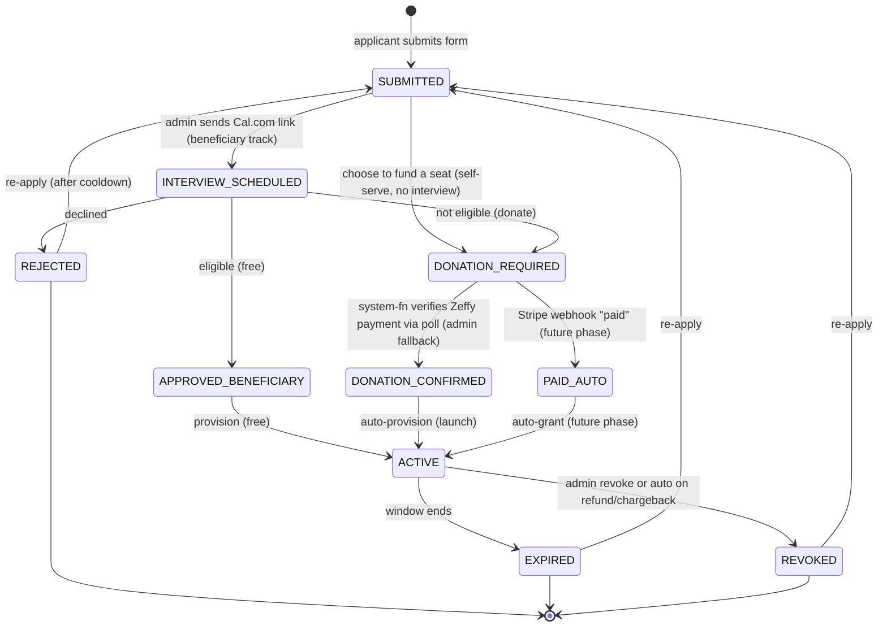
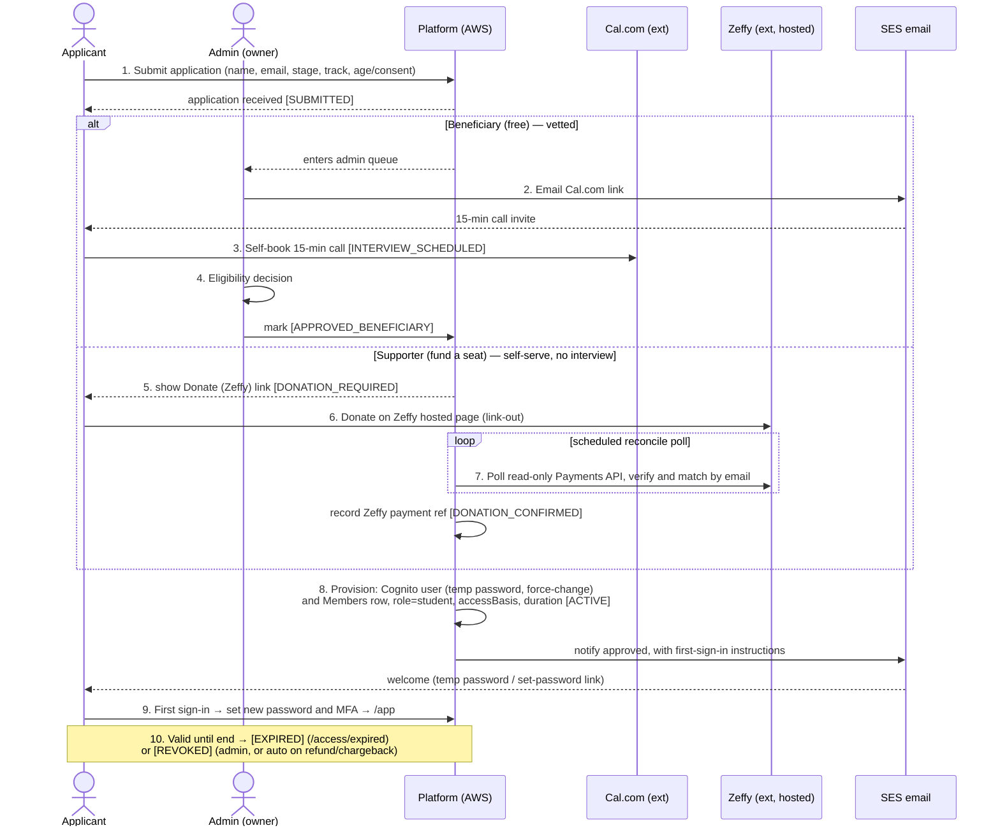

# Customer Journey — STEM Career Path (AI Era)

**Project:** STEM Graduates Career Path — AI Era (Code For Good)
**Doc type:** Personas + Access Lifecycle + End-to-End Journey Maps
**Owner:** Tinh Cao
**Status:** Draft for review
**Source of truth:** `docs/Platform-SRS.md` (platform) · `docs/Project SRS.md` (Phase-0 landing page)
**Companion docs:** `docs/Sitemap-and-Wireframes.md` · `docs/Architecture-Design.md`
**Credential model:** Email + password (resolved)

> **Launch-phase note (rev. 3).** At launch, donations stay on **Zeffy's hosted platform** (no
> Stripe, no receipt upload — the `PAID_AUTO` and `RECEIPT_REVIEW` states and every "Stripe
> webhook" interaction below belong to the **future** automated-payment phase,
> `Architecture-Design.md` Appendix A). **Supporters now self-serve without an interview:** the
> applicant donates on the Zeffy hosted page, `system-fn` **polls Zeffy's read-only Payments API**
> on a short schedule, verifies the payment and matches it to the application **by email**
> (idempotent on the Zeffy payment ID), and **auto-grants access within minutes** —
> `DONATION_REQUIRED` → `DONATION_CONFIRMED` (set by **system**, not an admin) → `ACTIVE`. The
> old **admin-confirm-in-dashboard** path remains as a manual fallback when the email match fails.
> **Beneficiaries are unchanged** — still admin-granted after the interview. Future-phase content
> is kept below and marked where it appears.

---

## 0. Purpose

This document describes **who the people are** and **the path they travel** through the
platform — from first hearing about the program to finishing (or lapsing). It is the human
counterpart to the structural `Sitemap-and-Wireframes.md` and the technical
`Architecture-Design.md`. The access lifecycle here is what the architecture enforces server-side.

Access is **earned and vetted, not open.** Every member arrives through one of two acquisition
paths that both end in an Admin-provisioned account:

- **Beneficiary path** — an eligible nonprofit beneficiary is granted **free** access after a
  short interview.
- **Supporter path** — an applicant who does not meet beneficiary criteria **donates** to unlock
  access; payment is confirmed, then access is granted.

This gives a human eligibility gate (protects scarce free seats) plus a self-funding route, while
keeping the platform itself off the payment-data path.

---

## 1. Personas

### 1.1 Primary learner personas

| Persona | Who | Stage | Suggested path | Top need |
|---------|-----|-------|----------------|----------|
| **New Grad** | Graduated (or about to), no offer yet | Recent graduate | Fast Track, or Roadmap pillars 1, 2, 3, 8 | A deployed project + market presence fast |
| **Current Student** | In school, long runway | Still in school | Full Roadmap (pillars 1, 2, 4, 7 first) | Build readiness over multiple terms |
| **Upskilling Professional** | Working, wants AI-era skills | Recent grad / professional | Fast Track, or Roadmap pillars 1, 6, 7 + a specialization track | Targeted upskill without quitting |

These personas drive the path/pillar focus the platform can **suggest** at onboarding — they are
recommendations, not hard assignments. The actual path is chosen at onboarding (self-select or
Admin-assigned from the interview) and can only be switched by an Admin.

### 1.2 Persona snapshots

**Maya — New Grad.** Finished a CS degree, six months of applications, no offers. Feels the gap
between "has a degree" and "can show deployed work." Anxious about time and money. Wants a fast,
structured sprint that ends in something she can link on LinkedIn. → **Fast Track**, supporter or
beneficiary depending on eligibility.

**Jordan — Current Student.** Sophomore, two+ years of runway, unsure where to start. Motivated
but easily overwhelmed by scattered advice. Wants a long, paced trail with feedback. → **Full
Roadmap**, likely beneficiary.

**Sam — Upskilling Professional.** Junior IT role, wants to move into AI/automation work. Limited
hours, willing to pay. Wants high signal-to-noise and a credential path. → **Fast Track** or
targeted Roadmap pillars, supporter.

### 1.3 Operator persona

**The Program Owner (Admin).** Reviews applications, runs 15-minute interviews, decides
beneficiary vs. donor, provisions accounts, manages durations and revocations, and holds the
content-gating **override** privilege. Optimizes for low admin time and clean nonprofit
accountability — every decision they make is audit-logged.

---

## 2. Roles & access basis

Two roles this sprint: **Student/Participant** and **Admin/Program Owner**. The access *basis*
(how a seat was earned) is recorded on the member but does **not** change in-app permissions — a
beneficiary and a supporter see the same Student app.

| Field | Values | Purpose |
|-------|--------|---------|
| `role` | `student` \| `admin` | Controls protected routes |
| `accessBasis` | `beneficiary` \| `supporter` | Impact reporting + donor records |
| `status` | see §4 lifecycle | Drives sign-in eligibility |

---

## 3. The journey at a glance


Five macro-stages: **Discover → Apply & Vet → Unlock Access → Onboard → Learn →
Complete/Lapse.** The two acquisition paths diverge only in the "Unlock Access" stage and
converge again at provisioning.

---

## 4. Access lifecycle (state machine)

Every application moves through a guarded state machine. Transitions are **idempotent** and
protected by conditional writes, so a retry or a duplicate webhook can never double-provision or
skip the gate (enforced in `docs/Architecture-Design.md`).

| State | Meaning | Set by |
|-------|---------|--------|
| `SUBMITTED` | Basic form received; in admin queue | Applicant |
| `INTERVIEW_SCHEDULED` | Cal.com 15-min call booked / pending | Admin / Applicant |
| `APPROVED_BENEFICIARY` | Passed vetting → free access | Admin |
| `DONATION_REQUIRED` | Not eligible for free; must donate | Admin |
| `DONATION_CONFIRMED` | Payment verified against Zeffy's read-only API — auto by `system-fn` poll (matched by email), or admin-confirmed in the dashboard as fallback (**launch path**) | System / Admin |
| `PAID_AUTO` | Stripe webhook confirmed payment (**future phase only**) | System |
| `RECEIPT_REVIEW` | Manual receipt uploaded; awaiting check (**future phase only**) | Applicant → Admin |
| `ACTIVE` | Account provisioned; can sign in | System / Admin |
| `EXPIRED` / `REVOKED` | Access ended | System / Admin |
| `REJECTED` | Declined at interview | Admin |



No path reaches `ACTIVE` without either `APPROVED_BENEFICIARY` (free, admin-granted after the
interview) or a **confirmed donation**. At launch the confirmation is **server-side**: `system-fn`
verifies the payment against Zeffy's read-only API before `DONATION_CONFIRMED` → `ACTIVE` (admin
dashboard-confirm remains a fallback); the future phase adds `PAID_AUTO` via signed webhook. That
two-path integrity is the core security property: a **beneficiary** grant is a human decision, a
**supporter** grant is a machine decision **gated on a verified payment** — never on an unverified
client signal.

---

## 5. End-to-end access flow (with actors)



**Reject branch:** at step 4, **REJECTED** → optional decline / re-apply email.

### 5.1 Donation & payment handling

- **Launch (Zeffy, self-serve auto-grant):** the applicant donates on Zeffy's hosted page (the
  site only links out). `system-fn` **polls Zeffy's read-only Payments API** on a short schedule,
  verifies the payment, and **matches it to the application by email** (idempotent on the Zeffy
  payment ID); on a match it records the reference (`DONATION_CONFIRMED`) and **auto-provisions
  access within minutes** — no interview, no admin step. If the email doesn't match (typo or a
  different donor email), it falls back to **admin confirm-in-dashboard**. The Zeffy **read-only
  API key** lives in SSM Parameter Store (SecureString); there is still **no webhook, no card
  data, and no receipt upload** in our stack.
- **Future phase (Stripe, automated — `Architecture-Design.md` Appendix A):** redirect to Stripe
  Checkout; on the `checkout.session.completed` webhook (signature-verified, event-id de-duped),
  the application moves `PAID_AUTO` → `ACTIVE`. A per-application tokened receipt-upload fallback
  (`RECEIPT_REVIEW`) returns in this phase too.
- **PCI posture (both phases):** the app **never sees card data** — all card entry happens on the
  processor's hosted page (SAQ-A). The platform stores only a payment reference, never a card
  number.
- **Edge cases:** refunds/chargebacks are processed inside Zeffy; the reconcile poll detects a
  reversed/refunded payment and triggers an **audited auto-`REVOKED`** if access was already
  granted (an admin can also revoke manually). Because supporter access is self-serve, the
  **age/consent gate runs at `/apply` *before* the donate step** (under-13 blocked; 13–17 guardian
  consent) — the interview no longer backstops eligibility for supporters.

### 5.2 Interview step (Cal.com)

After the form, the Admin sends a **Cal.com free-tier booking link** by email; the applicant
self-books a 15-minute call against the Admin's open blocks. The call decides beneficiary
eligibility vs. donor path. To save admin time, the call can be **required only on the
donor/borderline path** and skipped for clearly eligible beneficiaries. Cal.com holds only
scheduling data; no program PII flows through it.

---

## 6. Journey stage map (experience layer)

What the person is trying to do, where they touch the product, how they feel, where it can break,
and what we can do about it.

### Stage 1 — Discover  (`/`, `/donate`)

- **Goal:** Understand what the program is and whether it's for me.
- **Touchpoints:** Home hero, 8-pillar preview, How It Works, Two Paths, impact stories, FAQ.
- **Emotion:** Curious but skeptical ("is this legit / for someone like me?").
- **Pain points:** Unclear who qualifies; unclear cost (free vs. donate).
- **Opportunities:** Lead with eligibility clarity ("free for eligible beneficiaries, donation
  unlocks a seat otherwise"); show both tracks side by side so visitors self-identify.

### Stage 2 — Apply & vet  (`/apply` → `/apply/submitted`, Cal.com)

- **Goal:** Request access and prove I'm a fit.
- **Touchpoints:** Application form, "Application received" page, Cal.com email, 15-min call.
- **Emotion:** Hopeful, a little exposed (sharing background/reason).
- **Pain points:** Waiting with no status; not knowing what happens next; interview-scheduling
  friction.
- **Opportunities:** Set expectations on the confirmation page (review timeline, that email is the
  channel); make the Cal.com link arrive promptly; keep the form short.

### Stage 3 — Unlock access  (beneficiary grant OR `/donate` → Zeffy link-out)

- **Goal:** Get over the access gate.
- **Touchpoints:** Beneficiary approval email, or the Zeffy hosted donation page + an automatic
  welcome email with first-sign-in instructions.
- **Emotion:** Relief (approved) **or** decision friction (asked to donate).
- **Pain points:** Donation framed as a paywall can feel transactional for a nonprofit; the
  reconcile poll makes supporter access **near-instant (minutes), not literally instant**.
- **Opportunities:** Frame the supporter path as "fund a seat" (mission language, not paywall);
  set the expectation on-screen ("access unlocks automatically a few minutes after your
  donation"); the future Stripe phase (Appendix A) buys **seconds-level** auto-grant if minutes
  ever proves too slow or reconciliation outgrows the poll.

### Stage 4 — Onboard  (`/login`, `/app`, `/app/path`, readiness)

- **Goal:** Get in, orient, and start.
- **Touchpoints:** First sign-in (email + password set on first login), dashboard, path
  selection, readiness self-assessment.
- **Emotion:** Motivated, wants a clear "start here."
- **Pain points:** Password setup friction; choice paralysis on path; readiness left "not
  started."
- **Opportunities:** Pre-suggest the path from the interview/persona; make "Continue Learning"
  and "Start readiness" the two obvious first actions; keep `/auth/*` reset flow easy.

### Stage 5 — Learn  (`/app/pillars/*` or `/app/fasttrack/*`, `/app/resources`, `/app/progress`)

- **Goal:** Make real, provable progress.
- **Touchpoints:** Pillar phases / daily deliverables, 5-min video modules, deliverable
  link submission, badges, gig ladder.
- **Emotion:** Engaged when unlocking; frustrated when blocked.
- **Pain points:** Hard-locked stages can feel punitive; "submit a link" is unfamiliar; momentum
  loss between sessions.
- **Opportunities:** Make the lock reason explicit ("complete Day 3 deliverable to unlock Day 4");
  Admin override for legitimate edge cases; "What's New" + progress bars to pull people back.

### Stage 6 — Complete or lapse  (`/app/progress`, `/access/expired`, re-apply)

- **Goal:** Reach job-readiness / a deployed project — or gracefully exit.
- **Touchpoints:** Progress milestones, expiry/revoke notices (SES), `/access/expired`, re-apply.
- **Emotion:** Accomplished (graduate badge) **or** disappointed (window closed mid-progress).
- **Pain points:** Expiry can interrupt unfinished work; unclear how to extend.
- **Opportunities:** Proactive expiry reminders (EventBridge-scheduled) with an extend/re-apply
  path; capture an optional testimonial/earnings log at graduation for nonprofit impact reporting.

---

## 7. Learning journeys within each path

### 7.1 Path A — Full Roadmap (Current Student / long runway)

```text
Onboard → Pillar 1 (AI skills) → Pillar 2 (portfolio) → Pillar 3 (gig, Wk3+)
   → Pillar 4 (brand) → Pillar 5 (micro-internships) → Pillar 6 (certs)
   → Pillar 7 (tooling) → Pillar 8 (community) → Graduate
```

- **Unlocks by badge/stage.** A later phase stays 🔒 until the prior stage is complete or the
  required milestone/badge is earned.
- **Earn-While-You-Learn ladder** runs alongside from Week 3 (Week 3 → \$50–100 … Month 4+ →
  \$500–2,000/mo retainers), surfaced via **gig milestone badges** Starter → Builder → Earner →
  Professional → Graduate.
- **Specialization track** (AI Product Builder / AI Data Engineer / AI Automation Specialist) is
  picked by Month 2 and tagged on the profile, filtering projects/gigs/certs.
- **Suggested milestone arc** mirrors the SRS During-School track: Foundation & self-assessment →
  AI-era skill building → Portfolio development → Certifications & tooling → Micro-internships →
  Career materials & interview prep.

### 7.2 Path B — 4-Week Fast Track (New Grad / Upskiller)

```text
Onboard → Wk1 (LLM foundations) → Wk2 (prompt like a pro) → Wk3 (build & deploy)
   → Wk4 (market-ready) → first proposals out
```

- **Unlocks day-by-day.** One measurable output per day; commit to GitHub daily; Day N+1 opens
  when Day N's deliverable is submitted.
- **Accelerated route for grads:** do Weeks 1–2 first, then run Weeks 3–4 in parallel.
- **Week 4** includes the **5 prompt-engineering interview questions** prep set and the
  market-ready push (LinkedIn, cert fast-track, gig setup, outreach).
- **Capstones per week:** token counter → prompt-audit tool → deployed project (live URL + CI/CD +
  Loom) → updated profile + first proposals.

Both paths share the proof-of-work model: **progress = deliverables completed**, recorded mostly
as **external links** (GitHub / URL / Loom / LinkedIn), not files the platform hosts.

---

## 8. Re-engagement, expiry & re-application

- **Expiry reminders** — EventBridge-scheduled SES emails before the access window closes, with an
  "extend" or "re-apply" link.
- **Expired / revoked** → `/access/expired`; the screen offers *Contact program owner* and
  *Re-apply*. Re-application re-enters the state machine at `SUBMITTED`.
- **Open decision:** whether a rejected/expired applicant can re-apply, and after how long
  (cooldown). Tracked in `docs/Sitemap-and-Wireframes.md` §7.
- **Admin levers** on a member row: **Edit · Extend · Revoke · Unlock stage.** Extend pushes the
  access window; Revoke moves to `REVOKED`; Unlock stage is the per-student content-gating
  override — all four are audit-logged.

---

## 9. Trust & accountability touchpoints

The journey is built so the person can trust the gate and the org can account for every decision:

- **Allowlist + verified entry** — no anonymous sign-up: a **beneficiary** account requires an
  admin grant after the interview; a **supporter** account requires a **payment verified
  server-side against Zeffy's read-only API**. Every account is tied to an application and (for
  supporters) a confirmed payment.
- **Payment isolation** — card entry happens only on Zeffy's hosted pages (PCI SAQ-A); our stack
  holds **no card data and no webhook**, only a **read-only API key** (in SSM) used to *verify*
  donations plus an auto-captured/admin-entered payment reference.
- **Transparent access status** — the learner always sees their status, access window, and who
  granted it on `/app/profile`.
- **Logged decisions** — every admin action (approve / reject / provision / extend / revoke /
  unlock-override) is recorded for nonprofit accountability; the audit-trail design lives in
  `docs/Architecture-Design.md`.

---

## 10. Open decisions affecting the journey

1. **Donate-to-access screens** — the flow adds an interview + donation branch the public sitemap
   does not yet show. Next pass should add `/apply/interview`, `/apply/donate`, `/apply/receipt`
   states/sub-screens, plus an Admin donation/receipt review view and a public
   *Donate-to-access* screen distinct from the general `/donate` link.
2. **Interview for supporters — resolved:** supporters **self-serve with no interview** (access
   is gated on a server-verified donation, not a call); the interview remains the **beneficiary**
   eligibility gate. Whether to also skip the call for clearly-eligible beneficiaries stays an
   admin-time option (§5.2).
3. **Re-application cooldown** — allowed, and after how long? (§8)
4. **Notifications ownership** — approval/expiry emails fully automated (SES) vs. manual by owner.
5. **Refund/chargeback handling — resolved (launch):** the reconcile poll triggers an audited
   auto-`REVOKED` on a detected refund/chargeback; manual admin revoke remains available (§5.1).
