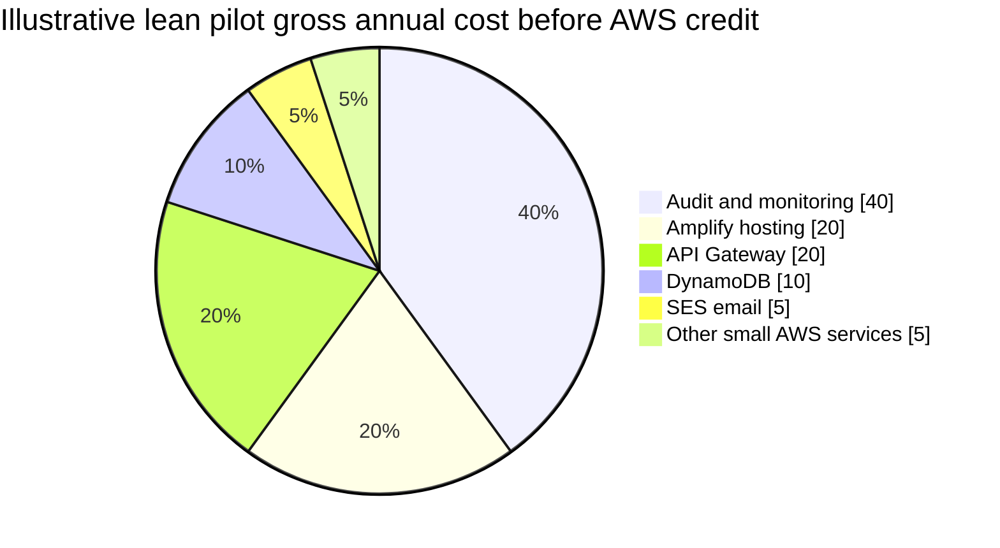
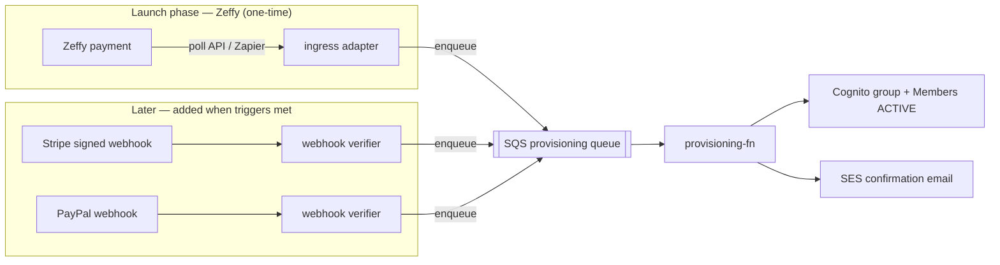

# Service Trade-off Analysis — STEM Career Path (AI Era)

**Project:** STEM Graduates Career Path — AI Era (Code For Good)  
**Doc type:** Service-selection trade-off & cost justification — **for Code For Good Leadership / Board**  
**Owner:** Tinh Cao  
**Status:** Audited draft for leadership review — rev. June 2026 (payment phasing + event-flow / webhook analysis)  
**Audience:** Non-technical decision-makers (board, leadership, program leads)  
**Companion docs:** [docs/Architecture-Design.md](Architecture-Design.md) · [docs/Customer-Journey.md](Customer-Journey.md) · [docs/Sitemap-and-Wireframes.md](Sitemap-and-Wireframes.md)

> Pricing and program assumptions were re-verified in **June 2026** from vendor pages. Event-flow /
> webhook capabilities were also re-verified June 2026: **Zeffy's public API is read-only (Beta),
> ~100 req/min, built around scheduled syncs and Zapier; native push webhooks remain a roadmap
> request, not a shipped feature.** Stripe and PayPal both offer native signed webhooks. See §6.7.1.

---

## 1. Executive summary

This platform is designed for a small 501(c)(3) nonprofit to launch a **pilot, one-time-contribution, access-based STEM career program** with very low infrastructure cost, low volunteer maintenance, and strong accountability over who receives access. (The pilot is scoped to **one-time contributions only** — no recurring subscription billing; that scope materially simplifies the payment integration, see §6.7.1.)

The recommended setup is:

- **Frontend:** AWS Amplify Hosting, because Code For Good is already hosted on Amplify.
- **Backend:** AWS serverless services — Amazon Cognito, AWS Lambda, API Gateway, DynamoDB, SES, CloudWatch, and CloudTrail.
- **Donation / access payment:** **Zeffy at launch as a standalone hosted donation platform — fully decoupled.** The site's *Donate* button links out to a Zeffy form; Zeffy holds donor and card data. There is **no payment API and no webhook in our stack.** Access is **granted by an admin** — after the interview (beneficiaries) or after an admin confirms the donation in Zeffy (supporters). Automated Stripe/PayPal webhooks are a documented **future** option (§6.7.1), added only when triggers are met.
- **Scheduling:** Cal.com or Calendly free tier, depending on whether the program needs multiple event types.
- **Security posture:** Launch lean with Cognito, API throttling, CloudWatch alarms, IAM least privilege, audit logs, and optional WAF later if abuse risk grows.

**Executive Summary:**

- **Infrastructure cost should be effectively $0 during the pilot.** The realistic AWS gross cost for a small pilot is expected to be roughly **$25–200/year without Amplify WAF**, or about **$200–400/year if Amplify WAF is enabled**. Code For Good is aiming for **$1,000 in AWS nonprofit credits ($95 one time fee at signup/renewal per $1,000. Max up to $5,000)**, which should cover the expected pilot infrastructure cost with room to spare.
- **The main real-money decision is payment processing.** Zeffy charges nonprofits **$0 platform fees and $0 processing fees**, funded by optional donor tips. Stripe has stronger payment automation and signed webhooks, but processing fees apply unless discounted nonprofit pricing is approved.
- **Event-flow (webhook) integration is where Stripe leads — but it barely moves this decision.** For a *one-time, human-vetted, latency-tolerant* access model, instant payment-driven activation has low marginal value, so the launch build skips payment integration entirely: donations live on Zeffy, and an admin grants access. The price is a little **manual admin reconciliation** (confirm the donation, click grant), not engineering. The architecture's queue-decoupled provisioning means a later Stripe/PayPal phase is a **trigger swap, not a rebuild** (§6.7.1).
- **Zeffy should be the default launch choice**, and it survives the event-flow pressure-test (§6.7.1).

---

## 2. How to read this document

A trade-off analysis explains what we chose, what else we considered, and why the recommended option fits the organization. Each major service decision is evaluated through five lenses:

| Lens | The question it answers |
|------|-------------------------|
| **Specific charges** | What does it actually cost us at pilot scale? |
| **Ease of integration** | How hard is it to connect to the rest of the platform? |
| **Deployment** | How easy is it to ship and update? |
| **Maintenance** | How much ongoing work does it create for volunteers? |
| **Nonprofit fit** | Does it protect donor funds, student data, and long-term sustainability? |

---

## 3. Decision criteria & why they matter

A volunteer-supported nonprofit should not optimize the same way as a venture-funded startup. The priorities are:

1. **Low, predictable cost** — donor money should fund students and programming, not idle infrastructure.
2. **Low maintenance** — volunteers rotate; the stack must not require a full-time engineer.
3. **Accountability** — donor-funded access must be explainable and auditable.
4. **Data stewardship** — the platform will handle applicant and student information, including minors.
5. **No painful lock-in** — services should be replaceable if cost, policy, or scale changes.
6. **Sustainable volunteer onboarding** — future student developers should be able to understand and maintain the stack from public documentation.

These criteria drive the recommendation more than pure developer convenience.

---

## 4. Cost model: what actually drives cost

### 4.1 Cost drivers at pilot scale

The platform is mostly pay-per-use. Between cohorts, there should be little or no backend traffic, so cost stays low. The meaningful cost drivers are:

1. **Amplify Hosting usage** — usually low for a small static or React-style site.
2. **Backend API traffic** — Lambda + API Gateway, likely very low at pilot scale.
3. **Database and storage** — DynamoDB and S3, likely near-free at pilot scale.
4. **Email** — SES is cheap for transactional email.
5. **Security add-ons** — AWS WAF is the one line that can create a fixed monthly cost.
6. **Payment processing** — Zeffy is $0 to the nonprofit; Stripe/PayPal style processors charge per transaction.

### 4.2 Illustrative annual run cost — recommended lean pilot

Assumptions: 501(c)(3), first pilot app, Code For Good already hosted on AWS Amplify, hundreds of users at most, monthly active users far below 10,000, basic transactional email, no paid WAF add-on at launch.

| Line item | Basis | Estimated annual gross cost |
|-----------|-------|-----------------------------|
| Frontend hosting | AWS Amplify Hosting, light traffic/build usage | **$0–25** |
| Identity | Amazon Cognito Essentials, under 10,000 MAU | **$0** |
| Compute | AWS Lambda, low request volume | **$0–10** |
| API | API Gateway HTTP API, low request volume | **$0–25** |
| Database | DynamoDB, small table size and low read/write volume | **$0–15** |
| Storage | S3 for receipts/log exports, small files | **$0–10** |
| Email | Amazon SES at low transactional volume | **$1–10** |
| Audit/monitoring | CloudWatch + CloudTrail, basic configuration | **$5–50** |
| Scheduling | Cal.com or Calendly free tier | **$0** |
| Secrets / EventBridge / SQS | Small usage | **$0–10** |
| **Subtotal — lean pilot** | Without Amplify WAF | **≈ $25–200/year** |
| **AWS nonprofit credit target** | Conservative planning assumption | **−$1,000/year** |
| **Expected net infrastructure cost** | Pilot scale | **$0** |
| Donation/access payment | Zeffy preferred; Stripe optional | **Zeffy $0; Stripe varies** |

**Takeaway:** even using a conservative **$1,000 AWS credit target**, the expected pilot infrastructure cost should be covered. The biggest uncertainty is not normal AWS usage; it is whether the team enables fixed-cost security add-ons too early.

### 4.3 Optional security cost: Amplify WAF

Amplify now supports direct AWS WAF integration, but it changes the cost picture. If WAF is attached directly to an Amplify app, AWS lists an **Amplify WAF integration charge of $15/month per app**, plus normal AWS WAF charges.

| Security option | Estimated cost | When to use |
|-----------------|----------------|-------------|
| **Lean launch security** | **$0–low** beyond normal logs/API usage | Best for pilot: Cognito, IAM, API throttling, CloudWatch alarms, CloudTrail logs |
| **Amplify + WAF integration** | **~$180/year + WAF usage** | Use if the public site sees abuse, scraping, spam, or brute-force pressure |
| **S3 + CloudFront + WAF alternative** | WAF usage without the Amplify integration fee | Consider later if WAF becomes necessary and hosting migration is acceptable |

**Recommendation:** do **not** enable Amplify WAF by default on day one unless there is a known abuse risk. Launch lean, monitor traffic, then enable WAF when the evidence justifies it.

### 4.4 Cost share — lean pilot before credits

> This chart intentionally excludes Amplify WAF. If WAF is enabled, it becomes the largest fixed infrastructure line item.

---

## 5. Nonprofit and compliance programs we rely on

| Program / issue | Benefit or requirement | Why it matters |
|-----------------|------------------------|----------------|
| **AWS Nonprofit Credit Program** | Code For Good is a 501(c)(3) and is aiming for **$1,000 AWS credits** | Conservative credit assumption still covers pilot infrastructure |
| **AWS Free Tier / low usage pricing** | Lambda, Cognito, DynamoDB, CloudFront/API-related services include free or low-cost usage bands | Keeps early usage near $0, especially before scale |
| **Zeffy** | $0 platform and payment-processing fees for nonprofits, funded by optional donor tips | Best fit for lowest-cost launch |
| **Stripe nonprofit discount** | Eligible nonprofits may receive discounted processing fees, subject to approval and region/card limits | Strong fallback if automation becomes more important than fee minimization |
| **IRS quid pro quo rules** | If payment grants something of value, receipts may need disclosure language | Important because minimum contribution may unlock access |
| **Minor/student privacy** | High school users may be minors; under-13 users create COPPA risk | The platform should collect minimal data and set clear age/consent rules |

Leadership action items:

1. Confirm the AWS nonprofit credit application path and timing.
2. Decide the minimum contribution threshold for automatic access.
3. Decide whether this is framed as a **donation**, **membership contribution**, **program access contribution**, or **sponsor-supported fee**.
4. Approve receipt language before launch.
5. Approve an age/guardian consent policy for high school participants.

---

## 6. Service-by-service trade-offs

### 6.1 Overall approach — AWS Amplify + AWS serverless vs. all-in-one platform vs. rented server

| Option | Specific charges | Integration | Deployment | Maintenance | Nonprofit fit |
|--------|------------------|-------------|------------|-------------|---------------|
| **AWS Amplify + serverless backend (chosen)** | Expected $0 net with $1,000 credit; low gross pilot cost | Native AWS path; works with Cognito, Lambda, DynamoDB | Amplify makes frontend deploys easy | Low; no servers to patch | Best match because Code For Good already uses Amplify |
| Firebase / Supabase | Generous free tiers; may become opinionated at scale | Fastest to start | Very easy | Low, but data/auth/backend tied to vendor model | Good developer experience, weaker fit with existing AWS hosting |
| Render / Railway / Heroku / VPS | $7–25+/month or more, often always-on | Simple mental model | Easy | Higher; app/runtime/server maintenance | Pays for idle time and weaker native audit story |
| Cloudflare stack | Very strong free/low-cost edge platform | Good for JS/edge apps | Easy for static and edge workloads | Low | Worth considering later, but switching now adds churn |

**Verdict.** Stay with AWS. Code For Good already uses Amplify, AWS nonprofit credits can offset pilot infrastructure, and the serverless backend avoids idle server cost. Switching clouds now would be architecture cosplay — fun for diagrams, bad for delivery.

---

### 6.2 Frontend hosting — AWS Amplify vs. S3 + CloudFront vs. Netlify / Vercel

| Option | Cost profile | Strength | Weakness | Recommendation |
|--------|--------------|----------|----------|----------------|
| **AWS Amplify Hosting (chosen)** | Low at pilot scale; paid WAF integration if enabled | Already used by Code For Good; easy deploys | Amplify WAF adds $15/month per app + WAF charges | **Use for launch** |
| S3 + CloudFront | Very low static hosting cost | Cheapest AWS-native static hosting; strong WAF/CDN control | More setup and migration from current Amplify workflow | Keep as future cost-control option |
| Netlify | Easy deploys; free/paid tiers | Friendly developer workflow | Another vendor; build/runtime limits; less AWS audit cohesion | Fine, but not better here |
| Vercel | Excellent frontend DX | Great for Next.js | Hobby plan restrictions and paid per-seat model for org use | Avoid unless app specifically needs Vercel features |

**Verdict.** Since the organization is already on Amplify, use Amplify Hosting for this pilot. Do not migrate to S3 + CloudFront unless WAF cost or hosting scale makes that worthwhile later.

---

### 6.3 Compute & API — Lambda + API Gateway vs. containers vs. VPS

- **Chosen:** AWS Lambda + API Gateway HTTP API.
- **Charges:** Lambda includes a large free usage band for small apps. API Gateway has a limited free-tier period and then low per-million-request pricing. At pilot scale, expected cost is near $0 to a few dollars.
- **Alternatives:** ECS/Fargate, App Runner, EC2, Render, Railway, or VPS hosting.
- **Integration:** Lambda integrates cleanly with API Gateway, Cognito authorizers, DynamoDB, SES, EventBridge, SQS, CloudWatch, and CloudTrail.
- **Deployment:** deploy through AWS IaC or Amplify/backend CI/CD pipeline.
- **Maintenance:** no servers to patch, no container cluster to babysit.

**Verdict.** Lambda + API Gateway is the right pilot backend. Containers can wait until traffic is constant or the app needs long-running workloads.

---

### 6.4 Identity & sign-in — Amazon Cognito vs. Clerk / Auth0 / Firebase

| Provider | Free / low-cost profile | Integration | Maintenance | Nonprofit fit |
|----------|--------------------------|-------------|-------------|---------------|
| **Amazon Cognito Essentials (chosen)** | 10,000 MAU free tier for direct/social users; low cost above that | Native AWS integration | Managed service | Best fit with Amplify/AWS backend |
| Clerk | Strong free tier and excellent developer experience | Easy frontend integration | Low | Good alternative, but another vendor and bill |
| Auth0 | Polished enterprise auth | Strong enterprise features | Low | Overkill and likely more expensive later |
| Firebase Auth | Large free tier | Best inside Google ecosystem | Low | Good product, weaker fit with AWS-first stack |

**Verdict.** Use Cognito Essentials. Do **not** enable Cognito Plus at launch unless threat-protection features are explicitly required, because Plus changes the cost profile. Keep the access model invite/admin-controlled rather than open public sign-up.

---

### 6.5 Database — DynamoDB vs. Postgres / Supabase

- **Chosen:** DynamoDB on-demand.
- **Charges:** DynamoDB includes a free storage allowance and low pay-per-request cost. Pilot usage should be near $0.
- **Alternatives:** RDS/Aurora Postgres, Supabase, Neon, PlanetScale-style managed databases.
- **Integration:** DynamoDB works well with Lambda and event-driven access-state records.
- **Maintenance:** no database server, no patching, no backups to babysit at pilot scale.
- **Nonprofit fit:** good for low-cost, low-maintenance access records, applications, audit pointers, status transitions, and entitlement state.

**Verdict.** DynamoDB is the right pilot database if the data model is simple and access-pattern-driven. If the app later needs heavy relational reporting, move reporting data into Postgres or add a small analytics replica. Do not pay Postgres rent before the product earns it.

---

### 6.6 Email — Amazon SES vs. SendGrid / Mailgun / Postmark

- **Chosen:** Amazon SES.
- **Charges:** SES is priced around pennies per thousand emails. For approval notices, receipts, expiry reminders, and interview scheduling links, annual cost should be tiny.
- **Alternatives:** SendGrid, Mailgun, Postmark, Resend.
- **Integration:** SES integrates directly with Lambda and AWS IAM.
- **Maintenance:** main setup work is domain verification, SPF/DKIM/DMARC, and SES sandbox removal.

**Verdict.** Use SES for transactional email. Use a marketing/email platform only if the program later needs newsletters, audience segmentation, or donor campaigns.

---

### 6.7 Donation / access payment — Zeffy vs. Stripe vs. PayPal / Donorbox

This is the most important service decision because it affects both money and user access.

| Option | Fee profile | Auto-grant access? | Integration | Best use case |
|--------|-------------|--------------------|-------------|---------------|
| **Zeffy (recommended launch default)** | $0 platform fees and $0 processing fees to the nonprofit | Possible, but less direct than Stripe; use API polling, Zapier, or admin review | Donation forms, donor data, read-only API, Zapier integrations | Cost-first nonprofit launch |
| **Stripe Checkout** | Standard or approved nonprofit-discounted processing fees | Excellent; signed webhooks can activate access immediately | Strong API/webhook ecosystem | Automation-first payment flow |
| PayPal Giving Fund / PayPal | Can be low-cost for eligible nonprofits | Limited / more awkward | Familiar to donors | Optional secondary donor preference |
| Donorbox | Platform fee plus processor fees | Some integrations | Easy donation widgets | Useful if donor-management UX matters more than cost |

#### Recommended launch flow with Zeffy

1. User applies or signs up for the program.
2. App creates a pending application record in DynamoDB.
3. For supporters, the site shows a **Donate** button that links out to a **Zeffy hosted form**. Zeffy holds donor and card data; **nothing flows back into the app automatically.**
4. An **admin reconciles manually**: confirms the donation in the Zeffy dashboard, then grants access in the admin console, which provisions the Cognito entitlement. Beneficiaries are granted the same way after the interview — independent of any payment.
5. All grants are logged for audit; the app stores only an admin-entered payment reference, **never card data.**

#### When to switch to Stripe

Use Stripe if leadership wants **near-real-time access activation** with fewer moving parts. Stripe webhooks are more mature for this exact product pattern. The trade-off is the processing fee.

#### Receipt and tax wording warning

If a minimum payment unlocks program access, the payment may not be a plain unrestricted donation. It may be partly a charitable contribution and partly a payment for benefits. Leadership should approve wording such as:

> "Your contribution supports Code For Good's STEM Career Path program. If your contribution provides access to program services, the tax-deductible amount may be limited to the amount paid above the fair market value of benefits received. Please consult your tax advisor."

**Verdict.** **Launch with Zeffy as a standalone hosted donation platform — fully decoupled** (the
*Donate* button links out; no payment API or webhook in our stack). Access is **admin-granted** after
the interview (beneficiaries) or after an admin confirms the donation in Zeffy (supporters). This
preserves every dollar and, per the pressure-test in §6.7.1, costs only a little manual reconciliation
because access is already human-vetted. **Add Stripe, then PayPal, later when needed** on the §6.7.1
triggers — each is an additive ingress into the same provisioning pipeline.

---

### 6.7.1 Webhook & event-flow integration — pressure-testing the Zeffy-first call

> **Launch decision (June 2026): donations are fully decoupled.** Leadership chose to use Zeffy as a
> **standalone hosted platform** — the *Donate* button links out, and **an admin grants access
> manually** after confirming the donation. So at launch **none of the integration options below are
> built.** This section is retained because it (a) records *why* skipping payment-driven automation is
> sound for this product, and (b) is the playbook for the **future** phase, if/when automated
> activation is needed.

You asked specifically how easy it is to wire **event flows** — payment confirmation, and the email
confirmations that follow — into the rest of the platform, and whether that ease should change the
Zeffy-first decision. It is the right question to press on, because event-flow integration is exactly
where Zeffy and Stripe differ most. Here is the honest test.

**What "good" looks like (the architecture's target).** `docs/Architecture-Design.md` draws the payment
path as *signed webhook → SQS → `provisioning-fn` → Cognito*. The processor pushes a cryptographically
signed event the instant a payment completes; the handler verifies the signature, writes the payment
reference idempotently (deduped on the processor's event ID), and hands off to a queue that provisions
access. This is Stripe's home turf.

**How each processor meets that bar (verified June 2026):**

| Processor | Event delivery | Signature / trust | Idempotency | Fit with the target design |
|-----------|----------------|-------------------|-------------|----------------------------|
| **Stripe** | Native signed webhooks, instant; rich event types (`checkout.session.completed`) | HMAC `Stripe-Signature`, verified per event | Built-in event IDs | Drop-in — the architecture was drawn for this |
| **Zeffy** | **No native push webhook on the public API** (read-only, Beta; native webhooks remain a roadmap request). Events reach you via **scheduled polling** of the Payments API or a **Zapier** trigger | None on a Zapier POST — you authenticate it and re-verify against the API | **You implement it** (dedupe on Zeffy payment ID) | Works, but you own the ingress adapter |
| **PayPal** | Native webhooks (legacy IPN deprecated) | Cert / transmission-ID verification (fiddlier than Stripe) | Built-in event IDs | Workable; donor-familiar secondary option |

So on raw integration ease, **Stripe wins decisively and Zeffy is the weakest** — the original framing
was right. The question the pressure-test actually answers is: *does that gap matter for this product?*
Four findings say it matters far less than it first appears.

1. **Your access model is latency-tolerant.** Access is gated behind a human interview and admin
   provisioning. A payment that activates in 5–15 minutes (a poll cycle) instead of 5 seconds (a
   webhook) changes nothing for a cohort that onboards over days. The single biggest thing native
   webhooks buy you — *instant* activation — has low marginal value here.
2. **The provisioning pipeline is trigger-agnostic — this reconciles the two docs.** The
   security-critical rule in the architecture is *the payment path cannot mint accounts*
   (webhook → SQS → `provisioning-fn`). Everything from SQS onward is identical no matter what enqueues
   the message. A Zeffy **poller** or a Zapier-posted endpoint feeds the *same* queue, with the *same*
   idempotent writes, audit log, and least-privilege provisioning. Choosing Zeffy at launch therefore
   swaps only the **ingress adapter**, not the architecture — the system is "webhook-ready" for a later
   Stripe phase without *requiring* webhooks for the Zeffy phase.
3. **One-time scope removes the strongest reason to want webhooks.** Webhooks earn their keep on
   *recurring* lifecycle events — renewals, `payment_failed`, dunning, cancellations, card-expiry.
   Those are stateful, time-sensitive, and genuinely painful to reconcile by polling. The pilot is
   scoped to **one-time contributions only**, so none of them exist. The entire event surface is a
   single terminal signal: "a qualifying payment happened" — the easiest possible thing to detect by
   polling. The case for native webhooks largely evaporates with the subscription scope.
4. **Email confirmations are not a processor concern at all.** The approval / receipt / expiry emails
   are sent by *your* backend through SES, triggered by your *internal* state change (status →
   `ACTIVE`). They depend only on the backend knowing a payment occurred — not on *how* it found out.
   Email-confirmation reliability is therefore identical across Zeffy, Stripe, and PayPal; only the
   trigger latency differs (instant on a Stripe webhook, within a poll cycle on Zeffy), which is
   immaterial for a welcome email.

**The same pipeline, whichever processor feeds it:**

**Where the Zeffy path genuinely costs you (no sugar-coating):**

- **You build and own idempotency + reconciliation.** With Stripe you borrow signed events and event
  IDs; with Zeffy you implement dedupe on the payment ID, a polling cursor, a backfill for missed
  cycles, and a periodic reconcile sweep (refunds / duplicates). More code, more tests, more for a
  student maintainer to get subtly wrong.
- **No cryptographic signature on a Zapier POST.** Treat any posted payload as untrusted: authenticate
  the endpoint (shared secret + IP allowlist) and **always re-verify the payment against Zeffy's
  read-only API before granting access**. Polling sidesteps this by pulling from the authenticated API
  directly — which is why **polling is the safer default and Zapier the convenience option**.
- **A second moving part if you use Zapier** — free-tier task / poll limits (~15-min polling) and
  another account / failure mode for a volunteer to debug.

**Verdict on event flows.** Zeffy-first **survives** the pressure test — but for a sharper reason than
"it's cheaper, accept worse automation." For a *one-time, human-vetted, latency-tolerant* access model,
the webhook advantage you forgo has **low marginal value**, and the queue-decoupled provisioning makes
adopting Stripe later a **trigger swap, not a rebuild**. The real price of Zeffy is **owning a small
amount of reconciliation / idempotency code** instead of leasing Stripe's. For this pilot, that is a
sound trade.

**Make "later when needed" concrete.** Add Stripe (and/or PayPal) when any of these becomes true:

1. You introduce **recurring / subscription billing** — the moment lifecycle events appear, polling
   stops being adequate; move the payment ingress to Stripe signed webhooks.
2. **Instant activation becomes a real UX requirement** (self-serve supporters with no interview gate).
3. **Reconciliation / manual handling outgrows volunteer capacity** per cohort.
4. **Zeffy polling / Zapier proves brittle** (missed payments, Zapier limits, or Beta-API changes).
5. For **PayPal specifically**, when donor familiarity or an existing PayPal base materially lifts
   conversion — add it as a parallel processor with its own signed-webhook adapter feeding the same
   SQS queue.

Because the pipeline is trigger-agnostic, each of these is *additive*: a new ingress Lambda that
verifies the processor's signature and enqueues to the existing SQS provisioning queue. No change to
`provisioning-fn`, the audit layer, or the access state machine.

---

### 6.8 Scheduling — Cal.com vs. Calendly vs. Google Calendar appointment scheduling

| Option | Free-tier fit | Strength | Weakness | Recommendation |
|--------|---------------|----------|----------|----------------|
| **Cal.com** | Free individual plan supports unlimited event types/calendars | Better if multiple interview types are needed | Another account/tool to manage | Strong default if free flexibility matters |
| Calendly | Free plan supports one event type | Very familiar and simple | Free tier is narrower | Good if one interview type is enough |
| Google Calendar appointment scheduling | Best if organization already uses Google Workspace | Keeps scheduling inside Google | Workspace/account dependency | Good if Code For Good already has Workspace |

**Verdict.** Use **Cal.com** if the program needs separate booking links for high school, college, graduate, and young professional tracks. Use **Calendly** if there is only one standard 15-minute interview. Scheduling should stay external; do not build scheduling from scratch.

---

### 6.9 Security, rate limiting & audit

**Launch security should be practical, not theatrical.** The pilot does not need enterprise security cosplay, but it does need clean controls.

Recommended launch controls:

- Cognito authentication and role/group separation.
- No public admin routes.
- API Gateway throttling and request limits.
- IAM least privilege for Lambda functions.
- DynamoDB conditional writes for idempotent access-state changes.
- CloudWatch alarms for error spikes and cost anomalies.
- CloudTrail enabled for account-level audit events.
- Manual override path for admins, with every override logged.
- No card data stored in Code For Good systems.

Optional later controls:

- Amplify WAF if public traffic shows abuse.
- Bot protection only if needed.
- More detailed CloudTrail data events for sensitive objects.
- Security review before expanding to larger cohorts.

**Verdict.** Launch lean. Add WAF only after risk justifies its fixed monthly cost.

---

## 7. Audience and data stewardship

The program audience includes:

- high school students,
- college students,
- graduate students,
- young professionals with 1–5 years of experience.

Because high school students may be minors, the platform should follow these rules:

1. **Do not target or knowingly collect data from children under 13.** If under-13 participation is ever considered, get legal review first.
2. **Add age-band collection, not exact birthdate unless needed.** Example: `Under 13`, `13–17`, `18+`.
3. **For minors, add parent/guardian consent language.** This can be lightweight for a pilot but should be explicit.
4. **Collect only necessary data.** Avoid sensitive demographic data unless it is truly needed for program reporting or grant requirements.
5. **Separate application data from payment data.** Zeffy/Stripe stores payment details; Code For Good stores only payment reference, status, amount threshold met, and audit metadata.
6. **Define retention.** Example: rejected applications retained 12 months, active member records retained while active plus 24 months, audit logs retained according to leadership policy.

**Verdict.** The mixed-age audience does not block launch, but it does require sharper privacy copy and consent handling than an adult-only app.

---

## 8. Vendor lock-in & exit strategy

| Component | Lock-in level | Exit mitigation |
|-----------|---------------|-----------------|
| Amplify Hosting | Low–Medium | Static frontend can move to S3/CloudFront, Netlify, Vercel, or Cloudflare Pages |
| Lambda/API Gateway | Medium | Keep business logic framework-light; isolate AWS event adapters |
| DynamoDB | Medium | Document access patterns; export data; migrate reporting to Postgres if needed |
| Cognito | Medium | Use email-based users and avoid unnecessary custom lock-in |
| Zeffy | Low | Store only payment references; Stripe/PayPal can replace it |
| Stripe fallback | Low | Payment processor is swappable if internal records remain processor-neutral |
| SES | Low | Email provider can be replaced with SendGrid/Postmark/Resend |
| Cal.com/Calendly | Low | Scheduling links are replaceable |

**Overall:** the design is AWS-first, but not trapped. The key is to keep application logic clean and avoid scattering vendor-specific assumptions through the whole codebase.

---

## 9. Risks & mitigations

| Risk | Likelihood | Impact | Mitigation |
|------|------------|--------|------------|
| AWS credit is lower than expected or delayed | Medium | Low–Medium | Plan with conservative $1,000 assumption; gross pilot cost remains manageable |
| Amplify WAF enabled too early | Medium | Medium | Delay WAF until needed; use API throttling and monitoring first |
| Zeffy automation is not real-time enough | Medium | **Low** | Access model is human-vetted and latency-tolerant; poll the read-only API every few minutes. Provisioning pipeline is trigger-agnostic, so moving to Stripe signed webhooks later is an additive ingress adapter, not a rebuild (§6.7.1) |
| Zeffy native webhooks assumed but unavailable | Medium | Medium | Treat native push webhooks as **roadmap, not shipped** (June 2026); design on **polling + Zapier** and re-verify against the API before granting access (§6.7.1) |
| Payment tied to access creates receipt/tax confusion | Medium | High | Use leadership-approved quid pro quo / benefit disclosure language |
| Minor participation creates privacy/consent risk | Medium | High | Age-band check, guardian consent for minors, no under-13 collection without review |
| AWS complexity overwhelms student volunteers | Medium | Medium | Use Amplify for frontend, serverless managed services, IaC, and clear runbooks |
| Cost spike from bug or abuse | Low–Medium | Medium | Budget alarms, API throttling, CloudWatch alerts, rate limits |
| Pricing changes after this document | Medium | Medium | Re-verify vendor pricing before build and before board approval |
| Vendor terms change | Low–Medium | Medium | Keep Zeffy/Stripe/payment abstraction and documented exit paths |

---

## 10. Recommendation

1. **Approve AWS Amplify Hosting + AWS serverless backend** for the pilot.
2. **Apply for the $1,000 AWS Nonprofit Credit** and use that as the conservative planning assumption.
3. **Launch Zeffy-first** for the **one-time** minimum contribution (no recurring billing in the pilot) because it preserves the full payment amount for the nonprofit — a choice that survives the event-flow pressure-test (§6.7.1).
4. **Implement automatic access carefully:** drive provisioning from **scheduled polling of Zeffy's read-only API (or a Zapier trigger)**, and **re-verify the payment against the API before** activating the Cognito entitlement. Treat native Zeffy webhooks as roadmap, not shipped (§6.7.1).
5. **Add Stripe, then PayPal, later — only when a trigger is met** (recurring billing, instant-activation UX, reconciliation outgrowing volunteers, or Zeffy brittleness; §6.7.1). Each is an additive ingress adapter feeding the **same** trigger-agnostic SQS → `provisioning-fn` pipeline, so it is a configuration step, not an architectural rewrite.
6. **Do not enable Amplify WAF at launch** unless there is a known threat. Start with Cognito, API Gateway throttling, IAM least privilege, CloudWatch alarms, and CloudTrail.
7. **Add minor/privacy safeguards** before accepting high school applicants.
8. **Review receipt language** before launch because payment-triggered access may require quid pro quo disclosure.
9. **Reconfirm all pricing and terms before production.** The current numbers are planning estimates, not contracts.

---

## 11. One-page cost summary for the board

| Category | Pilot recommendation | Estimated cost |
|----------|----------------------|----------------|
| Frontend | AWS Amplify Hosting | **$0–25/year** at light usage |
| Backend | Lambda + API Gateway + DynamoDB + Cognito | **$0–50/year** at pilot usage |
| Email | Amazon SES | **$1–10/year** |
| Monitoring/audit | CloudWatch + CloudTrail | **$5–50/year** |
| Optional WAF | Defer at launch | **$0 initially**; can add later |
| Scheduling | Cal.com or Calendly free tier | **$0** |
| Payment processor | Zeffy preferred | **$0 to nonprofit** |
| AWS nonprofit credit target | Conservative planning assumption | **−$1,000/year** |
| **Expected net infrastructure cost** | With credit | **$0** |

**Plain-English board summary:** Code For Good can pilot this platform on AWS with effectively no infrastructure cost after credits. The best launch path is Amplify + AWS serverless + Zeffy. The one decision that truly affects money and user experience is whether the organization wants Zeffy's zero-fee model or Stripe's stronger instant-payment automation — and for a one-time, human-vetted access model, Zeffy's weaker automation costs little, while Stripe and PayPal can be added later without re-architecting if and when the program needs them (§6.7.1).

---

## 12. References verified June 2026

- AWS Nonprofit Credit Program — https://aws.amazon.com/government-education/nonprofits/nonprofit-credit-program/
- AWS for Nonprofits — https://aws.amazon.com/government-education/nonprofits/
- AWS Amplify Hosting pricing — https://aws.amazon.com/amplify/pricing/
- AWS Amplify WAF pricing documentation — https://docs.aws.amazon.com/amplify/latest/userguide/waf-pricing.html
- AWS WAF pricing — https://aws.amazon.com/waf/pricing/
- Amazon Cognito pricing — https://aws.amazon.com/cognito/pricing/
- AWS Lambda pricing — https://aws.amazon.com/lambda/pricing/
- Amazon API Gateway pricing — https://aws.amazon.com/api-gateway/pricing/
- Amazon DynamoDB pricing — https://aws.amazon.com/dynamodb/pricing/
- Amazon SES pricing — https://aws.amazon.com/ses/pricing/
- Stripe nonprofit fee discount — https://support.stripe.com/questions/fee-discount-for-nonprofit-organizations
- Zeffy zero-fee fundraising — https://www.zeffy.com/
- Zeffy public API (read-only, Beta; ~100 req/min) — https://www.zeffy.com/integration/api
- Zeffy native webhooks — roadmap / feature request (not shipped as of June 2026) — https://feedback.zeffy.com/feature-requests/p/webhook
- Zeffy integrations / Zapier — https://support.zeffy.com/integrating-zeffy-with-other-softwares-74zts
- Stripe webhooks (native signed events) — https://docs.stripe.com/webhooks
- PayPal webhooks (native; legacy IPN deprecated) — https://developer.paypal.com/api/rest/webhooks/
- Calendly pricing — https://calendly.com/pricing
- Cal.com pricing — https://cal.com/pricing
- FTC COPPA rule — https://www.ftc.gov/legal-library/browse/rules/childrens-online-privacy-protection-rule-coppa
- IRS quid pro quo contribution guidance — https://www.irs.gov/charities-non-profits/substantiating-charitable-contributions

> Final pre-launch check: confirm AWS credit award amount, **Zeffy event-flow method (polling vs. Zapier) and confirm whether native webhooks have shipped**, Stripe/PayPal add-later terms, minimum contribution amount, receipt language, age policy, and whether Amplify WAF is needed.
