# Sitemap & Wireframes — STEM Career Path (AI Era)

**Project:** STEM Graduates Career Path — AI Era (Code For Good)
**Doc type:** Information Architecture + Low-Fidelity Wireframes
**Owner:** Tinh Cao
**Status:** Draft for review
**Source of truth:** `docs/Platform-SRS.md` (platform) · `docs/Project SRS.md` (Phase-0 landing page)
**Companion docs:** `docs/Customer-Journey.md` · `docs/Architecture-Design.md`

---

## 0. Purpose & scope

This document defines **where pages live** (sitemap), **who can reach them** (route-level
access), and **roughly what each screen contains** (low-fidelity wireframes). It deliberately
does **not** specify visual design, final copy, or the internal structure of courses/lessons.

The user journey behind these screens (apply → vet → provision → learn → expire) lives in
`docs/Customer-Journey.md`. The technical platform that enforces the access rules lives in
`docs/Architecture-Design.md`. Wireframe fidelity is intentionally low: boxes and labels, no
styling — the goal is to agree on structure and flow before build.

---

## 1. Platform shape

A **standalone platform** on AWS with four zones:

| Zone | Auth | Who | Entry |
|------|------|-----|-------|
| **Public** | none | Guests, prospective members, donors | `/` |
| **System / Auth** | shared | Anyone signing in or hitting an access wall | `/login` |
| **Student** | login + `role=student` | Vetted, provisioned participants | `/app` |
| **Admin** | login + `role=admin` | Program owner(s) | `/admin` |

The program runs as **two enrollable learning paths** — a student follows one, and the
dashboard, sidebar, and progress views adapt to it:

| | Path A — **Full Roadmap** | Path B — **4-Week Fast Track** |
|---|---|---|
| Length | ~12 months | 28 days (~60 hrs · 2–3 hrs/day) |
| Shape | 8 Pillars × phased units | 4 Weeks × 7 days, daily deliverable |
| Best for | Current students / long runway | Recent grads / upskillers needing speed |
| Outcome | Job-ready portfolio + gig income + network | Deployed project + market presence in 4 weeks |

Path is chosen at onboarding (self-select or Admin-assigned from the interview) and can only
be switched by an Admin.

---

## 2. Sitemap (tree)

```mermaid
graph TD
    ROOT["STEM Career Path — AI Era<br/>(standalone platform, AWS)"]

    ROOT --> PUB["PUBLIC ZONE<br/>(no login)"]
    ROOT --> SYS["SYSTEM / AUTH<br/>(shared)"]
    ROOT --> STU["STUDENT ZONE<br/>(role = student)"]
    ROOT --> ADM["ADMIN ZONE<br/>(role = admin)"]

    PUB --> P1["/ — Home / Marketing"]
    PUB --> P2["/apply — Request Access"]
    PUB --> P3["/apply/submitted — Received"]
    PUB --> P4["/donate — Donate"]
    PUB --> P5["/login — Sign In"]

    SYS --> S1["/login — Sign in"]
    SYS --> S2["/logout — Sign out"]
    SYS --> S3["/access/expired"]
    SYS --> S4["/access/denied"]
    SYS --> S5["/auth/* — reset / verify"]

    STU --> A0["/app — Dashboard"]
    STU --> A1["/app/path — Path overview"]
    STU --> A2["/app/pillars — Path A · 8 Pillars"]
    A2 --> A2a["/app/pillars/:id — Pillar detail"]
    STU --> A3["/app/fasttrack — Path B · Weeks 1–4"]
    A3 --> A3a["/week/:n — Week overview"]
    A3 --> A3b["/day/:n — Day view"]
    STU --> A4["/app/practice — Practice [DEFERRED]"]
    STU --> A5["/app/resources — Resource hub + modules"]
    STU --> A6["/app/progress — Milestones · badges · gig ladder"]
    STU --> A7["/app/notes — My Notes"]
    STU --> A8["/app/profile — Profile & Account"]

    ADM --> D0["/admin — Admin Dashboard"]
    ADM --> D1["/admin/applications — Access Requests queue"]
    D1 --> D1a["/admin/applications/:id — Review & provision"]
    ADM --> D2["/admin/members — Members / Users"]
    D2 --> D2a["/admin/members/:id — Member detail"]
    ADM --> D3["/admin/content — Manage paths/pillars/modules [light]"]
    ADM --> D4["/admin/cohorts — Cohorts [placeholder]"]
    ADM --> D5["/admin/settings — Program settings"]
```



The same tree in plain text, with one-line descriptions:

```text
STEM Career Path — AI Era  (standalone platform, AWS)
│
├── PUBLIC ZONE  (no login required)
│   ├── /                  Home / Marketing (logged-out): mission, 8-pillar preview,
│   │                      how it works, two paths, impact stories, FAQ
│   ├── /apply             Request Access (application form)
│   ├── /apply/submitted   Application Received (pending state)
│   ├── /donate            Donate (external link / placeholder)
│   └── /login             Sign In
│
├── SYSTEM / AUTH FLOWS  (shared)
│   ├── /login             Sign in (email + password)
│   ├── /logout            Sign out → returns to Home
│   ├── /access/expired    Access expired / not yet active
│   ├── /access/denied     Not authorized (wrong role)
│   └── /auth/*            Reset password / verify email
│
├── STUDENT ZONE  (requires login, role = student)
│   ├── /app               Student Dashboard
│   ├── /app/path          Path overview / selection (Full Roadmap | Fast Track)
│   ├── /app/pillars       PATH A · Full Roadmap — 8 Pillars (sidebar nav)
│   │   └── /:id           Pillar → phases (Units↔Weeks) · video modules · resources
│   ├── /app/fasttrack     PATH B · 4-Week Fast Track — Weeks 1–4
│   │   ├── /week/:n       Week overview (focus + capstone deliverable)
│   │   └── /day/:n        Day view (learn · practice · ONE deliverable)
│   ├── /app/practice      Practice & Activities  [DEFERRED content]
│   ├── /app/resources     Resource hub + 5-min video module library
│   ├── /app/progress      Progress — milestones, badges, gig ladder, deliverables
│   ├── /app/notes         My Notes
│   └── /app/profile       Profile & Account (info · access status · sign out)
│
└── ADMIN ZONE  (requires login, role = admin / website owner)
    ├── /admin                       Admin Dashboard (pending apps, active members)
    ├── /admin/applications          Access Requests (queue)
    │   └── /:id                      Review → Approve / Reject → Provision access
    ├── /admin/members               Members / Users
    │   └── /:id                      Member detail → edit access / extend / revoke
    ├── /admin/content               Manage paths · pillars/weeks · modules · badges [light]
    ├── /admin/cohorts               Cohorts (optional placeholder)
    └── /admin/settings              Program settings
```

---

## 3. Route map

Every wireframe maps to a route, and every route maps to a wireframe (or is a redirect).

| Route | Zone | Guard | Wireframe |
|-------|------|-------|-----------|
| `/` | Public | — | §5.1 |
| `/apply` | Public | — | §5.2 |
| `/apply/submitted` | Public | — | §5.3 |
| `/donate` | Public | — | external link |
| `/login` | Auth | — | §5.4 |
| `/logout` | Auth | session | redirect → `/` |
| `/auth/*` | Auth | — | reset / verify (email + password) |
| `/access/expired` | Auth | — | §5.11 (left) |
| `/access/denied` | Auth | session | §5.11 (right) |
| `/app` | Student | `student` | §5.5 |
| `/app/path` | Student | `student` | path select |
| `/app/pillars` | Student | `student` | §5.5 sidebar |
| `/app/pillars/:id` | Student | `student` + gating | §5.6 (A) |
| `/app/fasttrack` | Student | `student` | path B index |
| `/app/fasttrack/week/:n` | Student | `student` + gating | week overview |
| `/app/fasttrack/day/:n` | Student | `student` + gating | §5.6 (B) |
| `/app/practice` | Student | `student` | [DEFERRED] |
| `/app/resources` | Student | `student` | module library |
| `/app/progress` | Student | `student` | milestones · badges |
| `/app/notes` | Student | `student` | notes |
| `/app/profile` | Student | `student` | §5.7 |
| `/admin` | Admin | `admin` | §5.8 |
| `/admin/applications` | Admin | `admin` | review queue |
| `/admin/applications/:id` | Admin | `admin` | §5.9 |
| `/admin/members` | Admin | `admin` | §5.10 |
| `/admin/members/:id` | Admin | `admin` | member detail |
| `/admin/content` | Admin | `admin` | content [light] |
| `/admin/cohorts` | Admin | `admin` | placeholder |
| `/admin/settings` | Admin | `admin` | settings |

**Guard semantics** — unauthenticated request to a guarded route → redirect `/login`;
authenticated but wrong role → `/access/denied`; valid session but lapsed access →
`/access/expired`. "Gating" means a content lock (phase/week/day) enforced server-side
on top of the role guard (see `docs/Architecture-Design.md`).

---

## 4. Content hierarchy modeled by each path

**Path A — Full Roadmap (12-month, 8 Pillars)**

```text
Path → Pillar → Phase (Units ↔ Weeks) → Action steps · Video module(s) · Resources
```

The 8 Pillars:

1. Build AI-Augmented Skills
2. Build a Portfolio of Real Projects
3. Enter the Gig Economy (starts Week 3)
4. Build a Personal Brand & Network Online
5. Target the Hidden Job Market via Micro-Internships
6. Stack Certifications Strategically
7. Master the Tools Industry Actually Uses
8. Solve Real Problems in Communities You Belong To

Each pillar screen contains: **Why This Matters**, a **phase-by-phase roadmap** (Units mapped
to Weeks/Months), embedded **5-minute video modules**, a **resources table** (tool · what it
offers · cost/link), and example outcomes. Cross-pillar layers surfaced (not hard-gated yet):
specialization tracks (BUILD-DEPLOY-MONETIZE), the Earn-While-You-Learn gig ladder, gig
milestone badges (Starter → Builder → Earner → Professional → Graduate), the 12-Month Master
Action Plan, and a certification roadmap by degree.

**Path B — 4-Week Fast Track (Prompt Like a Pro)**

```text
Path → Week (1–4) → Day (1–28) → Learning block · Practice exercise · ONE measurable deliverable
```

| Week | Days | Focus | Capstone deliverable |
|------|------|-------|----------------------|
| 1 | 1–7 | LLM foundations + token economics | Token counter / cost calculator (GitHub) |
| 2 | 8–14 | Prompt like a pro: SCALE framework + 10 optimization techniques + anti-patterns | Prompt-audit tool (GitHub) |
| 3 | 15–21 | Build & deploy an enterprise-scale project (Option A / B / C) | Live URL + CI/CD + Loom walkthrough |
| 4 | 22–28 | Market-ready: LinkedIn · cert fast-track · gig setup · interview prep · outreach | Updated profile + first proposals |

**Shared progress mechanics** (both paths): progress = **deliverables completed**, not content
viewed; deliverables are submitted mostly as **external links** (GitHub / URL / Loom /
LinkedIn) the platform records; progression is **hard-locked** server-side (a later
phase/week/day stays visible but not enterable, 🔒, until its prerequisite is met); an **Admin
override** can unlock or re-lock any stage per student and is logged.

---

## 5. Wireframes (low-fidelity)

**Conventions** — `[ ]` button · `( )` link · `____` input · `▣` icon/logo · `…` truncated ·
`[DEFERRED]` = content supplied later. Boxes show layout regions only; no real copy/colors implied.

### 5.1 Public — Home (logged out)  `/`

```text
┌───────────────────────────────────────────────────────────────┐
│ ▣ STEM Career Path        Mission  Pillars  How  FAQ   (Login) │
│                                          [ Apply for Access ]   │
├───────────────────────────────────────────────────────────────┤
│   STEM Graduates Career Path — AI Era                           │
│   Build AI-era skills, a real portfolio, and career readiness.  │
│                                                                 │
│   [ Apply for Access ]   ( Donate )                             │
├───────────────────────────────────────────────────────────────┤
│  The 8 Pillars (preview)                                        │
│  ┌─────┐ ┌─────┐ ┌─────┐ ┌─────┐                               │
│  │  1  │ │  2  │ │  3  │ │  4  │   … (8 cards, locked preview)  │
│  └─────┘ └─────┘ └─────┘ └─────┘                               │
├───────────────────────────────────────────────────────────────┤
│  How It Works   │   Timeline Tracks   │   FAQ                   │
└───────────────────────────────────────────────────────────────┘
```

### 5.2 Public — Apply / Request Access  `/apply`

```text
┌───────────────────────────────────────────────────────────────┐
│ ▣ STEM Career Path                                  (Login)    │
├───────────────────────────────────────────────────────────────┤
│  Apply for Program Access                                       │
│  We review every application before granting access.           │
│                                                                 │
│  Full name      ____________________________                    │
│  Email          ____________________________  (used for access)│
│  Current stage  ( ) Still in school  ( ) Recent graduate        │
│  Preferred track( ) During School    ( ) Recent Graduate        │
│  Background /   ┌───────────────────────────────┐              │
│  why you want   │                               │              │
│  to join        └───────────────────────────────┘              │
│  Links (GitHub/LinkedIn, optional) _______________              │
│                                                                 │
│  [ Submit Application ]                                          │
└───────────────────────────────────────────────────────────────┘
```

### 5.3 Public — Application Received (pending)  `/apply/submitted`

```text
┌───────────────────────────────────────────────────────────────┐
│  ✓ Application received                                         │
│                                                                 │
│  Thanks! The program owner will review your application and     │
│  verify the requirements. If approved, you'll get an email at   │
│  the address you provided with sign-in instructions.            │
│                                                                 │
│  ( Back to Home )       ( View FAQ )                            │
└───────────────────────────────────────────────────────────────┘
```

### 5.4 Auth — Sign In  `/login`  (email + password)

```text
┌───────────────────────────────────────────────────────────┐
│ ▣ STEM Career Path                                         │
│                                                             │
│   Sign In                                                   │
│   Access is granted by the program owner after approval.    │
│                                                             │
│   Email     ____________________________                    │
│   Password  ____________________   ( Forgot? )              │
│   [ Sign In ]                                               │
│                                                             │
│   Not a member yet?  ( Apply for access )                   │
└───────────────────────────────────────────────────────────┘
```

> Credential model is **email + password** (set on first sign-in, persists until revoked).
> Password reset and optional email verification live under `/auth/*`. Sign-in attempts are
> rate-limited and audit-logged (see `docs/Architecture-Design.md`).

### 5.5 Student — Dashboard  `/app`  (sidebar shell)

```text
┌────────────┬──────────────────────────────────────────────────┐
│ ▣ STEM     │  Dashboard          Track: Recent Grad   ▣ Tinh ▾ │
│            │                                                    │
│ DASHBOARD  │  ┌── What's New ───────────────────────────────┐  │
│ ─────────  │  │ • New resource: GitHub portfolio checklist  │  │
│ PILLARS    │  │ • Cohort kickoff workshop Fri               │  │
│  1 AI Skills│ └─────────────────────────────────────────────┘  │
│  2 Portfolio│                                                   │
│  3 Gig Econ │  ┌── Continue Learning ───────────────────────┐  │
│  4 Branding │  │ Pillar 2 · Deployed Portfolio   [ Resume ] │  │
│  5 Micro-Int│  │ ███████░░░░░  58%                           │  │
│  6 Certs    │  └─────────────────────────────────────────────┘ │
│  7 Tooling  │                                                   │
│  8 Community│  ┌── My Track ──────────┐ ┌── Readiness ──────┐  │
│ ─────────  │  │ Recent Graduate      │ │ Self-assessment   │  │
│ PRACTICE   │  │ 8–12 wks · Step 3/6  │ │ not started       │  │
│ RESOURCES  │  │ [ View milestones ]  │ │ [ Start ]         │  │
│ PROGRESS   │  └──────────────────────┘ └───────────────────┘  │
│ MY NOTES   │                                                    │
│ ─────────  │                                                    │
│ Profile    │                                                    │
└────────────┴──────────────────────────────────────────────────┘
```

> Sidebar is **path-aware**: Path A lists the 8 Pillars (shown); Path B lists Weeks 1–4.
> Header shows the active path.

### 5.6 Student — Learning detail (path-aware)

**Path A · Pillar detail**  `/app/pillars/:id`

```text
┌────────────┬──────────────────────────────────────────────────┐
│ PILLARS    │  Path A · Pillar 1 · Build AI-Augmented Skills    │
│  1 ●       │  Why this matters · SCALE framework · token econ. │
│  2         │                                                    │
│  3         │  ┌── Phases (Units → Weeks) ──────────────────┐    │
│  4         │  │ ▸ Units 1–2  Foundation        Wk 1–2  ✓   │    │
│  5         │  │ ▸ Units 3–4  Applied Practice  Wk 3–4  ▶   │    │
│  6         │  │ ▸ Units 5–6  Specialization    Wk 5–6 🔒  │    │
│  7         │  │ ▸ Units 7–12 Portfolio & Proof Wk 7–9 🔒  │    │
│  8         │  └────────────────────────────────────────────┘    │
│ ─────────  │  ┌── 5-min video modules ────────────────────┐    │
│ Resources  │  │ ▷ Token Economics for Engineers            │    │
│ Progress   │  │ ▷ The SCALE Framework in Action            │    │
│            │  └────────────────────────────────────────────┘    │
│            │  Resources: promptingguide.ai · OpenAI · Anthropic │
│            │  [ Mark phase done ] ( Add note ) ( Submit link ▸)│
└────────────┴──────────────────────────────────────────────────┘
```

**Path B · Fast Track day view**  `/app/fasttrack/day/:n`

```text
┌────────────┬──────────────────────────────────────────────────┐
│ FAST TRACK │  Path B · Week 1 · Day 1 — Token Mechanics        │
│  Wk1 ███▷  │  Day 1 / 28           [ ◂ Prev ]    [ Next ▸ ]    │
│  Wk2 ░░░   │                                                    │
│  Wk3 ░░░   │  ┌── Learn ──────────────────────────────────┐    │
│  Wk4 ░░░   │  │ Read: OpenAI tokenizer docs + tiktoken     │    │
│            │  └────────────────────────────────────────────┘    │
│            │  ┌── Practice ───────────────────────────────┐     │
│            │  │ Count tokens in 5 of your old prompts      │     │
│            │  └────────────────────────────────────────────┘    │
│            │  ┌── Deliverable (1 per day) ────────────────┐     │
│            │  │ 1-page summary: what surprised you         │     │
│            │  │ Submit: [ GitHub/URL __________ ]  [ Done ]│     │
│            │  └────────────────────────────────────────────┘    │
└────────────┴──────────────────────────────────────────────────┘
```

> Deliverables are submitted as **external links** (GitHub / URL / Loom / LinkedIn) the platform
> records — progress is proof-of-work, not content views. Locked stages (🔒) open only after the
> prerequisite is met, or via an **Admin override**.

### 5.7 Student — Profile & Access status  `/app/profile`

```text
┌────────────┬──────────────────────────────────────────────────┐
│  (sidebar) │  Profile & Account                                │
│            │  Name      Tinh Cao         [ Edit ]              │
│            │  Email     tinh@example.com  (login identity)     │
│            │  Track     Recent Graduate                        │
│            │                                                    │
│            │  ── Access status ─────────────────────────────   │
│            │  Status:   Active                                  │
│            │  Access:   "Active until 2026-09-01"  (duration)  │
│            │  Granted by: Program Owner                         │
│            │                                                    │
│            │  [ Change password ]   [ Sign out ]               │
└────────────┴──────────────────────────────────────────────────┘
```

### 5.8 Admin — Dashboard  `/admin`

```text
┌────────────┬──────────────────────────────────────────────────┐
│ ▣ STEM     │  Admin                                  ▣ Owner ▾ │
│  ADMIN     │                                                    │
│ ─────────  │  ┌ Pending apps ┐ ┌ Active members ┐ ┌ Expiring ┐ │
│ Dashboard  │  │      5       │ │      23        │ │    2     │ │
│ Applications│ └──────────────┘ └────────────────┘ └──────────┘ │
│ Members    │                                                    │
│ Content    │  ┌── Needs your review ───────────────────────┐   │
│ Cohorts    │  │ • A. Nguyen   Recent Grad   2h ago  [Open] │   │
│ Settings   │  │ • J. Lee      During School 1d ago  [Open] │   │
│            │  └─────────────────────────────────────────────┘  │
└────────────┴──────────────────────────────────────────────────┘
```

### 5.9 Admin — Application review & provision  `/admin/applications/:id`

```text
┌────────────┬──────────────────────────────────────────────────┐
│  (sidebar) │  Application · A. Nguyen                          │
│            │  Email      anguyen@example.com                   │
│            │  Stage      Recent graduate                       │
│            │  Track      Recent Graduate                       │
│            │  Background  "…short statement…"                  │
│            │  Links       github.com/…                         │
│            │                                                    │
│            │  ── Verify requirements ───────────────────────   │
│            │  ☑ Meets eligibility    ☑ Email valid             │
│            │                                                    │
│            │  ── Provision access (on Approve) ─────────────   │
│            │  Access basis: ( ) Beneficiary  ( ) Supporter     │
│            │  Duration:     [ 12 weeks ▾ ]                     │
│            │  Role:         ( ) Student   ( ) Admin            │
│            │                                                    │
│            │  [ Approve & Provision ]   [ Reject ]  ( Request  │
│            │                                          info )    │
└────────────┴──────────────────────────────────────────────────┘
```

> "Approve & Provision" is the moment the Admin **creates the account and grants access**.
> It writes the member record, assigns the Cognito group, sets the access window, and emits an
> audit event + SES notification (see `docs/Customer-Journey.md` §access flow).

### 5.10 Admin — Members / Users  `/admin/members`

```text
┌────────────┬──────────────────────────────────────────────────┐
│  (sidebar) │  Members                       [ + Add by email ] │
│            │  Search ____________   Filter: All ▾              │
│            │  ┌──────────────────────────────────────────────┐ │
│            │  │ Name      Email          Role   Status  Ends  │ │
│            │  │ A.Nguyen  anguyen@…      Stud.  Active  09-01 │ │
│            │  │ J.Lee     jlee@…         Stud.  Active   —    │ │
│            │  │ Owner     owner@…        Admin  Active   —    │ │
│            │  └──────────────────────────────────────────────┘ │
│            │  Row: (Edit) (Extend) (Revoke) (Unlock stage)      │
└────────────┴──────────────────────────────────────────────────┘
```

### 5.11 System — Access expired & Access denied

```text
┌───────────────────────────────┐   ┌───────────────────────────────┐
│  Access expired               │   │  Not authorized               │
│                               │   │                               │
│  Your access window has ended │   │  This area needs different    │
│  or hasn't started yet.       │   │  permissions.                 │
│                               │   │                               │
│  ( Contact program owner )    │   │  ( Back to Dashboard )        │
│  ( Re-apply )                 │   │  ( Sign in as another user )  │
└───────────────────────────────┘   └───────────────────────────────┘
        /access/expired                     /access/denied
```

---

## 6. Navigation map by role

Route-level permissions. Guest sees public + Apply + Login; Student sees `/app/*`; Admin sees
`/admin/*`. `accessBasis` (beneficiary | supporter) is recorded on the member for impact/donor
reporting but does **not** change in-app permissions.

| Nav item        | Guest | Student | Admin |
|-----------------|:-----:|:-------:|:-----:|
| Home / public   |  ✅   |   —     |  —    |
| Apply           |  ✅   |   —     |  —    |
| Login / Logout  |  ✅   |   ✅    |  ✅   |
| Dashboard       |  —    |   ✅    |  ✅\* |
| Pillars (1–8)   |  —    |   ✅    |  ✅\* |
| Practice        |  —    |   ✅    |  —    |
| Resources       |  —    |   ✅    |  —    |
| Progress        |  —    |   ✅    |  —    |
| My Notes        |  —    |   ✅    |  —    |
| Profile         |  —    |   ✅    |  ✅   |
| Applications    |  —    |   —     |  ✅   |
| Members         |  —    |   —     |  ✅   |
| Content/Settings|  —    |   —     |  ✅   |

`*` Whether an Admin can view the student experience for support is an open decision (§7, item 2).

---

## 7. Open decisions affecting IA

1. **~~Credential type~~** — resolved: **email + password** (`/auth/*` carries reset/verify).
2. **Admin "view as student"** — should Admin have a support mode into `/app/*`, or stay fully
   separate? Affects the `✅*` rows above.
3. **Public preview depth** — how much of the 8 pillars is visible before applying?
4. **Re-application** — can a rejected/expired applicant re-apply, and after how long?
   (`/access/expired` and `/apply` both link to "Re-apply".)
5. **Donate-to-access screen** — the access flow adds an interview + donation branch the public
   sitemap should eventually show: `/apply/interview`, `/apply/donate`, `/apply/receipt`, plus an
   Admin donation/receipt review view. Tracked in `docs/Customer-Journey.md`.

---

## 8. Acceptance criteria

- [ ] Sitemap covers public, student, admin, and auth/system zones.
- [ ] Every wireframe screen maps to a route in §3 (and vice versa).
- [ ] Student experience uses the sidebar-shell structure (path-aware nav, dashboard,
      continue-learning, track/progress).
- [ ] Admin experience supports reviewing applications and provisioning access.
- [ ] Course-access structure reflects the two supplied paths (Full Roadmap + Fast Track), §4.
- [ ] Role-based nav map is consistent with the access model in `docs/Customer-Journey.md`.
```
