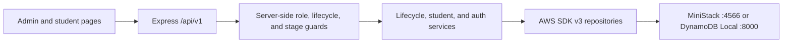

# Reproducing the V2 Local Prototype

V2 production was planned but never built. A local Node.js prototype demonstrated the intended
`apply → vet/donate → grant → learn → expire` lifecycle against an AWS-compatible local cloud. The
exact source remains at tag `legacy-v1-v2-final`; this document consolidates its runtime notes,
architecture, walkthrough, and accepted ADR outcomes.

## Retrieve and start

Requirements were Node.js 20 or newer and Docker. Check out the historical tag in isolation:

```bash
git fetch origin tag legacy-v1-v2-final
git worktree add ../stem-career-path-v2 legacy-v1-v2-final
cd ../stem-career-path-v2/demo
npm ci
cp .env.example .env
npm run cloud:up
npm run db:create
npm run db:seed
npm start
```

The application serves at <http://localhost:3000>. Seeded credentials and sample data are for local
demonstration only and must never be reused in a deployed environment.

## Prototype architecture

One Express process served the admin and student pages plus a versioned `/api/v1` API. Its routers
preserved the planned production trust zones even though they shared a process. AWS SDK v3
repositories addressed nine DynamoDB tables through `AWS_ENDPOINT_URL`; changing that endpoint
switched between MiniStack, the DynamoDB Local jar, and a future AWS account.



The local tables were `Applications`, `Members`, `Donations`, `Progress`, `StageLocks`, `Notes`,
`AuditLog`, `Curriculum`, and demo-only `DemoAuth`. Conditional writes protected lifecycle
transitions and provisioning from retries. Audit records were append-only and excluded PII.

## Accepted design decisions

### Runtime stack

Node.js, Express, AWS SDK v3, and DynamoDB semantics were chosen over Python/FastAPI, an in-memory
database, or a live AWS sandbox. The decision favored direct reuse of data-access code, simple local
startup, and faithful conditional-write behavior. The trade-off was that Express did not reproduce
Lambda isolation or API Gateway behavior.

### Local cloud

MiniStack was selected as the full local-cloud target because one MIT-licensed container covered
DynamoDB, Cognito, SQS, S3, SES, and EventBridge-compatible workflows. DynamoDB Local remained the
no-Docker/database-only fallback. `AWS_ENDPOINT_URL` was the portability boundary. The accepted risk
was relying on a younger emulator; switching endpoints was the escape hatch.

### Student interface

The polished dashboard mock was ported into the live prototype and driven by server responses.
Locked, active, and complete states remained server-derived. CSS duplication was accepted for the
small single-file demo; extracting shared styles was deferred until another branded surface or a
palette change justified it.

## API surface

| Zone | Representative routes | Enforcement |
| --- | --- | --- |
| Public | `POST /api/v1/applications`, `POST /api/v1/applications/:id/donate` | Input and age/consent validation; supporter payment simulated server-side |
| Auth | `POST /api/v1/auth/login`, `GET /api/v1/auth/me` | Demo credential store and signed token |
| Admin | `/api/v1/admin/applications/*`, `/api/v1/admin/members/*` | Admin role and conditional lifecycle transitions |
| Student | `/api/v1/app/profile`, `/api/v1/app/path`, stage submission | Student role, ACTIVE/in-window access, and sequential stage gating |
| Content | `GET /api/v1/curriculum[/:pathKey]` | Seeded curriculum reads |

Beneficiaries reached ACTIVE only after interview, approval, and administrative provisioning.
Supporters reached ACTIVE only after the server-side donation stand-in verified payment and
auto-provisioned access. The browser never decided role, access window, or stage eligibility.

## Production mapping

| Prototype | Planned AWS V2 service |
| --- | --- |
| Express trust-zone routers | API Gateway HTTP API plus `public-fn`, `app-fn`, and `system-fn` Lambdas |
| Local DynamoDB-compatible endpoint | DynamoDB on-demand with PITR, deletion protection, and TTL |
| DemoAuth and signed-token shim | Cognito User Pool with mandatory MFA and no self-signup |
| In-process provisioning | SQS to `system-fn`, the sole holder of `AdminCreateUser` |
| Curriculum table and stage view | Private S3 through CloudFront OAC and signed cookies |
| AuditLog table | Application audit table plus CloudTrail and WORM export |
| Simulated donation verification | Zeffy hosted payment plus read-only server reconciliation |

These were intentional stand-ins, not production-ready security controls. The prototype returned a
temporary login credential to make the demo usable; the planned system would create it in Cognito
and send it through SES.

## Test and walkthrough

With the local cloud running:

```bash
npm test
npm run test:e2e
npm run test:all
```

The backend suite covered schemas, GSIs, conditional transitions, idempotent provisioning,
supporter auto-grant, PII-free audit, role/access guards, curriculum, and sequential gating. The E2E
suite drove the student page with system Chromium and checked roadmap rendering, proof submission,
navigation, persistence, and accessibility.

A manual demonstration should exercise:

1. Admin login and beneficiary movement from SUBMITTED through interview, approval, and ACTIVE.
2. Supporter application, simulated donation verification, automatic provisioning, and login.
3. Both learning paths, including completion of only the currently active stage.
4. Locked-stage rejection, access expiry, extension, and revocation.
5. Audit entries for every privileged lifecycle change.

## Historical limits

The prototype did not provide production MFA, refresh-token rotation, Lambda trust isolation,
CloudFront-gated bytes, SES delivery, or real Zeffy verification. Consult
[`architecture.md`](architecture.md) and [`service-tradeoffs.md`](service-tradeoffs.md) for the
planned production controls. Do not deploy the historical demo as an application.
