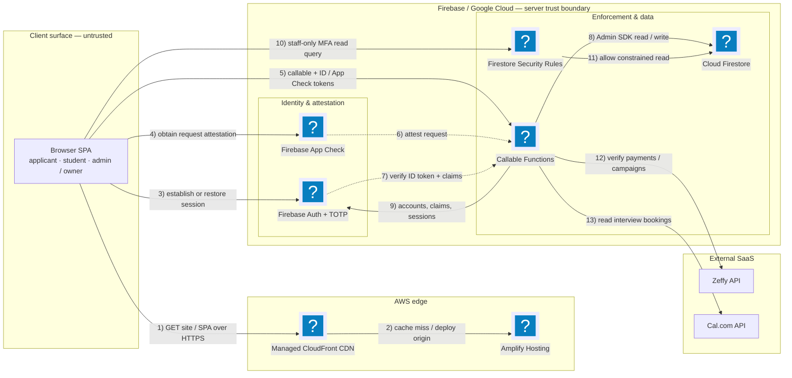

# CFG V3 — secured hosted MVP

V3 is the hosted Code For Good STEM Career Path MVP: a Vite multi-page frontend on AWS Amplify
and a Firebase Blaze backend (Auth, Firestore, and 2nd-generation Cloud Functions).

Security and test source of truth:
[`docs/Security-Verification-Walkthrough.md`](docs/Security-Verification-Walkthrough.md).
Architecture source of truth: [`docs/Architecture-V3.md`](docs/Architecture-V3.md).

## Runtime context

The numbered connections show the request and enforcement flow. Logo nodes use Mermaid's Iconify
`logos` pack; render locally with `mmdc --iconPacks @iconify-json/logos`.



| zone | implementation |
| --- | --- |
| public landing | frontend/index.html; submitApplication callable with App Check rate limit COPPA gate |
| student | frontend/app.html; callable-only dashboard curriculum and sequential stage submission |
| admin | frontend/admin.html; TOTP + App Check callables for every mutation |
| owner | role/admin roster settings and global lockdown; last-owner/self-change protections |
| backend | backend/sync-fn (the only registered Functions codebase) |
| data protection | deny-all browser writes; revocation sessionVersion; TTL; PITR production gate |
| audit | client-immutable Firestore events + structured Cloud Logging copies; locked bucket production gate |

The old `backend/functions/` directory and `docs/Spark-Backend.md` are historical references and are
not deployed.

## Install

```bash
nvm install 22
npm install --global firebase-tools@15.22.2
npm ci --prefix v3/frontend
npm ci --prefix v3/backend/sync-fn
npm ci --prefix v3/backend/admin-cli
```

## Verify locally

```bash
cd v3/frontend && npm run build && npm run test:security
cd v3/frontend && npm run test:e2e

cd v3/backend
DEBUG= firebase emulators:exec --only firestore \
  'cd admin-cli && npm run test:rules'

DEBUG= ZEFFY_API_KEY=test-key ZEFFY_API_BASE_URL=http://127.0.0.1:7777 \
firebase emulators:exec --only auth,firestore,functions \
  'cd admin-cli && npm run test:security'

DEBUG= firebase emulators:exec --only firestore,auth \
  'cd admin-cli && npm run test:flow'
```

Do not use production credentials for these tests. Full setup, baselines, expected results,
production configuration, deploy order, and read-only live checks are in the security walkthrough.

## Deploy

Production deployment is intentionally gated. Required external controls include Identity Platform
TOTP, App Check enforcement, exact CORS origins, Firebase secrets, Firestore PITR/TTL, a locked Cloud
Logging audit bucket, budget alerts, and Amplify environment variables. Follow the ordered procedure
in the security walkthrough; do not deploy individual pieces ad hoc.
