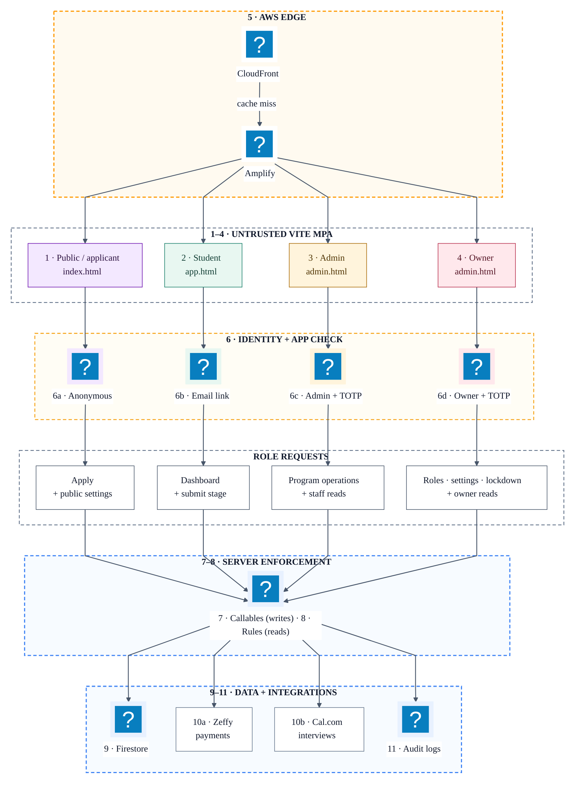
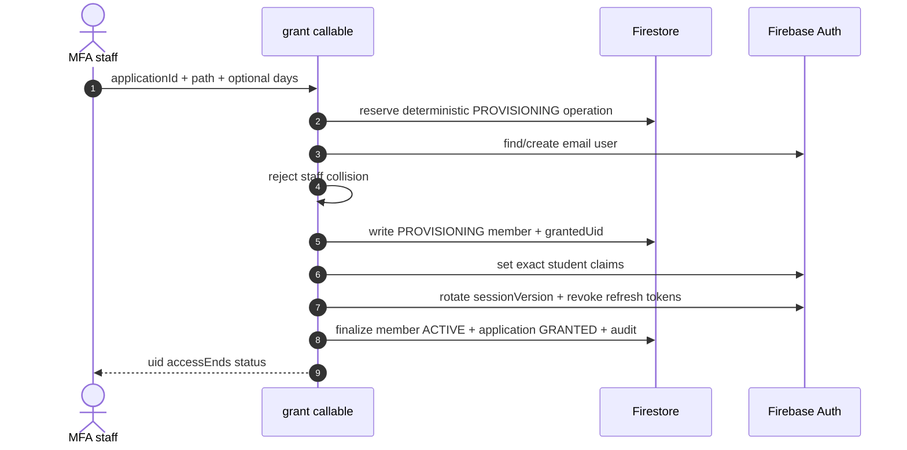

# V3 Architect Walkthrough and Defense Guide

Rev. 1 — 2026-07-01

Audience: an architect with no prior knowledge of the project. This is the presentation narrative for
the implemented V3 MVP. Use [`Implementation-Handler-Catalog.md`](Implementation-Handler-Catalog.md)
when the discussion reaches individual browser handlers, callable Functions, records, or code paths.

## 1. Start with the scope boundary

This repository contains three deliberately separate horizons:

| horizon | status | purpose | authority |
| --- | --- | --- | --- |
| V1 | built | static marketing landing page | ../../STEM Career Path Landing Page.html and ../../docs/Project SRS.md |
| V2 | planned not built | target AWS serverless learning platform | ../../docs/Platform-SRS.md and ../../docs/Architecture-Design.md |
| V3 | built and hosted | current secured MVP | README.md CLAUDE.md Architecture-V3.md and Security-Verification-Walkthrough.md |

The presentation is about V3. V2 is useful as the long-term architecture reference, but no V2
Lambda, API Gateway, Cognito, DynamoDB, SQS, S3 curriculum, or EventBridge implementation should be
claimed as running. V3 uses the requested AWS edge while Firebase owns its application backend.

One-sentence system description:

> V3 is a Vite multi-page application hosted by AWS Amplify/CloudFront, using Firebase
> Authentication, read-only browser access to Firestore, and App-Check-protected second-generation
> callable Functions as the mutation and authorization boundary.

## 2. The problem the architecture solves

Code For Good needs to accept applicants, distinguish beneficiary and supporter access, vet or
verify them, issue time-bound learning access, enforce sequential progress, let staff operate the
program, and revoke access safely. The system also handles minors, externally hosted interviews and
donations, and a very small nonprofit operations team.

The central architecture question is not “can the browser show the right button?” It is:

> Can a modified browser grant itself access, skip a learning stage, forge a donation, mutate a
> record, retain a revoked session, or escalate a staff role?

The implemented answer is server enforcement. UI state improves usability; it never grants
authority.

## 3. Runtime architecture

Service nodes use Mermaid's Iconify `logos` pack. Zone headings are aligned to the upper-left so
the eye can scan trust boundaries before following the numbered role paths.

| # | Runtime role or boundary | What it is allowed to do |
| --- | --- | --- |
| 1 | Public/applicant | Read the landing page and public settings; establish anonymous Auth; submit a server-validated application. It cannot grant access. |
| 2 | Student | Use email-link Auth; call only the dashboard, curriculum, and stage-submission paths for its own active membership. It cannot read Firestore records directly. |
| 3 | Admin | Use email-link plus confirmed TOTP; perform program operations through callables and make Rules-gated read-only queries outside lockdown. It cannot manage staff roles. |
| 4 | Owner | Inherits staff operations and additionally manages roles, public settings, account recovery, and lockdown. It remains available during lockdown for recovery. |
| 5 | Hosting edge | Serves the three Vite MPA entries and immutable hashed assets with security and cache headers. |
| 6 | Identity/attestation | Firebase Auth proves identity and claims; App Check attests the production app request. Neither replaces handler authorization. |
| 7 | Mutation API | Callable Functions validate input, re-derive state, authorize the actor, transact mutations, call integrations, and emit audit evidence. |
| 8 | Read policy | Firestore Rules allow only public settings or current MFA staff reads; every browser write is denied. |
| 9 | Application data | Firestore stores applications, members, progress, locks, donations, settings, revocations, and the operational audit index. |
| 10 | External services | Zeffy remains the payment system of record; Cal.com remains the interview schedule source. Secrets stay in Functions. |
| 11 | Tamper-resistant audit | Structured security events are routed to the production locked Cloud Logging bucket after that external deployment gate is verified. |

The deployed backend is only `backend/sync-fn`, registered as Functions codebase `sync` in
`backend/firebase.json`. `backend/functions` is historical and excluded from deployment.

## 4. Walk the app in this order

### 4.1 Public landing and application

Open `/`. Explain the eight-pillar program, the full roadmap and four-week fast track, then open the
application modal.

The browser first performs an age/consent usability gate:

- the UI offers only `13–17` and `18+`;
- a minor cannot see the full form until guardian consent is checked;
- the modal traps focus, closes with Escape, and restores focus to its opener.

On submission, the browser lazily loads Firebase, obtains an anonymous Auth session, and calls
`submitApplication`. The server repeats the important checks. It validates a strict bounded schema,
rejects under-13 input even if handcrafted, requires consent for `13–17`, normalizes and hashes the
email, limits an anonymous UID to five submissions per hour, deduplicates an email for one day,
writes server timestamps/retention, and records an audit event in one Firestore transaction.

The outcome is routing, not access:

- beneficiary → configured Cal.com interview link;
- supporter → configured Zeffy donation link.

Neither branch creates a student account or grants learning access.

### 4.2 Staff authentication

Open `/admin.html`. Staff sign in with a Firebase email link. In production an owner or admin must
also enroll and use a TOTP authenticator.

The first confirmed enrollment calls `confirmMfaEnrollment`. The server checks the actual enrolled
factor in Firebase Auth, sets the authorization claim, rotates `sessionVersion`, revokes refresh
tokens, and requires a new email-link plus TOTP sign-in. This prevents a browser from declaring its
own MFA status.

Admin/owner pages use two data paths:

| operation | path | enforcement |
| --- | --- | --- |
| read applications members donations audit settings | Firestore Web SDK | Rules require current MFA staff token and respect lockdown |
| change any lifecycle payment role lock or setting | callable Function | App Check Auth current-session MFA role validation transaction audit |

This is intentional: direct reads keep the pilot console simple, while all writes remain behind
server code. Firestore Rules deny every browser write.

### 4.3 Beneficiary approval and grant

Select a submitted beneficiary application. The console can read the applicant's nearest Cal.com
booking through `getInterview`; the API key remains a Function secret.

When staff selects a path and chooses **Approve & grant**, `grant` enters a resumable saga:

Firebase Auth and Firestore cannot share one transaction, so the code does not pretend the grant is
globally atomic. Instead it reserves `grant:<applicationId>`, persists the operation inputs, resumes
matching retries, rejects conflicting retries, and converges concurrent requests on one Auth user
and one member. This is the core reliability defense for provisioning.

The default access window is 365 days for either learning path. Staff may explicitly choose up to
3,650 days. `accessBasis` is beneficiary/supporter reporting metadata, not a permission difference.

### 4.4 Supporter payment verification

A supporter application cannot use the beneficiary grant callable. Staff supplies a Zeffy payment
ID to `confirmDonation`.

The Function re-fetches the payment from Zeffy using a server-side read-only secret and requires:

- the application exists and selected supporter access;
- payment status is `succeeded`;
- it is not refunded, disputed, failed, or canceled;
- normalized payment email equals normalized applicant email;
- the payment is not already bound to another application.

Only then does it write `verificationState=VERIFIED` and enter the same grant saga with the payment
ID. V3 stores payment references and reporting fields, never card data.

`syncDonations` imports at most ten 100-item pages per invocation, limits concurrency to one
instance, and revokes a previously granted supporter when a later sync finds a refund or dispute.
This is polling initiated by staff, not a real-time webhook; that latency is an explicit current
limitation.

### 4.5 Student sign-in and learning

Open `/app.html` and sign in with the granted email. Student startup is one
`getStudentDashboard` callable after Auth restoration. It returns the member projection, progress,
stage overrides, and server-owned curriculum.

The curriculum file exists only under `backend/sync-fn/curriculum.json`; it is not emitted into the
Amplify build. The two paths are:

| path | server stages | display duration |
| --- | --- | --- |
| fasttrack | 28 daily stages | 4 weeks (~60 hours) |
| roadmap | 8 pillar stages | 12-18 months |

The browser calculates cards, progress percentage, and the next visible stage for presentation.
Checklist ticks are only local usability state in `localStorage`. They are not completion records.

The authoritative completion action is `submitStage(stageKey, deliverableUrl)`. In one transaction
the server checks active member status and window, known stage, an existing idempotent completion,
an explicit admin lock, the natural next stage or an explicit unlock override, and an HTTPS proof
URL. It then writes completion and audit together. The browser refetches the dashboard after
success; it does not optimistically unlock the next stage.

### 4.6 Staff learning controls

The Members area reads progress and server curriculum, then presents progress and stage locks.
`setStageLock` supports:

| action | effect |
| --- | --- |
| locked | deny the stage even if naturally next |
| unlocked | allow that known stage as an explicit exception |
| auto | delete the override and return to sequential behavior |

Completed stages remain complete. Member operations refuse to target an owner or admin account.

### 4.7 Access lifecycle and session invalidation

V3 intentionally separates account sign-in state from the learning access window:

| operation | Auth effect | member effect |
| --- | --- | --- |
| disable | disable Auth and rotate/revoke session | ENDED reason=disabled |
| enable | re-enable Auth and rotate/revoke session | ACTIVE only after mistaken disable with remaining window; revoked/reversed/expired stays ENDED |
| daily reconcile | none | donationReconcile mirrors Zeffy and revokes reversed supporters every 24 hours |
| extend/restore | write future student claims | ACTIVE and clear ended/TTL fields |
| revoke | expire claims and rotate/revoke session | ENDED reason=revoked |
| daily expiry | expire claims and rotate/revoke session | ENDED reason=expired |

“Enable is not extend” is a deliberate invariant. Re-enabling an expired account restores the
ability to sign in but does not silently issue a new learning entitlement. Staff must separately
restore access. A supporter restore also revalidates that a clean verified payment still exists.

Every grant, disable, enable, revoke, staff role change, and MFA confirmation rotates a random
`sessionVersion`, revokes refresh tokens, and records the new version plus revoke time in
`revocations/{uid}`. Rules and callables compare the presented token to that record, so an already
issued token fails immediately rather than remaining usable until normal expiry.

### 4.8 Owner controls and incident response

Owners can update the public Zeffy/Cal.com links, list Auth accounts, change staff roles, enable or
disable eligible accounts, and enable system lockdown.

The hierarchy protections are server-side:

- admins cannot manage staff roles;
- nobody can change or disable their own account from the console;
- the last active owner cannot be removed;
- an owner cannot be disabled by the account-control handler;
- removing an admin's final staff role restores exact student claims only when a current ACTIVE,
  unexpired member record exists;
- the old staff token is always revoked after a role change.

Lockdown blocks non-owner sensitive Rules reads and callables. The owner remains exempt so the
system has a recovery path and can lift the lock.

### 4.9 Maintenance and break glass

`maintenanceSweep` runs every 24 hours in `America/Chicago`, expires up to 500 due active members,
deletes old anonymous Auth users with a 2,000-account safety bound, and records an audit summary.

Normal production operations use the hosted MFA/App-Check callables. `backend/admin-cli` exists for
emulator testing and explicit break glass. Against a real project it requires both:

- `CFG_BREAK_GLASS=I_UNDERSTAND_PRODUCTION_BYPASS`;
- an attributable `CFG_OPERATOR_ID`.

Partial emulator configuration and non-loopback emulator hosts fail closed. The service credential
must remain outside the repository. Owner bootstrap has a separate explicit root-access phrase.

## 5. Data model explained by responsibility

| path | responsibility | key relationships and retention |
| --- | --- | --- |
| applications/{id} | intake and grant state | emailHash applicantUid accessChoice status grantedUid provisioning expiresAt |
| members/{uid} | entitlement and selected path | applicationId accessBasis accessEnds status path expiresAt |
| members/{uid}/progress/{stageKey} | authoritative completion | status deliverableUrl completedAt |
| members/{uid}/stageLocks/{stageKey} | staff override | state locked\|unlocked updatedBy updatedAt |
| donations/{paymentId} | Zeffy mirror and verified binding | applicationId grantedUid verificationState refund/dispute fields |
| campaigns/{campaignId} | Zeffy reporting mirror | title status currency syncedAt |
| auditLog/{eventId} | client-immutable operational timeline | type actorId target IDs status/reason operationId ts |
| revocations/{uid} | immediate token invalidation | sessionVersion revokeTime expiresAt |
| rateLimits/{bucket} | per-anonymous-UID intake control | count expiresAt |
| applicationIntake/{emailHash} | per-email intake dedupe | applicationId lastSubmittedAt expiresAt |
| settings/public | public hosted links | allowlisted zeffyUrl calComUrl |
| system/lockdown | incident switch | enabled reason by at |

TTL is configured for application, member, rate-limit, intake, and revocation expiry fields. TTL
activation and Firestore point-in-time recovery are production configuration gates that must be
verified in the Firebase project; source files alone do not prove the live settings.

## 6. Decision log and defense

| decision | why | trade-off or consequence |
| --- | --- | --- |
| Keep V1 V2 V3 separate | prevents planned AWS controls from being misrepresented as implemented | reviewers must know which source of truth applies |
| AWS Amplify edge + Firebase backend | meets AWS-hosting requirement while minimizing pilot backend operations | two-cloud observability billing and portability burden |
| Vite multi-page app without React | three small surfaces need little shared client state | more manual DOM rendering but smaller migration and dependency footprint |
| Firebase email-link sign-in | avoids passwords and self-service account minting | email delivery and same-browser completion become operational dependencies |
| TOTP only for staff | protects privileged operators without SMS cost/student friction | staff enrollment and recovery need explicit runbooks |
| App Check on production callables | reduces scripted abuse from non-app clients | attestation setup/CSP must be correct and it is not a substitute for authorization |
| Deny all browser writes | removes client-side mutation bypass classes | all mutations incur Function latency and require backend handlers |
| Allow constrained staff reads | keeps pilot reporting console simple | Rules and live session revocation become critical and queries are Firebase-specific |
| Server-owned private curriculum | prevents public curriculum download and direct progress coupling | student startup depends on a callable |
| One dashboard callable | reduces student startup round trips and inconsistent snapshots | response grows with curriculum/progress size |
| Custom claims plus member re-check | fast coarse authorization plus durable entitlement verification | claim/member synchronization must be maintained carefully |
| sessionVersion revocation | invalidates already-issued tokens immediately | affected users must request a fresh email link |
| Grant saga | Auth and Firestore cannot transact together | resume/idempotency logic is more complex than a single DB transaction |
| Hosted Zeffy and Cal.com | keeps card data and scheduling out of scope | external availability/API behavior and reconciliation latency remain dependencies |
| Transactional sequential stage gate | handcrafted UI requests cannot skip stages | progress submission requires a Function transaction |
| Local checklist state only | avoids writes for non-authoritative task ticks | ticks are device-specific and may disappear |
| Owner lockdown | preserves a fast incident containment and recovery path | owner credential protection is especially important |
| Firestore audit plus locked log copy | fast in-app timeline plus tamper-resistant production record | locked logging sink/bucket is external irreversible configuration |
| TTL PITR and bounded scheduled cleanup | low-operations retention and recovery | activation must be verified and pilot bounds need scale triggers |
| Break-glass CLI with phrases and operator ID | provides recovery when hosted controls fail | long-lived local credentials require strict custody |
| Polling rather than webhook for Zeffy | smaller MVP integration surface | refund revocation is not real time and depends on a sync invocation |

### Why not implement V2 now?

V2 is a more complete AWS-native target with API Gateway, Cognito, Lambda trust splits, DynamoDB,
SQS, private S3/CloudFront curriculum, and server-side Zeffy reconciliation. V3 was chosen as a
hosted MVP with fewer operational components and an existing Firebase implementation. V3 does not
claim parity with every V2 control. Migration remains possible because the Amplify-hosted frontend
is static, but Auth claims, Firestore Rules, Firestore data access, and callable contracts are the
main Firebase coupling points.

## 7. Security argument by attempted bypass

| attempt | server-side result |
| --- | --- |
| submit under-13 with handcrafted request | submitApplication rejects failed-precondition |
| omit minor consent | submitApplication rejects |
| write Firestore from DevTools | Rules deny all writes |
| read student/member records as student | Rules deny; dashboard callable returns only own projection |
| download curriculum.json from hosting | build does not emit it and live smoke requires 404 |
| call staff Function with student token | assertStaff rejects role |
| call staff Function without TOTP | assertStaff rejects claim/factor |
| reuse old token after revoke or role change | sessionVersion/revokeTime check rejects immediately |
| grant supporter through beneficiary action | accessChoice/accessBasis mismatch rejects |
| reuse one payment for another application | payment binding transaction rejects |
| skip to a future learning stage | transactional next-stage check rejects |
| unlock stage only in DOM | server sees no stageLocks override and rejects |
| change own role or remove last owner | setRole rejects |
| mutate while lockdown is active | non-owner Rules and callables reject |
| point test CLI at a remote fake emulator | loopback validation rejects |

## 8. Reliability, performance, and cost posture

| concern | current control | scale trigger or limitation |
| --- | --- | --- |
| cold starts | small Node callables and no always-on compute | measure dashboard latency before adding minimum instances |
| student startup | one dashboard callable plus Auth restoration | curriculum growth may require versioned caching or split payload |
| admin reads | status indexes and 100-item application limit | add pagination before queues regularly exceed 100 |
| account roster | Admin SDK page size 100 and continuation token returned | owner UI follows nextPageToken |
| member dashboard | progressCompleted counter avoids N+1 reads; detail reads exact state | pre-counter members use fallback reads |
| donation sync | daily schedule and staff cursor follow-up, one instance | polling is not real-time; webhook remains tightening path |
| expiry | 500-member daily batch with per-member fault isolation | failures counted in audit summary; add checkpoint beyond pilot |
| external APIs | 10-15 second aborts and bounded pages | no circuit breaker; staff paths surface unavailable errors |
| deployment skew | lockdown then Functions/indexes then frontend then restrictive Rules | requires disciplined maintenance window |
| static performance | immutable hashed assets HTML no-store and Brotli JS budget | CI enforces current 220 KB threshold |
| cost | no always-on backend and bounded pilot operations | live billing budget/anomaly alerts remain mandatory |

## 9. Evidence and release gates

The architecture is defended by executable evidence, not only diagrams:

| gate | evidence |
| --- | --- |
| dependency/syntax | three npm audits at moderate threshold plus Node syntax checks |
| frontend security | Vite build and seven static security tests |
| landing behavior | seven Playwright Chrome scenarios |
| Firestore boundary | five Rules tests |
| callable lifecycle/security | one end-to-end suite with seventeen named subtests |
| break glass | idempotent flow regression ending ALL_PASS plus two fail-closed CLI tests |
| secret history | full-history Gitleaks in CI |
| production smoke | headers cache policy private curriculum and unauthenticated callable denial without writes |

The authoritative commands, pass baselines, production setup, ordered deployment, and release block
conditions are in [`Security-Verification-Walkthrough.md`](Security-Verification-Walkthrough.md).

Repository tests cannot prove these external production facts; verify them before claiming them:

- Identity Platform and actual staff TOTP enrollment;
- App Check registration, metrics, and enforcement for relevant Firebase products;
- exact `APP_ORIGINS` and Amplify environment variables;
- Zeffy and Cal.com Function secrets;
- active Firestore TTL policies and PITR;
- locked 365-day Cloud Logging audit bucket and working sink;
- budget/anomaly alerts and the deployed header/cache behavior.

## 10. Known limitations and honest answers

| limitation | architect-facing answer |
| --- | --- |
| Two-cloud architecture | accepted MVP trade-off; static frontend is portable but identity/data/functions are Firebase-coupled |
| No real-time Zeffy webhook | refund/dispute enforcement occurs on staff sync; define an SLA and schedule/webhook trigger before higher volume |
| Admin lists are pilot-scale | some screens read whole collections and owner roster ignores nextPageToken; pagination is the first scale fix |
| Daily expiry bounds | 500 due members per run and 2000 anonymous deletions; sufficient for pilot but must be checkpointed at scale |
| Application lifecycle is intentionally small | INTERVIEW_SCHEDULED is recognized but no current handler writes it; Cal.com booking is read externally |
| Audit immutability has two layers | Firestore is client-immutable but administrators can technically use server credentials; the locked log bucket is the tamper-resistant production record |
| External controls are not code-provable | release procedure treats them as explicit gates and requires live verification |
| No file upload | proof is an external HTTPS URL; Storage is deny-all/not registered in the active Firebase deploy |
| No automated full admin-browser E2E | backend callables and Rules are covered; landing has Playwright; admin/student visual workflows remain manual verification |
| Historical files remain in repo | README/CLAUDE/firebase.json label active sources; backend/functions and old phase plans must not be deployed |

`backend/storage.rules` contains stale historical comments about serving curriculum from the static
build. It is not registered in `backend/firebase.json`, and the current build/test baseline requires
that no public curriculum file exist. Treat the active Firebase config and secured architecture as
authoritative.

## 11. Suggested 35-minute presentation

| minutes | topic | show |
| --- | --- | --- |
| 0-3 | scope and problem | V1/V2/V3 boundary and one-sentence system description |
| 3-7 | runtime/trust model | architecture diagram and browser-vs-server rule |
| 7-11 | public intake | age/consent modal and submitApplication defenses |
| 11-17 | admin and grant | staff MFA direct-read/callable-write split and grant saga |
| 17-21 | supporter path | Zeffy verification and refund reconciliation |
| 21-26 | student path | dashboard curriculum stage proof and server sequencing |
| 26-30 | lifecycle/incident | enable-vs-extend revocation role hierarchy lockdown |
| 30-33 | evidence | security tests CI deployment gates and live smoke |
| 33-35 | trade-offs | known limitations and scale triggers |

## 12. Likely architecture questions

### Why are custom claims not enough by themselves?

Claims provide fast coarse authorization, but a current member record is re-read for student
dashboard and stage submission. `sessionVersion` also makes revocation immediate. The design uses
claims as a signed session projection, not the sole durable entitlement record.

### Why can the admin browser read Firestore directly if the browser is untrusted?

Untrusted does not mean “no access”; it means every access is independently authorized. Rules allow
only read operations for a current MFA-confirmed staff token and deny them during lockdown for
non-owners. All writes remain impossible from the browser. This is a pilot simplicity trade-off,
not a claim that browser code is trusted.

### Is App Check authorization?

No. App Check attests the calling app/environment and reduces abuse. Auth, roles, MFA,
`sessionVersion`, access windows, member state, payment verification, and transactions provide
authorization and integrity.

### What happens if grant fails halfway through?

The deterministic provisioning reservation records all grant inputs. A matching retry resumes;
conflicting work aborts. Finalization checks both application and member operation IDs. Tests cover
idempotent and concurrent grants. The system chooses a resumable saga because Auth and Firestore
cannot share a transaction.

### Can an admin make itself owner?

No. `setRole` is owner-only, self-change is denied, and the final active owner cannot be removed.
Role changes rotate the target session.

### What is the disaster-recovery story?

Code and configuration are versioned; Firestore PITR is a production gate; critical security audit
events are copied to a locked log bucket; owner lockdown contains incidents; and an attributable
local break-glass path exists. Recovery configuration must be verified in the live project before a
production-readiness claim.

### Where should this architecture evolve first?

Priorities should be triggered by evidence: schedule/checkpoint donation reconciliation when refund
latency matters; paginate/aggregate admin reads as cohorts grow; checkpoint maintenance above pilot
bounds; add admin/student browser E2E; and decide whether scale, compliance, or organizational
requirements justify migration toward the V2 AWS-native design.
