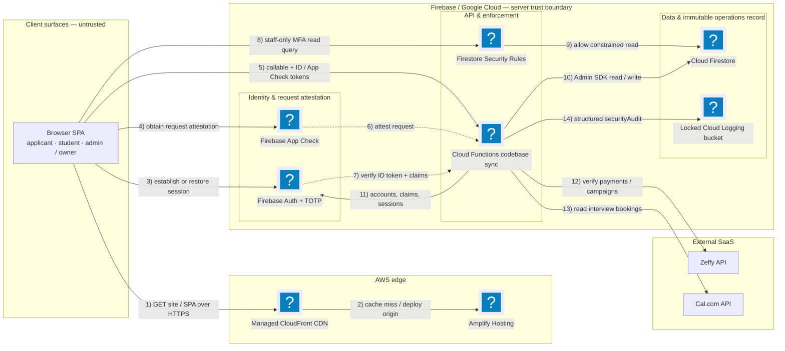
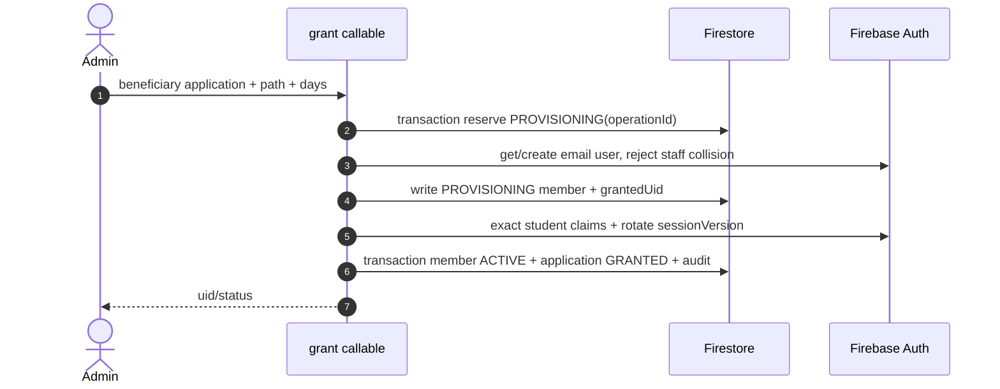

# V3 System Architecture (Rev. 3)

Current architecture for the secured hosted MVP. Security verification and deployment procedure:
[`Security-Verification-Walkthrough.md`](Security-Verification-Walkthrough.md).

## 1. Decision

V3 keeps the low-operations Amplify + Firebase stack, but the trust boundary is no longer split
between browser logic and Firestore writes. Browsers are read-only in Firestore. All intake,
progress, lifecycle, payment, settings, role, and incident mutations run through App-Check-protected
2nd-generation callable Functions.

| layer | service | responsibility |
| --- | --- | --- |
| edge | AWS Amplify Hosting + CloudFront | static Vite MPA + security/cache headers |
| browser | Firebase Web SDK | session-only Auth; memory-only Firestore; App Check token |
| identity | Firebase Auth with Identity Platform | email-link first factor + TOTP staff second factor |
| API | Cloud Functions 2nd gen Node 22 | validation authorization transitions integrations audit |
| data | Cloud Firestore | applications members progress locks payments revocations audit settings |
| external | Zeffy + Cal.com | hosted payments and interviews; keys in Functions secrets |
| operations | Cloud Logging + Firestore TTL/PITR | locked audit retention cleanup recovery |

## 2. Runtime topology

The numbered arrows show the runtime request and mutation flow. Service nodes use Mermaid's
Iconify `logos` pack; render locally with `mmdc --iconPacks @iconify-json/logos`.

## 3. Trust zones

| zone | trust | allowed |
| --- | --- | --- |
| anonymous browser | untrusted | public settings + anonymous Auth + submitApplication callable |
| student browser | untrusted authenticated | getStudentDashboard getCurriculum submitStage callables |
| staff browser | untrusted privileged | MFA + App Check callables; Rules-gated read-only admin views |
| owner browser | untrusted highest human role | staff operations + roles settings lockdown recovery |
| Functions | server trust boundary | Admin SDK mutations after in-handler checks |
| local admin CLI | break-glass root | emulator or explicit production phrase + attributable operator |
| Firestore Rules | server enforcement | deny writes; current MFA staff reads only |

No browser state, route, button, curriculum copy, stage state, accessBasis, payment signal, or
deliverable field is trusted for authorization.

## 4. Authentication and authorization

Student authorization uses custom claims `role=student`, `accessBasis`, `accessEnds`, and
`sessionVersion`. Staff uses `role=admin|owner`, `mfaEnrolled=true`, and `sessionVersion`.

Every callable:

1. Firebase verifies the ID token and App Check token.
2. `security.js` verifies role, current `sessionVersion`, access window/MFA, and lockdown.
3. The handler validates bounded input with a strict Zod schema.
4. The operation re-derives state from server data and commits conditionally.

`revocations/{uid}` carries the required random `sessionVersion`. Disable, revoke, role change,
grant, MFA confirmation, and re-enable rotate it and revoke refresh tokens. An already-issued token
therefore fails immediately without waiting for its normal expiration.

Staff TOTP enrollment is confirmed server-side from the Auth user record. The callable then sets
`mfaEnrolled=true`, rotates the session, and requires a fresh email-link + TOTP sign-in.

Removing a staff role follows the same invalidation rule. If the Auth account also has an ACTIVE,
unexpired member record, `setRole(role=none)` restores `role=student`, `accessBasis`, and `accessEnds`
from that server record. Otherwise it clears the role. It never leaves a valid returning student
without the claims required by `assertActiveStudent`.

## 5. Firestore boundary

| collection | browser read | browser write | server writer |
| --- | --- | --- | --- |
| settings/public | public | never | owner updateSettings |
| applications | MFA current staff outside lockdown | never | submit/reject/grant callables |
| members + subcollections | MFA current staff outside lockdown | never | lifecycle/student/admin callables |
| donations + campaigns | MFA current staff outside lockdown | never | Zeffy integration |
| auditLog | MFA current staff outside lockdown | never | audit helpers |
| system | MFA current staff; owner during lockdown | never | owner setLockdown |
| revocations/rateLimits/applicationIntake | never | never | security/intake handlers |

Student data and curriculum are returned through one dashboard callable. This avoids public
curriculum bytes, direct progress writes, and the previous multi-query student startup path.

## 6. Intake

`submitApplication` requires an anonymous Firebase session and production App Check. It enforces:

- strict name/email/age/access schema and length limits;
- under-13 denial;
- guardian-consent boolean and timestamp for ages 13–17;
- normalized email + SHA-256 email key;
- five submissions/hour per anonymous uid;
- one submission/day per normalized email;
- server-generated document id/timestamps;
- one-year PII expiry (90 days after rejection);
- actor-attributed audit.

## 7. Grant saga

Auth and Firestore cannot share a transaction, so grant uses a resumable saga instead of claiming
cross-service atomicity.

Retries resume the deterministic operation. Concurrent calls converge on one Auth account and one
member. A `GRANTED` application returns idempotently. Supporter applications cannot call this
beneficiary route.

## 8. Curriculum and progress

The server-owned curriculum is `backend/sync-fn/curriculum.json`; no copy is deployed by Amplify.
`submitStage` transactionally checks:

- current active student and member window;
- stage exists in the member's path;
- existing completion (idempotent success);
- explicit administrative `locked` denial;
- natural next stage or explicit `unlocked` override;
- HTTPS proof URL and bounded key/length;
- progress write and audit in the same transaction.

After a successful response, the browser refetches `getStudentDashboard`; the newly completed stage
and next naturally open stage therefore come from committed server state rather than optimistic UI.

## 9. Payments

Zeffy remains hosted; V3 stores no card data. `confirmDonation` re-fetches the payment using a
read-only secret and requires succeeded status, no refund/dispute, supporter application, matching
normalized buyer/applicant email, and one payment bound to one application. Only then is
`verificationState=VERIFIED` written and supporter grant resumed.

`syncDonations` uses bounded pages and a single instance. A refund/dispute on a payment with
`grantedUid` calls the same revocation path and records `revocationProcessedAt` idempotently.

## 10. Staff and incident controls

| control | behavior |
| --- | --- |
| owner hierarchy | admin cannot manage staff; self role/disable denied; last active owner cannot be removed |
| settings | owner-only and zeffy.com/cal.com HTTPS hosts only |
| disable | Auth disabled + session rotated + member ENDED |
| enable | Auth enabled + member ACTIVE only if window remains + new session rotation |
| extend/restore | active or ended enabled member receives a future window + ACTIVE state; reversed supporter payment remains denied |
| remove staff role | active unexpired member regains exact student claims; otherwise staff claims are cleared; old staff token is revoked |
| revoke | expired claim + new sessionVersion + refresh-token revoke + member ENDED |
| lockdown | all non-owner sensitive Firestore reads and callables denied; owner can investigate/lift |
| break glass | service credential outside repo + exact phrase + operator uid; normal UI uses callables |

## 11. Audit, retention, and recovery

Every privileged mutation records IDs/status/reason codes and actor uid without immutable PII.
Firestore audit events are client-immutable and optimized for the admin timeline. The same events are
JSON structured logs. Production routes `jsonPayload.securityAudit:*` to a 365-day locked Cloud
Logging bucket; this is the tamper-resistant record.

Firestore TTL covers application/member expiry and ephemeral rate/revocation metadata. A daily
scheduled function expires due members and removes anonymous Auth accounts older than seven days.
Firestore PITR and budget alerts are mandatory external configuration gates.

## 12. Reliability and scale

| concern | control |
| --- | --- |
| function abuse | App Check + role/MFA + rate limits + maxInstances |
| external latency | 15-second aborts and bounded pages |
| Zeffy concurrency | syncDonations maxInstances=1 |
| admin account listing | 100-user pages with continuation token |
| student startup | one dashboard callable returns member progress locks curriculum |
| partial grant | resumable PROVISIONING operation |
| scheduled cleanup | maintenanceSweep maxInstances=1 |
| deployment skew | owner lockdown + Functions/indexes → frontend → Rules ordered rollout |
| dependency supply chain | lockfiles npm audit and full-history Gitleaks CI gates |

The two-cloud stack remains an operational trade-off: Amplify provides the requested AWS edge while
Firebase owns identity/data/functions. Static hosting is portable; Auth, Rules, and direct Firestore
admin reads are Firebase-specific. No React/framework migration is required for this pilot.

## 13. Latency posture

- Hashed assets are immutable-cached; HTML is `no-store/no-cache` to prevent deployment skew.
- Student startup is one Auth restoration plus one dashboard callable rather than member → progress
  → locks → public curriculum sequencing.
- Scale-to-zero functions can cold-start; admin operations tolerate this, while dashboard functions
  are bounded to one member and two small subcollections.
- Current static security baseline caps total Brotli JavaScript at 220 KB and the logo at 300 KB.
- The CSP permits both Firebase App Check token endpoints, including
  `content-firebaseappcheck.googleapis.com`; removing either breaks production callable attestation.
- External Zeffy/Cal calls are staff-only, timed out, and never on student rendering paths.

## 14. Deferred/non-runtime references

`backend/functions/`, `docs/Spark-Backend.md`, `docs/V3-Plan.md`, `docs/MVP-Plan.md`, and phase plans
describe earlier design stages. They are not deployment sources. `backend/firebase.json` registers
only `backend/sync-fn`.
