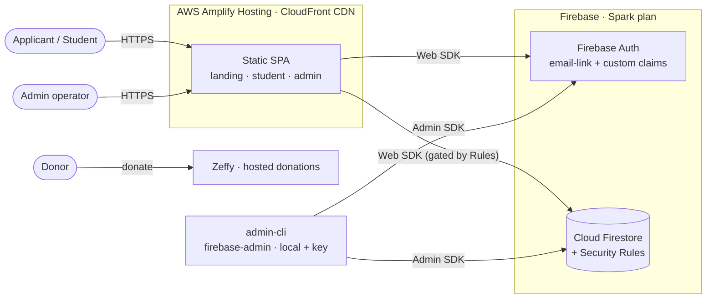
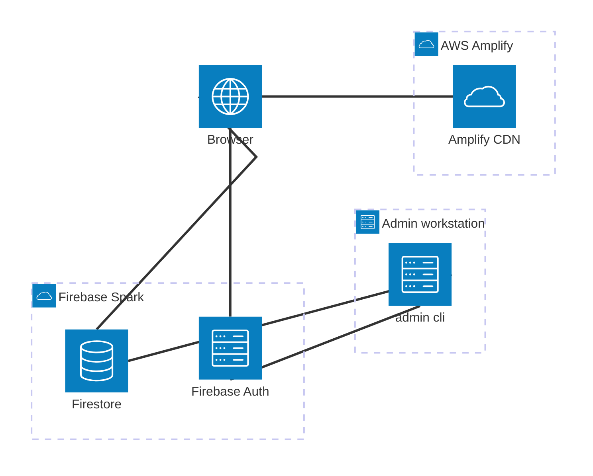
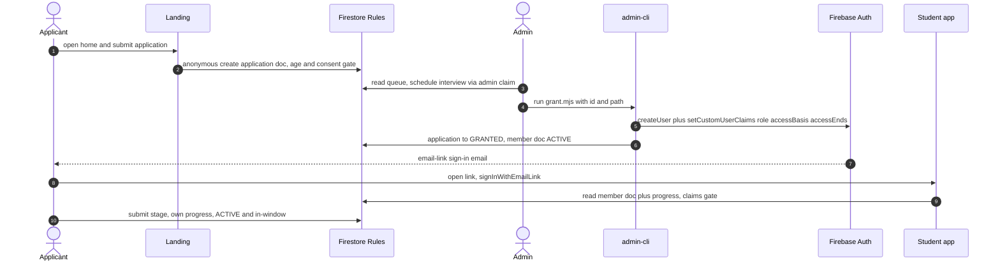
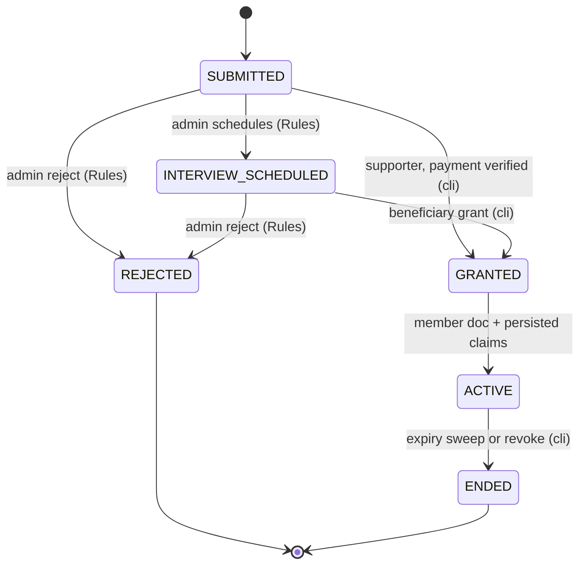
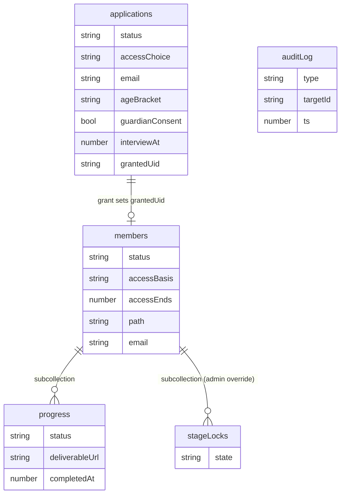
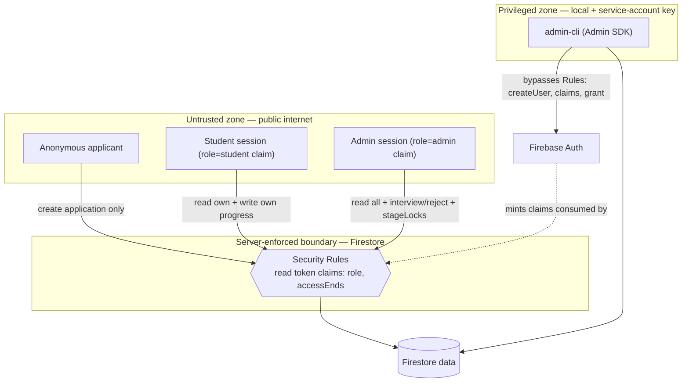
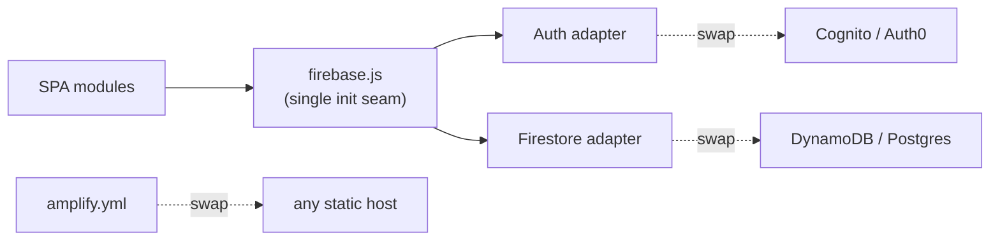
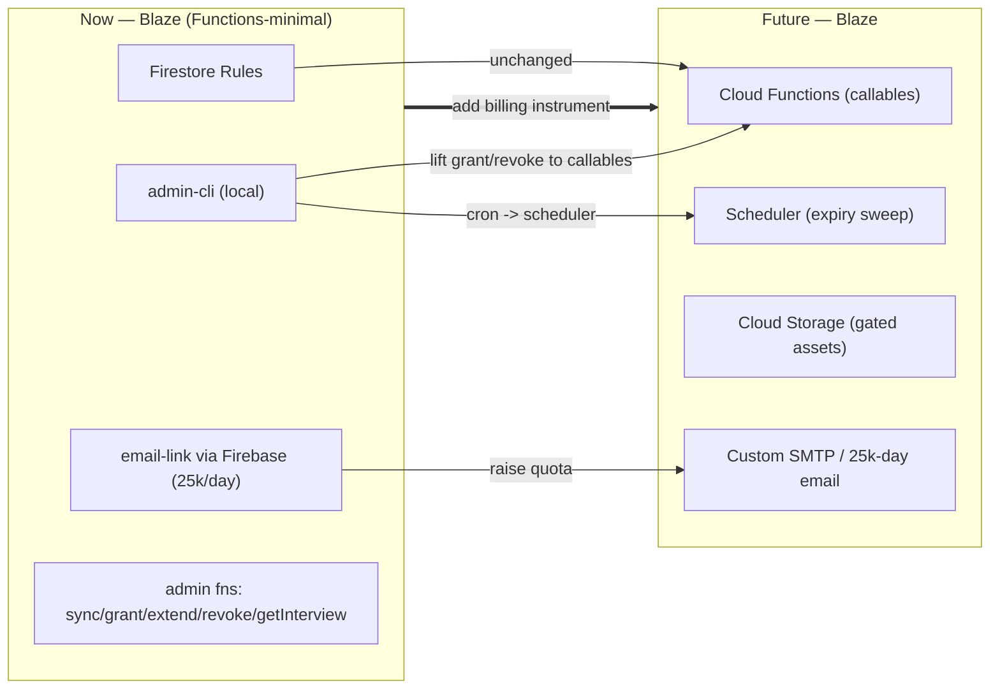

# V3 System Architecture (Rev. 1)

Architecture reference for the **V3 hosted MVP** of the Code For Good STEM Career Path platform.
Written for engineers and reviewers; every diagram below is validated headless with `mmdc` (Mermaid
CLI) so it renders. Source-of-truth for behavior: [`Spark-Backend.md`](Spark-Backend.md); install /
configure / test: [`Setup-Guide.md`](Setup-Guide.md); agent guide: [`../CLAUDE.md`](../CLAUDE.md).

> **One-line thesis.** Push the trust boundary into **Firestore Security Rules** (server-enforced,
> free) and keep every privileged authority — account-minting, role claims, the lockdown kill-switch,
> and secret-backed integrations — in **admin/owner-gated Cloud Functions plus a local Admin-SDK CLI**,
> never the browser. A static frontend on **AWS Amplify** + **Firebase (Blaze)** delivers a vetted-access
> learning platform at ~$0, with the V2 security model intact and an **owner > admin > student** tier on top.

---

## 1. Context & goals

```csv
goal,how V3 meets it,measure
$0 / no-card pilot,Amplify free tier + Firebase Spark (Firestore+Auth); no always-on compute,monthly bill = $0
keep V2 trust model,server-side enforcement via Rules + claims; account-minting CLI-only,no client can mint accounts or self-grant
ship fast,static SPA + managed backend; no infra to operate,apply→grant→learn live + E2E-tested
portable,thin seams over Auth/DB; Blaze upgrade path preserved in functions/,migrate without a frontend rewrite
```

Non-goals (this horizon): always-on API, real-time fan-out, multi-region, SSO/MFA at launch. Each
has a documented re-entry path (§9–§10). **Exception:** a small set of on-demand, admin-gated Cloud
Functions (`syncDonations`, `getInterview`, `grant`, `extendAccess`, `revokeAccess`) is deployed on
Blaze — all scale-to-zero (no always-on compute). They keep the Zeffy/Cal.com keys server-side and run
the Admin-SDK privileged ops (account-minting + claims) that cannot run in the browser (§11a).

---

## 2. System context (C4 level 1)



---

## 3. Deployment topology — icon group

Built-in Mermaid `architecture-beta` icons (`internet`/`cloud`/`server`/`database`) so it renders
without an external icon pack. For brand icons, render with `mmdc --iconPacks @iconify-json/logos`
and swap to `logos:aws-amplify`, `logos:firebase`, etc.



---

## 4. Numbered end-to-end flow (apply → grant → learn)



---

## 5. Access lifecycle state machine

Server-set; every transition to a privileged state runs through the admin-cli or a Rules-gated
admin write. No path reaches `ACTIVE` without an admin grant (beneficiary) or verified payment (supporter).



---

## 6. Data model (Firestore)



Read-light by design: a student renders from `members/{uid}` + its `progress` subcollection (≤3
reads); curriculum is a static bundle (0 reads); the admin overview uses Firestore aggregation
counts. Indexes: composite `(status, createdAt)` on applications, `(status, accessEnds)` on members.

---

## 7. Security architecture & trust boundaries



Security invariants (enforced, not aspirational):

```csv
invariant,enforcement
only the admin-cli mints accounts / sets role claims,no hosted or browser code calls createUser/setCustomUserClaims
browser admin limited to non-minting writes,Rules allow admin claim to set INTERVIEW_SCHEDULED/REJECTED + stageLocks only
apply behind age/consent gate,Rules reject under-13 and 13-17 without guardian consent (and bad shapes)
student writes only own progress while ACTIVE,Rules: request.auth.uid == uid && role==student && accessEnds > now
protected collections client-read-only,members/counters/donations/auditLog writable only via Admin SDK; auditLog append-only
service-account key never committed,gitignored (*adminsdk*.json etc.); emulator path needs no key
supporter ACTIVE requires verified payment,verifyDonation fails closed; never trusts a client claim
```

Known operational limit: email-link sign-in emails are **5/day on Spark** (Blaze 25,000/day);
mitigations in §10.

---

## 8. Technology choices & trade-offs (ADR digest)

```csv
decision,chosen,alternatives,trade-off accepted
hosting (frontend),AWS Amplify (Git-connect CDN),Firebase Hosting · S3+CloudFront,2-vendor split (Amplify+Firebase) for the user's stated stack; CORS + 2 consoles
backend plan,Firebase Spark (no card),Blaze · all-AWS (V2),no Cloud Functions/Storage; trust boundary moves to Rules + local CLI
enforcement,Firestore Security Rules + claims,app-server checks · API gateway,gating logic split across Rules + client; complex sequencing relaxed
privileged ops,local firebase-admin CLI,deployed system-fn (Blaze),not always-on; admin runs commands (fine at pilot scale)
auth,passwordless email-link,password · OAuth,depends on Firebase email quota (5/day Spark); no password store
build,Vite multi-page (vanilla JS),React/Next,tiny bundle, no framework runtime; manual DOM in 3 SPAs
data,Firestore (denormalized, read-light),DynamoDB (V2) · SQL,per-doc read billing; no joins; aggregation for counts
```

---

## 9. Portability (exit costs & seams)



```csv
concern,portability posture
frontend host,plain static build (dist/) — movable to any CDN; only amplify.yml is host-specific
auth,all SDK use funnels through src/firebase.js + lib/auth.js — one seam to repoint
data access,reads/writes are localized in app.js/admin.js/landing.js; Firestore-specific calls are shallow
privileged ops,admin-cli is plain Node + Admin SDK — portable to any runner (laptop, CI, Cloud Run on Blaze)
curriculum,static JSON — portable verbatim; same content powers V1/V2/demo
lock-in risk,Security Rules language is Firebase-specific (would be re-expressed as server checks on migration)
```

---

## 10. Future expansion & merge to Blaze

The `functions/` directory is a **build-ready Blaze reference** (not deployed). Upgrading is additive
— Rules stay; the local CLI logic lifts into callables/triggers; email + scheduling become managed.



```csv
trigger to upgrade,what unlocks
>5 email-link sign-ins/day,Blaze raises to 25k/day (or generate links via Admin SDK: 20k/day, send via own SMTP)
need an always-on API,deploy functions/ (callables) — students/admin call instead of writing Firestore directly
gated curriculum bytes,Cloud Storage + signed URLs (Storage needs Blaze on new projects)
scheduled expiry without a laptop,EventBridge-style Scheduler trigger replaces the manual expiry-sweep
MFA / SSO,Firebase MFA + App Check (config-only on Blaze/Identity Platform)
```

---

## 11. Scalability, cost & ops

```csv
dimension,posture at pilot,scale lever
cost,~$0 (Blaze + Amplify free tier); a few scale-to-zero admin functions (§11a),Blaze pay-as-you-go; read-light model keeps Firestore reads tiny
reads,student ≤3 reads/view; curriculum 0 reads (static); admin counts via aggregation,denormalized rollups if views grow
writes,apply (1) · stage submit (1) · admin overrides (small),batch + transactions already used for idempotency
availability,managed (Amplify CDN + Firebase SLA); no self-run compute,multi-region is a Firebase/Amplify config
observability,Firebase console (Auth/Firestore usage) + auditLog (PII-free),add Cloud Logging/metrics on Blaze
recovery,Firestore PITR (enable) + rules/code in git,IaC (functions via SAM/Firebase deploy) on upgrade
```

### 11a. Deployed admin Cloud Functions (cost & constraints)

The admin console's privileged actions run as **admin-claim-gated 2nd-gen callables** on **Blaze**,
all in one codebase (`v3/backend/sync-fn`, codebase `sync`, nodejs22) so `firebase deploy --only functions`
never touches the unrelated `functions/` reference design. They mirror the local `admin-cli` scripts,
which remain an equivalent fallback.

```csv
function,gate,job,secret
syncDonations,staff,Zeffy payments + campaigns → Firestore (Donations Refresh); persists campaigns/{id} so the name shows with 0 payments,ZEFFY_API_KEY
getInterview,staff,reads the applicant's self-booked Cal.com slot for the interview modal,CAL_API_KEY
grant,staff,account-minting: createUser + role/window claims + member doc (Approve & grant),—
extendAccess,staff,push out a member's access window + claim (no re-login); refuses staff targets,—
revokeAccess,staff,end a member + expire claim + revoke refresh tokens; refuses staff targets,—
setRole,owner,manage the admin/owner roster (admin|owner|none); cannot target self,—
disableAccount,staff,block sign-in + kill sessions of a compromised account (admin→students only; owner→anyone but an owner),—
enableAccount,staff,re-enable a disabled account (same targeting rules),—
setLockdown,owner,global kill-switch: writes system/lockdown; blocks every non-owner fn + client write until lifted,—
```

Role tiers: **owner > admin > student** (custom claim `role`). "staff" = admin or owner; owner-gated
functions fail closed unless `role=='owner'`, so an admin can never promote/demote anyone, lift a
lockdown, or disable an admin/owner. The first owner is minted **local-only** via `admin-cli/make-owner.mjs`
(a root of trust hosted code can't forge). When `system/lockdown.enabled`, both the functions
(`assertNotLockedDown`) and Firestore Rules (`notLocked()`) deny all non-owner activity.

```csv
constraint,detail
why functions at all,the Zeffy + Cal.com keys are secrets (server-side only); grant/extend/revoke need the Admin SDK (createUser + setCustomUserClaims) which cannot run in the browser
auth,fail-closed on EVERY fn — rejects unless the caller's verified custom claim role==admin (HttpsError permission-denied)
invariant change,this relaxes the earlier 'no hosted account-minting' rule (we are on Blaze now); bounded by the admin gate + idempotent/conditional writes; the browser client still cannot createUser or set role claims
idempotent,grant only from SUBMITTED/INTERVIEW_SCHEDULED; donations upsert-merge on payment id
scale-to-zero,min instances = 0 → no idle cost; one invocation per admin click
secret handling,defineSecret('ZEFFY_API_KEY'|'CAL_API_KEY'); set once via `firebase functions:secrets:set <NAME>` — not in git/config
deploy scope,codebase "sync" → `firebase deploy --only functions:sync` (reference functions/ stays undeployed)
```

Cost: effectively **$0** at pilot scale. The Cloud Functions perpetual free tier (2M invocations,
400K GB-seconds, 200K vCPU-seconds, 5 GB egress per month) dwarfs an admin-only refresh hit a few
times a day. The only non-zero items are tiny: **Artifact Registry** storage for the function's
container image (~$0.10/GB-month; often inside the free 0.5 GB) and **Cloud Build** on deploy (120
free build-minutes/day). Realistic bill: **$0, occasionally a few cents/month.** Blaze's runaway-cost
risk is bounded here because the function is admin-claim-gated and scale-to-zero.

---

## 12. Risks & mitigations

```csv
risk,severity,mitigation
email quota (5/day Spark),medium,Blaze done (25k/day); link-generation fallback documented
cross-cloud split (Amplify+Firebase),low,single init seam; CORS locked to the Amplify origin; both managed
Rules gaps (logic in two places),medium,rules-unit tests (planned) + live E2E (apply/grant/read verified)
service-account key exposure,high,gitignored + never pasted; rotate via console if leaked; emulator for dev
relaxed sequential gating,low,admin stageLocks override; strict gating returns with Functions (Blaze)
single admin operator,low,bootstrap more admins via make-admin; CLI is portable to CI later
```

---

## Appendix — diagram validation

All Mermaid blocks above are validated headless with `mmdc` (see `../CLAUDE.md` → "Render/validate
a Mermaid diagram headless"). Re-validate after edits:

```bash
# extract each ```mermaid block to /tmp/dN.mmd and run mmdc with the snap-Chromium puppeteer config
```
