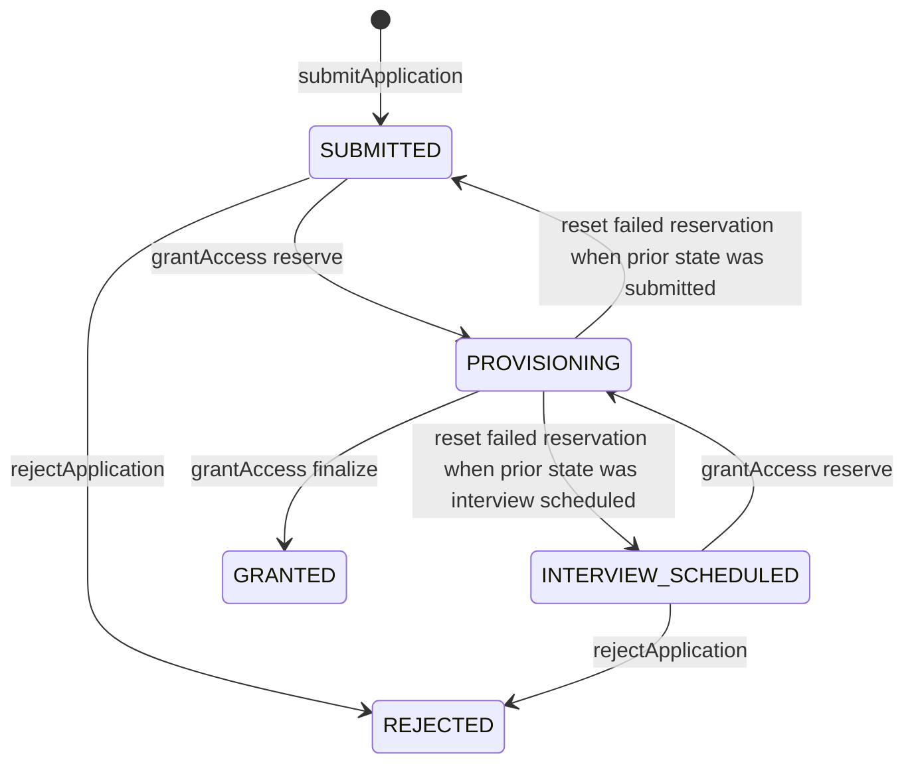

# V3 Implementation and Handler Catalog

Rev. 1 — 2026-07-01

Purpose: code-level companion to
[`Architect-Defense-Guide.md`](Architect-Defense-Guide.md). It maps every active surface, browser
handler, callable Function, shared enforcement module, operational command, and important record to
its responsibility. Paths are relative to `v3/` unless stated otherwise.

The frontend has no React/Vue component framework. “Component” below means an HTML region plus the
JavaScript renderer/event handlers that own it.

## 1. What is active

| area | active source | entry or deployment |
| --- | --- | --- |
| public browser | frontend/index.html + frontend/src/public | landing.js and ui.js |
| student browser | frontend/app.html + frontend/src/student/app.js | Vite MPA app entry |
| admin/owner browser | frontend/admin.html + frontend/src/admin/admin.js | Vite MPA admin entry |
| shared browser runtime | frontend/src/firebase.js + frontend/src/lib | modular Firebase Web SDK |
| backend API | backend/sync-fn/index.js | Firebase codebase sync Node 22 |
| database policy | backend/firestore.rules + firestore.indexes.json | Firebase Rules/index deploy |
| hosting | repo-root amplify.yml + customHttp.yml | AWS Amplify monorepo build/headers |
| operations | backend/admin-cli | emulator tooling and explicit production break glass |
| tests | frontend tests/scripts + backend/admin-cli/test | Playwright static Rules callable and flow suites |

Inactive references: `backend/functions`, `docs/Spark-Backend.md`, `docs/V3-Plan.md`,
`docs/MVP-Plan.md`, and phase plans. `backend/storage.rules` is not registered by the active
`firebase.json`.

## 2. Deployed callable API inventory

All callable Functions use `us-central1`, exact production CORS origins, production App Check,
256 MiB memory, ten max instances, and a 30-second timeout unless the row says otherwise.

| callable | caller | input | output | reads/writes | principal enforcement |
| --- | --- | --- | --- | --- | --- |
| submitApplication | anonymous applicant | name email ageBracket guardianConsent accessChoice optional stage track reason | applicationId status next | applications rateLimits applicationIntake auditLog | anonymous current token strict schema COPPA consent limits dedupe transaction |
| grant | admin or owner | applicationId path default fasttrack days default 365 | uid accessEnds path status idempotent | applications members donations auditLog + Auth | staff MFA current token beneficiary-only resumable saga max 60s/5 instances |
| rejectApplication | admin or owner | applicationId reasonCode | applicationId status | applications auditLog | staff MFA allowed source state transaction |
| getCurriculum | active student or staff | none | curriculum | server JSON | student window/member or staff MFA |
| getStudentDashboard | active student | none | member progress locks curriculum | members/{self} subcollections | student role current token future claim and ACTIVE future member |
| submitStage | active student | stageKey deliverableUrl | stageKey status idempotent | member progress lock auditLog | known stage HTTPS active window sequential/override transaction |
| syncDonations | admin or owner | optional cursor | synced revoked campaigns nextCursor truncated | Zeffy campaigns donations members Auth auditLog | staff MFA bounded 10 pages max 120s/1 instance |
| confirmDonation | admin or owner | applicationId paymentId path days | grantAccess result | Zeffy applications donations members Auth auditLog | staff MFA clean settled email match unique payment max 60s/5 instances |
| getInterview | admin or owner | applicationId | booking count | applications + Cal.com | staff MFA server secret future noncancelled booking max 20s/5 instances |
| confirmMfaEnrollment | admin or owner with enrolled factor | none | confirmed reauthenticationRequired | Auth revocations auditLog | current staff token actual enrolled factor then session rotation |
| setStageLock | admin or owner | uid stageKey action locked\|unlocked\|auto | uid stageKey state | member stageLocks auditLog | staff MFA target not staff member exists transaction |
| updateSettings | owner | zeffyUrl calComUrl | normalized settings | settings/public auditLog | owner MFA exact HTTPS root/subdomain allowlists |
| extendAccess | admin or owner | uid days | uid accessEnds | member donations Auth auditLog | staff MFA target not staff enabled supporter payment validity transaction |
| revokeAccess | admin or owner | uid | uid status | members Auth revocations auditLog | staff MFA target not staff |
| disableAccount | admin or owner | uid | uid disabled | Auth members revocations auditLog | no self admin student-only target owner denied |
| enableAccount | admin or owner | uid | uid disabled memberStatus | Auth members revocations auditLog | only mistaken disable with future window restores ACTIVE; revoked/reversed/expired remains ENDED |
| listAccounts | owner | optional pageToken | accounts nextPageToken | Auth first 100 + member status + auditLog | owner MFA |
| setRole | owner | uid role admin\|owner\|none | uid effective role reauthenticationRequired | Auth members revocations auditLog | owner MFA no self last-owner protection server-derived student restoration |
| setLockdown | owner | enabled optional reason | enabled reason | system/lockdown auditLog | owner MFA allowed during lockdown transaction |

Scheduled export:

| handler | schedule | work | bounds |
| --- | --- | --- | --- |
| maintenanceSweep | every 24 hours America/Chicago | expire due active members and delete anonymous Auth users older than 7 days | 500 members 2000 anonymous deletions maxInstances=1 timeout=540s |
| donationReconcile | every 24 hours America/Chicago | bounded Zeffy mirror and reversed-supporter revocation | five continuation batches maxInstances=1 timeout=300s secret-bound |

## 3. Backend modules and internal handlers

### `backend/sync-fn/index.js`

Pure export manifest. Its exports are the deployed API. If a handler is not exported here, it is not
deployed from this codebase.

### `src/config.js`

| symbol | responsibility |
| --- | --- |
| callableOptions | central region CORS App Check instance memory and timeout policy |
| IS_EMULATOR | only supported switch for emulator relaxations |
| retention constants | application rejected member rate-limit and revocation TTL calculations |
| access constants | 365-day default 3650-day maximum and 10-page sync bound |

Production CORS defaults to the current Amplify branch origin unless `APP_ORIGINS` is provided.
Production deployment must set every real origin explicitly.

### `src/security.js`

| handler | responsibility | failure condition |
| --- | --- | --- |
| roleOf | read signed role claim | no role returns null |
| assertAuthenticated | require Firebase Auth UID | unauthenticated |
| assertCurrentToken | compare sessionVersion and auth_time with revocations/{uid} | old/mismatched token becomes unauthenticated |
| assertNotLockedDown | allow owner or require lockdown off | non-owner receives unavailable |
| assertStaff | require current admin/owner TOTP actual factor and optional owner role | permission denied or lockdown |
| assertStaffMfaBootstrap | bind a real enrolled factor to mfaEnrolled claim | not staff disabled missing factor or lockdown |
| assertActiveStudent | require current student claim future accessEnds and no lockdown | permission denied |
| assertAnonymousApplicant | require current anonymous provider outside emulator | permission denied |
| assertTargetNotStaff | protect privileged accounts from member operations | permission denied |
| recordSessionRevocation | rotate sessionVersion revoke refresh tokens and write revokeTime/TTL | returns revokeTime |

`assertCurrentToken` is duplicated conceptually in Firestore Rules so direct staff reads and
callables use the same current-session condition.

### `src/validation.js`

`parse` converts strict Zod failures into bounded `invalid-argument` callable errors.
`normalizeEmail` trims and lowercases email before comparison or hashing.

### `src/lifecycle.js`

| handler | role in lifecycle |
| --- | --- |
| submitApplication | server-authoritative intake and transactional rate/dedupe/audit write |
| getOrCreateStudent | convergent Auth lookup/create by email |
| resetFailedProvisioning | returns a matching failed reservation to its prior application state |
| grantAccess | shared beneficiary/supporter saga implementation |
| grant | staff beneficiary wrapper over grantAccess |
| rejectApplication | staff terminal rejection with shorter PII TTL |
| ensureMemberTarget | shared existence plus non-staff target check |

Application transitions currently implemented:

No active handler sets `INTERVIEW_SCHEDULED`; Cal.com remains externally authoritative and is read
through `getInterview`.

### `src/student.js`

| handler | details |
| --- | --- |
| safeProofUrl | requires HTTPS except HTTP loopback for local development |
| activeMember | rechecks durable ACTIVE state and future accessEnds |
| getCurriculum | returns server curriculum to active student or current MFA staff |
| getStudentDashboard | returns own member projection progress locks and curriculum in one call |
| submitStage | transactional known-stage sequential/override completion and audit |

### `src/admin.js`

| handler | details |
| --- | --- |
| requireAllowedHost | normalizes credentials out of URL and restricts HTTPS root/subdomains |
| activeOwnerCount | pages Auth users until enough active owners are known |
| confirmMfaEnrollment | confirms real factor then rotates session |
| setStageLock | writes/deletes explicit stage override with audit in transaction |
| updateSettings | owner-only Zeffy/Cal public link update |
| assertSupporterExtensionEligible | requires clean currently verified payment before supporter restore |
| extendAccess | extends from later of now/current end and reactivates entitlement |
| revokeStudent | shared revoke/expire/payment-reversal implementation |
| revokeAccess | staff wrapper for manual revoke |
| disableAccount | disables Auth and ends any member |
| enableAccount | re-enables Auth; only mistaken disable with future window restores ACTIVE |
| listAccounts | owner roster page joined to member status |
| setRole | owner hierarchy and server-derived returning-student claim restoration |
| setLockdown | owner incident switch available during lockdown |

### `src/integrations.js`

| handler | details |
| --- | --- |
| externalJson | fetch wrapper with abort and fail-closed non-2xx handling |
| refunded | normalizes dispute/refund/failure/cancel reversal conditions |
| loadCampaigns | bounded Zeffy campaign pagination and Firestore mirror |
| runDonationSync/syncDonations | bounded payment mirror core plus staff callable wrapper |
| runScheduledDonationReconcile/donationReconcile | bounded cursor-following scheduled mirror and revocation |
| confirmDonation | live payment verification and unique binding before supporter grant |
| getInterview | nearest eligible Cal.com booking lookup by applicant email |

Secrets `ZEFFY_API_KEY` and `CAL_API_KEY` are attached only to handlers that need them. Emulator base
URL overrides are honored only when `FUNCTIONS_EMULATOR=true`.

### `src/audit.js`

| handler | use |
| --- | --- |
| auditData | allowlisted event projection without arbitrary/undefined fields |
| queueAudit | create audit record inside caller transaction |
| writeAudit | standalone Firestore event followed by structured Cloud Logging copy |
| logCommittedAudit | structured log after a transaction containing queueAudit commits |

Audit fields are IDs/status/reason/operation metadata, not full application/member snapshots.

### `src/curriculum.js` and `curriculum.json`

`stagesFor`, `stageKeys`, `nextOpenStage`, and `isKnownStage` are server helpers. The file has 28
fast-track stages and 8 roadmap stages. The backend file is the only active curriculum source.

## 4. Public browser handlers

### `frontend/src/public/ui.js`

| handler | event/effect |
| --- | --- |
| mobile nav IIFE | button click link click Escape toggles data-open and aria-expanded |
| sticky header IIFE | passive scroll toggles compact/scrolled state after 12px |
| program dropdown IIFE | click outside click Escape and link click synchronize hidden/data-open/aria-expanded |
| FAQ IIFE | one disclosure open at a time with generated aria-controls and hidden panels |

### `frontend/src/public/landing.js`

| handler | event/effect |
| --- | --- |
| setPageInert | removes background regions from interaction while modal is open |
| updateEligibility | shows consent for minor and reveals form only after supported age/consent |
| openModal/closeModal | manage dialog state body scroll background inertness and focus return |
| trapModalFocus | cycles Tab within dialog and closes on Escape |
| signup/login listeners | open application dialog or route to app.html |
| loadPublicLinks | dynamically reads settings/public and falls back to embedded safe links |
| showMessage | creates/focuses assertive error region |
| makeExternalAction | creates noopener/noreferrer new-tab action with screen-reader context |
| showSubmitted | routes supporter to Zeffy or beneficiary to prefilled Cal.com |
| form submit listener | repeats client validation lazily imports apply.js calls backend and renders generic failure |

### `frontend/src/public/apply.js`

`apply(form)` obtains/reuses an anonymous Firebase session, projects trimmed fields, and invokes
`submitApplication`. It is a transport adapter; it does not decide eligibility.

The former unreferenced donate helper was removed; donation routing remains in active public entry
handlers.
The active donation links come from `index.html`, `settings/public`, and `landing.js` fallbacks.

## 5. Shared browser handlers

### `frontend/src/firebase.js`

| responsibility | implementation |
| --- | --- |
| configuration | Vite VITE_FB_* public identifiers |
| App Check | reCAPTCHA Enterprise with automatic token refresh outside emulator |
| Firestore | memoryLocalCache so sensitive records do not persist in IndexedDB |
| Auth | browserSessionPersistence so tab close removes session |
| Functions | regional callable client |
| emulators | explicit loopback Auth 9099 Firestore 8080 Functions 5001 only when VITE_USE_EMULATORS=true |

The production build preflight rejects missing Firebase/App Check identifiers and rejects emulator
mode. Runtime also logs a fail-closed configuration error when a production build lacks App Check;
callables themselves enforce attestation.

### `frontend/src/lib/auth.js`

| handler | responsibility |
| --- | --- |
| storeEmail/loadEmail/clearSignInState | 15-minute same-browser email-link completion context |
| ensureAnonymous | establish applicant identity for rate limiting/audit |
| requestSignInLink | send Firebase email link returning to the same page |
| resolveTotpSignIn | complete required second factor with enrolled TOTP hint |
| requestTotpEnrollmentCode | accessible QR/manual-key dialog validation copy fallback and focus handling |
| completeSignInIfPresent | finish email link then resolve TOTP if required and scrub URL |
| enrollTotpMfa | create TOTP secret display QR and enroll factor |
| hasEnrolledMfa | local factor-presence check before enrollment UI |

### Other shared modules

| module | handler | purpose |
| --- | --- | --- |
| lib/cache.js | loadCurriculum | session-memory cache for staff curriculum callable |

## 6. Student browser handlers

File: `frontend/src/student/app.js`.

| handler | responsibility | authority |
| --- | --- | --- |
| refetch | get one dashboard payload from callable | server data |
| buildView | join curriculum/progress/locks into display state | display only |
| loadTicks/saveTicks | store checklist indices in localStorage | non-authoritative usability state |
| login/logout | email-link request or Auth sign-out | Auth transport |
| boot | load dashboard identity/access presentation and render | server call decides access |
| showInactive | render safe unavailable/ended message | presentation |
| loadPath | refetch and rerender after mutation | server data |
| renderPath | render progress stats navigation cards hero detail and ladder | presentation |
| featuredStage/checkedReqStates/heroChecklistHtml | choose/display current work | presentation |
| renderHero/renderWeeks/renderStageCards/renderStageDetail | component renderers | presentation |
| wireStageForm | require visible checklist and proof input before submit | client usability only |
| openStage/wireStageLinks/wireAccordions | hash navigation keyboard and disclosure behavior | presentation |
| renderLadder | visual progress ladder | presentation |
| submitStage | normalize URL invoke callable refetch then clear local checks | server mutation |
| normalizeUrl | add https scheme and require HTTP(S) client-side | server repeats stricter validation |
| openMenu/closeMenu | mobile sidebar state and aria-expanded | presentation |
| Auth bootstrap | complete link or react to non-anonymous session | Auth transport |

The client state algorithm mirrors server gating for clarity, but only `submitStage` can create a
completion and it independently enforces sequence/locks.

Pure student view helpers are `stageUnitsOf`, `findStage`, `stageKeyFromHash`, `cardClass`,
`shortTitle`, `requirementsFor`, `refreshHeroChecklist`, and the inline SVG factories. They reshape
or format already-loaded data and perform no I/O or authorization.

## 7. Admin and owner browser handlers

File: `frontend/src/admin/admin.js`.

### Authentication and shell

| handler | responsibility |
| --- | --- |
| login/logout/showLogin | email-link request session clear and view reset |
| showApp | force-refresh claims require staff role enroll/confirm MFA when missing then load console |
| renderTabs | application status donations and owner navigation |
| refresh | parallel overview queue and member reads |

### Applications and granting

| handler | responsibility | data path |
| --- | --- | --- |
| loadOverview | status counts for applications/members | direct Rules-gated reads |
| loadQueue | up to 100 applications by status/createdAt | direct Rules-gated read |
| openApp | detail UI and grant/reject/confirm-donation action wiring | reads local row then callable mutations |
| loadInterviewSlot | show nearest Cal.com booking | getInterview callable |
| loadTimeline | read audit events for application/member and sort locally | direct Rules-gated read |

### Members and progress

| handler | responsibility | data path |
| --- | --- | --- |
| loadMembers | use progressCompleted fast path; fallback for pre-counter members | direct Rules-gated reads + getCurriculum callable |
| showMemberExtend | collect days and invoke extendAccess | callable mutation |
| openMemberProgress | fetch exact progress/stage overrides on demand and render controls | direct Rules-gated read |
| setStageLock | map UI lock/unlock/auto to callable action | callable mutation |
| disableMember/reactivateMember | confirm and invoke account handlers | callable mutation |

### Donations

| handler | responsibility | data path |
| --- | --- | --- |
| showDonations/ensureDonationsView | switch console surface | presentation |
| refreshDonations | follow up to five sync continuation cursors and surface truncation | syncDonations callable |
| renderDonationsView | read donations/campaigns calculate donor totals sort/filter table | direct Rules-gated reads |

### Owner controls

| handler | responsibility | data path |
| --- | --- | --- |
| ensureSettingsButton/openSettings | read current public settings and invoke update | public read + owner callable write |
| setLockdown/refreshLockdownBanner | change or display incident mode | owner callable write + Rules-gated read |
| showOwner/ensureOwnerView | owner surface routing | presentation |
| renderOwnerView | page account roster with nextPageToken and join member names | owner callable + Rules-gated reads |
| changeRole | confirm and invoke setRole | owner callable |
| acctSetDisabled | invoke disable/enable and refresh | callable |

Every string inserted into generated admin/student HTML passes the local `esc` helper except fixed
markup. Proof URLs are rendered in student links only after server URL normalization and are escaped
with `rel=noopener`.

Pure admin view helpers include `fmtDate`, `stateTxt`, `clearDetail`, `progressMini`, `rolePill`,
`promoteTarget`, and `demoteTarget`. `showApplications`, `showDonations`, `showOwner`, and their
`ensure*View` helpers only switch or create presentation regions; they confer no role or data access.

## 8. Firestore Rules contract

File: `backend/firestore.rules`.

| resource | anonymous | student | current MFA admin | current MFA owner | write |
| --- | --- | --- | --- | --- | --- |
| settings/public | read | read | read | read | deny |
| applications members progress locks donations campaigns auditLog | deny | deny | read outside lockdown | read including lockdown | deny |
| system | deny | deny | read outside lockdown | read including lockdown | deny |
| revocations rateLimits applicationIntake | deny | deny | deny | deny | deny |
| everything else | deny | deny | deny | deny | deny |

“Current” means signed token `sessionVersion` equals `revocations/{uid}.sessionVersion` and token
`auth_time` is at or after `revokeTime` within a one-second tolerance.

Rules are not a schema validator for server writes because Admin SDK bypasses Rules. Callable Zod
schemas, handler checks, and transactions are therefore part of the data-integrity boundary.

## 9. Hosting and browser policy

| file | control |
| --- | --- |
| repo-root amplify.yml | Node 22 npm ci production env preflight Vite build dist artifact |
| repo-root customHttp.yml | HSTS CSP nosniff DENY framing referrer permissions COOP/CORP |
| frontend/vite.config.js | three MPA entries index app admin |
| frontend/scripts/check-production-env.mjs | required public config and no emulator production gate |
| frontend/scripts/security-static.test.mjs | no public curriculum inline execution stale credentials unsafe CSP or bundle regression |
| frontend/scripts/verify-live-security.mjs | read-only live pages headers cache private curriculum assets and callable presence/denial |

HTML is no-store/no-cache to avoid deployment skew. Hashed assets are immutable for one year. CSP
allows the two Firebase App Check token endpoints; removing either can make authenticated callable
requests appear unauthenticated.

## 10. Break-glass command catalog

These commands bypass callable enforcement through the Admin SDK and are not the normal production
path.

| command | purpose | key safety behavior |
| --- | --- | --- |
| configure-auth-security.mjs | enable Identity Platform TOTP and improved email privacy | break-glass phrase and operator required |
| make-owner.mjs | bootstrap root owner | separate CFG_OWNER_BOOTSTRAP phrase outside emulator |
| make-admin.mjs | bootstrap admin | refuses owner demotion and records revocation/audit |
| grant.mjs | resumable beneficiary/supporter grant | verified payment for supporter staff collision defense deterministic reservation |
| confirm-donation.mjs | live Zeffy verify then spawn grant | fail closed on API/status/refund/dispute/email |
| sync-donations.mjs | manual bounded Zeffy mirror | ten campaign and ten payment pages |
| extend.mjs | extend/restore access | supporter payment recheck and non-staff enabled target |
| revoke.mjs | end learning access | expire claim and rotate/revoke session |
| expiry-sweep.mjs | manual due-member expiry | query and revoke each member |

Shared `lib/admin.mjs` requires both emulator services or neither, restricts emulator hosts to
loopback, uses application-default credentials only for real projects, requires explicit production
bypass, protects staff from member commands, and centralizes audit/session revocation.

## 11. State and claim invariants

| invariant | enforced by |
| --- | --- |
| no browser can write Firestore | firestore.rules catch-all and per-collection denies |
| student access requires signed future claim and durable ACTIVE future member | assertActiveStudent plus activeMember |
| supporter grant requires server-verified uniquely bound payment | confirmDonation plus grantAccess transaction |
| one application cannot provision conflicting grants | deterministic operationId and persisted exact parameters |
| member operation cannot target staff | assertTargetNotStaff/ensureMemberTarget |
| staff operation requires current token role TOTP factor and no lockdown | assertStaff |
| owner recovery remains during lockdown | assertStaff allowDuringLockdown and Rules owner exemption |
| last active owner survives | setRole activeOwnerCount |
| enable does not create a new entitlement | enableAccount derives state from existing accessEnds |
| staff demotion cannot erase valid student entitlement | setRole derives basis/end from ACTIVE member |
| stage completion cannot skip sequence without explicit override | submitStage transaction |
| audit accompanies privileged mutations | queueAudit/writeAudit and security test assertions |

Custom claim shapes:

| principal | claims |
| --- | --- |
| student | role=student accessBasis accessEnds sessionVersion |
| admin | role=admin mfaEnrolled=true sessionVersion |
| owner | role=owner mfaEnrolled=true sessionVersion |
| emulator staff | production claims plus testMfa=true |

## 12. Test-to-control traceability

| suite | tests | principal controls |
| --- | --- | --- |
| Playwright landing | 7 | navigation supported ages guardian gate focus management FAQ failure state mobile usability |
| frontend static security | 7 | private curriculum no obsolete helpers restore control QR fallback no inline JS headers CSP bundle/logo bounds |
| Firestore Rules | 5 | public-only anonymous deny writes deny student reads current MFA staff and lockdown |
| callable security | 17 named subtests | intake grant concurrency collision curriculum counters stage locks payment refund lifecycle recovery settings revocation lockdown role removal audit |
| scheduled maintenance | 2 | expiry fault isolation and donation reconcile mirror |
| CLI safety | 2 | partial and remote emulator configuration fail closed |
| CLI flow | scripted ALL_PASS | break-glass grant idempotency one-user assertion revoke and restore |
| CI | one workflow | full-history secret scan locked installs audits syntax static Rules callable and flow gates |
| live smoke | read-only | headers caching private curriculum hashed assets deployed callable unauthenticated denial |

The landing Playwright suite is intentionally separate from the mandatory security matrix in some
older text. For a full presentation or landing/access change, run it as well.

## 13. Code-review navigation shortcuts

| architect question | start here | then inspect |
| --- | --- | --- |
| What is deployed? | backend/firebase.json | backend/sync-fn/index.js |
| Where is authorization? | backend/sync-fn/src/security.js | backend/firestore.rules |
| Can the browser write? | backend/firestore.rules | frontend/src/admin/admin.js callable actions |
| How is access granted? | backend/sync-fn/src/lifecycle.js | security.e2e grant/concurrency tests |
| How is payment trusted? | backend/sync-fn/src/integrations.js | security.e2e supporter/refund test |
| How are stages gated? | backend/sync-fn/src/student.js | curriculum.js and stage tests |
| How is revocation immediate? | security.js recordSessionRevocation | Rules tokenIsCurrent and revoke tests |
| How are roles protected? | backend/sync-fn/src/admin.js setRole | role-removal test |
| What happens in an incident? | admin.js setLockdown | Rules notLocked and security tests |
| What is external configuration? | Security-Verification-Walkthrough.md sections 6-8 | live project consoles/output |
| What is historical? | README.md deferred note | Architecture-V3.md section 14 |
