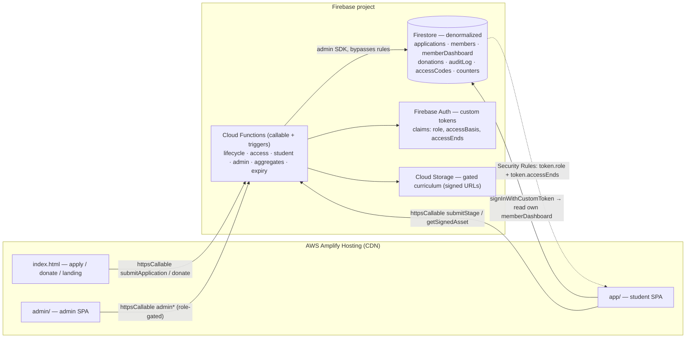
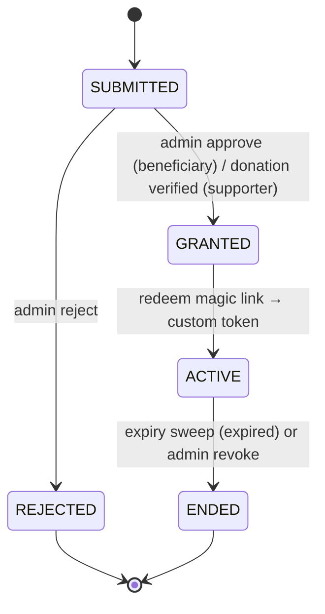

# V3 Plan — Hosted demo on Amplify + Firebase (Rev. 2, DRAFT)

Owner: Tinh Cao · Code For Good. This is the **V3 horizon**: take the runnable V2 demo
(`demo/`, Node/Express + AWS SDK v3 over local DynamoDB) and ship it as a **real hosted app**
with the least possible operational surface. V3 is a deliberate pivot off the all-AWS V2
design — frontend on **AWS Amplify Hosting**, backend on **Firebase** (Firestore + Cloud
Functions + Storage + Auth-for-sessions-only) via the official SDKs.

> V3 does **not** replace V2's `docs/Architecture-Design.md`. It is a leaner, hosted variant
> that keeps V2's security invariants (server-side enforcement, audit-only-via-server,
> no client-minted accounts, idempotent transitions) while optimizing for two goals the
> user set: **minimize read-heavy cost** and **simplify the account lifecycle**.

Source of truth this builds on: `demo/docs/Demo-Architecture.md` (component map) ·
`docs/Customer-Journey.md` (lifecycle) · `docs/Platform-SRS.md` (FRs/NFRs).

> **Rev. 2 — tech-debt audit fixes folded in.** Design corrections from the audit:
> (1) role/window claims are **persisted via `setCustomUserClaims`**, not baked one-shot
> into a custom token — so extend/revoke never force a passwordless re-auth (which would
> lock users out); (2) curriculum has a **single server-owned source** (`functions/src/curriculum.js`)
> driving gating + percent, with the frontend bundle demoted to a display-only copy;
> (3) Zeffy verification **fails closed** (throws when unconfigured, never defaults to
> "verified"). Also: `accessCodes.expiresAt` is now a Firestore `Timestamp` so the TTL
> policy works; `extendMember` is transactional; magic numbers live in `config.js`.
> Still open (launch items, see §9/§11): admin MFA + App Check, email-delivery choice,
> `redeemCode` rate-limiting, IaC, and the test suite.

---

## 1. Goals & non-goals

```csv
goal,how V3 meets it
minimize read-heavy,denormalized aggregate docs (1 read per view) + client-side curriculum cache + counter docs maintained by triggers (no scans)
simplify account lifecycle,collapse the 11-state machine to 5 server-states; Firebase Auth owns sessions/refresh/expiry; drop the DemoAuth password table entirely
passwordless content access,access-code / magic-link issued on grant (open-source nanoid) exchanged for a Firebase custom token carrying role+window claims; no password store
real hosting,Amplify Hosting (frontend) + Firebase (backend) — both free-tier friendly at pilot scale
keep V2 trust model,server-side enforcement in Cloud Functions + Firestore Security Rules; audit append-only; no client account creation
```

```csv
non-goal (V3),why
rebuild on AWS Lambda/Cognito/DynamoDB,that is V2 (docs/Architecture-Design.md); V3 is the lean hosted path
MFA at launch,deferred like V2 §14; Firebase Auth MFA is a config-only add later
real card processing in-stack,donations stay hosted (Zeffy) — V3 only verifies server-side, never touches card data
admin deliverable-verification of every stage,kept self-attested for pilot (matches demo); add verify step post-pilot
```

---

## 2. Topology — who hosts what

```csv
layer,platform,role
frontend (public site + student SPA + admin SPA),AWS Amplify Hosting,static build (Vite) on managed CDN; Git-connected continuous deploy; one origin
backend API + enforcement,Firebase Cloud Functions (2nd gen Node 20),callable functions = the trust boundary; all state transitions + gating run here
data,Cloud Firestore (native mode),denormalized read-light collections; conditional writes via transactions
sessions / identity,Firebase Authentication (custom-token only),holds sessions/refresh/expiry; NO self-signup; accounts minted only by a Function
gated curriculum bytes,Cloud Storage for Firebase,private bucket; signed download URLs minted by a Function after the gate check
payments,Zeffy (hosted) + read-only verify,card entry off-stack (PCI SAQ-A); a Function verifies the donation server-side
scheduled jobs,Cloud Functions (scheduler trigger),expiry sweep + Zeffy reconcile poll + email reminders
email,Firebase Trigger Email ext. (or SendGrid),sends the magic-link / welcome / expiry reminders
```

Request flow (mirrors the V2 zone split, now Amplify↔Firebase):



---

## 3. Simplified account lifecycle (5 server-states)

V2/demo had 11 states (`SUBMITTED → INTERVIEW_SCHEDULED → APPROVED_BENEFICIARY → … →
ACTIVE → EXPIRED/REVOKED`). V3 collapses the intermediate vetting steps into **status flags
on the application** and keeps only the states that change what a user *can do*. Both
beneficiary (admin-granted) and supporter (donation-verified) converge on a single `GRANTED`
transition that mints the account.

```csv
state,meaning,enter via
SUBMITTED,application received; under review,public submitApplication callable
GRANTED,access authorized — account minted + magic link issued,admin approve (beneficiary) OR server-verified donation (supporter)
ACTIVE,signed in within the access window,first signInWithCustomToken; window = claim accessEnds
ENDED,window passed (expired) or admin-revoked,scheduled expiry sweep OR admin revoke (sub-reason: expired|revoked)
REJECTED,not eligible and not funded,admin reject
```



What got simpler, and why it matters for reads/ops:

```csv
V2 concern,V3 simplification
INTERVIEW_SCHEDULED / DONATION_REQUIRED / DONATION_CONFIRMED / APPROVED_BENEFICIARY states,become app sub-status fields (vetting.interviewAt / vetting.donationId); not lifecycle states
password store (DemoAuth) + temp-password rotation,deleted — Firebase Auth owns sessions; passwordless redemption only
expiry enforced by app-side window check on every request,baked into the token claim accessEnds; Firestore Rules + Functions compare to request.time — zero extra reads
provision() across SQS trust seam,a single grantAccess() Function that creates the Auth user + memberDashboard doc + access code in one transaction (idempotent on applicationId)
accessBasis as a permission,stays pure reporting metadata (beneficiary|supporter); identical student app either way
```

Server invariant preserved: **no path reaches `GRANTED` without an admin grant OR a
server-verified Zeffy payment** — never a client claim. `grantAccess()` is the *sole* caller
of `admin.auth().createUser`; the web SDK never creates accounts (self-signup disabled).

---

## 4. Read-light data model (Firestore)

Principle: **one read renders a view.** Denormalize aggressively, pre-compute rollups in
triggers, cache the static curriculum on the client. Firestore bills per document read, so
the design target is: student dashboard = **1 read**; admin overview = **1 read**; curriculum
= **0 reads after first load** (cached).

```csv
collection,doc id,purpose,read pattern
applications,applicationId (ULID),intake + vetting sub-status + audit pointer,admin list via byStatus index; 1 doc on detail
members,uid (Auth sub),canonical member record (status, accessBasis, accessEnds),rarely read directly; source for dashboard rollup
memberDashboard,uid,DENORMALIZED rollup: profile + path + per-stage gating + progress + next action,STUDENT DASHBOARD = 1 READ; rebuilt by trigger on progress/member change
donations,donationId (ULID),Zeffy payment refs only (zeffyPaymentId = idempotency key),verify path; no card data
accessCodes,codeHash,one-time magic-link redemption record (uid, expiresAt, usedAt),read once at redeem; deleted/TTL after use
auditLog,auto-id (under member subcollection or top-level),append-only PII-free events (ids + status codes),admin-only; never on hot paths
counters,"singleton: overview",DENORMALIZED counts by status (maintained by triggers),ADMIN OVERVIEW = 1 READ; no collection scans
```

Read-minimization tactics:

```csv
tactic,effect
memberDashboard rollup doc,collapses path+progress+gating (was N reads in demo) into 1 read; trigger keeps it fresh on writes
counters singleton via Firestore triggers,admin overview never scans; onWrite(applications) increments/decrements counts
curriculum is server-owned (functions/src/curriculum.js) with a versioned display-only copy in the frontend build,0 Firestore reads for curriculum; server drives gating/percent so the client copy is never trusted; version key busts client cache
Firestore SDK local persistence (IndexedDB) + getDocFromCache,repeat views served from cache; network read only on change
claims carry role + accessEnds,authz needs no lookup doc; Rules read the token, not the DB
list endpoints use composite indexes (byStatus), not scans,bounded reads even as data grows
```

---

## 5. Passwordless access gate (open-source library)

The user's ask — *"password can use open source library to access content once donated/approved
from admin"* — is realized as a **passwordless magic-link / access-code** flow. No password is
ever stored. Open-source `nanoid` generates the code; Node's built-in `crypto` hashes it;
Firebase Admin mints the session token. (If a self-managed JWT is preferred over Firebase
custom tokens, swap in `jose` — noted below.)

```mermaid
sequenceDiagram
  autonumber
  actor U as Applicant/Donor
  actor Ad as Admin
  participant F as Cloud Functions
  participant FS as Firestore
  participant A as Firebase Auth
  Ad->>F: approveApplication(id)  (beneficiary)
  Note over U,F: …or donation verified server-side (supporter)
  F->>A: createUser(uid)  [sole caller; self-signup disabled]
  F->>A: setCustomUserClaims(uid, {role, accessBasis, accessEnds})  [PERSISTED]
  F->>FS: txn: application→GRANTED, member doc, accessCodes{hash(code), expiresAt}
  F-->>U: email magic link  https://app/redeem?c=<code>  (Trigger Email)
  U->>F: redeemCode(code)
  F->>FS: verify hash + unused + unexpired (txn marks usedAt)
  F->>A: createCustomToken(uid)  [claims come from the persisted account, not from here]
  F-->>U: custom token
  U->>A: signInWithCustomToken → session; claims in every ID token, refreshable
  U->>FS: read own memberDashboard (Rules allow: token.role==student && accessEnds>now)
```

```csv
property,V3 design
no password stored,only SHA-256(code) of an unguessable 256-bit single-use code is stored (accessCodes); expiresAt is a Firestore Timestamp so the TTL policy purges it; usedAt marks redemption
account minted only server-side,grantAccess() is the only caller of admin.auth().createUser
authz without DB reads,role + accessBasis + accessEnds are PERSISTED on the account via setCustomUserClaims (not baked one-shot into the custom token) and flow into every ID token; Rules read the token
extend window,setCustomUserClaims with the new accessEnds and DO NOT revoke — client picks it up on the next ID-token refresh (or getIdToken(true)); revoking would force a re-auth a passwordless user can't complete
revoke / expire,intended lock-out: expire the claim (accessEnds=now) + revokeRefreshTokens(uid) + member→ENDED + audit; idempotent
open-source libs,nanoid (code), node:crypto (hash) — firebase-admin signs the token; jose as alt if self-managed JWT wanted
```

Security Rules sketch (enforced by Firestore, no extra reads):

```
match /memberDashboard/{uid} {
  allow read: if request.auth.uid == uid
    && request.auth.token.role == 'student'
    && request.auth.token.accessEnds > request.time.toMillis();
  allow write: if false;   // only Functions (admin SDK) write
}
match /auditLog/{doc} { allow read: if request.auth.token.role == 'admin'; allow write: if false; }
```

---

## 6. Folder restructure — `v3/` (frontend + backend split)

```text
v3/
  docs/
    V3-Plan.md                 # this file
  README.md                    # run + deploy quickstart
  frontend/                    # → AWS Amplify Hosting (Vite static build)
    package.json
    vite.config.js
    amplify.yml                # Amplify build spec (root: v3/frontend)
    index.html                 # public: landing / apply / donate
    app.html                   # student SPA shell
    admin.html                 # admin SPA shell
    public/
      curriculum.json          # static curriculum bundle (0-read cache; copied from demo/src/content)
    src/
      firebase.js              # initializeApp + getFirestore/getFunctions/getAuth (modular SDK)
      lib/
        accessLink.js          # redeem ?c= code → custom token → signInWithCustomToken
        cache.js               # curriculum + dashboard client cache helpers
      public/  apply.js  donate.js
      student/ dashboard.js  path.js  submit.js
      admin/   applications.js  members.js  overview.js
  backend/                     # → Firebase project
    firebase.json              # functions + firestore + storage emulator/deploy config
    .firebaserc                # project alias (set your Firebase projectId)
    firestore.rules            # server-side gating (token claims)
    firestore.indexes.json     # byStatus composite indexes
    storage.rules              # gated bucket — deny all client reads (signed URLs only)
    functions/
      package.json             # firebase-admin, firebase-functions, nanoid, ulid, zod
      index.js                 # exports all callables + triggers
      src/
        lifecycle.js           # submit / approve / reject / grantAccess (state machine, txns)
        access.js              # issueCode / redeemCode → custom token
        donations.js           # verifyDonation (Zeffy read-only) → supporter grant
        student.js             # submitStage (server gating) / getSignedAsset
        admin.js               # overview / list / member extend|revoke (role-gated)
        aggregates.js          # Firestore triggers: rebuild memberDashboard + counters
        expiry.js              # scheduled sweep: ENDED + revokeRefreshTokens
        curriculum.js          # SERVER-OWNED stage order + gating/percent helpers (single source)
        config.js              # tunable constants (access days, code TTL, signed-url TTL)
        _audit.js  _db.js      # shared: append-only audit, admin SDK handles
```

V1 (`STEM Career Path Landing Page.html`) and V2 (`demo/`, `docs/`) are untouched —
V3 is self-contained under `v3/`.

---

## 7. Full library list

Frontend (`v3/frontend`):

```csv
package,scope,why
firebase,dep,modular Web SDK — app + firestore + functions + auth + storage (httpsCallable, signInWithCustomToken, IndexedDB persistence)
vite,devDep,dev server + static build that Amplify Hosting deploys
(no UI framework),—,vanilla JS/ES modules to honor the project's lightweight ethos; swap to preact/lit only if needed
```

Backend Functions (`v3/backend/functions`):

```csv
package,scope,why
firebase-admin,dep,server SDK — createUser/createCustomToken/revokeRefreshTokens + rules-bypassing Firestore/Storage writes
firebase-functions,dep,2nd-gen callable + Firestore triggers + scheduler trigger
nanoid,dep,cryptographically-strong single-use access codes (the open-source access lib)
ulid,dep,sortable ids for applications/donations (parity with demo)
zod,dep,server-side input validation on every callable (never trust client payloads)
jose,dep (optional),only if self-managed JWTs are chosen over Firebase custom tokens
```

Tooling / CI:

```csv
tool,scope,why
firebase-tools,devDep/global,Local Emulator Suite (Firestore+Auth+Functions+Storage) — replaces MiniStack for local dev; also deploys backend
@aws-amplify/cli,optional,only if configuring Amplify Hosting via CLI; Git-connected console deploy needs no CLI
node 20,runtime,Functions 2nd-gen + Vite
```

Local emulators replace the V2 `docker-compose` MiniStack: `firebase emulators:start` runs
Firestore + Auth + Functions + Storage locally, so the same Function code runs locally and in
the cloud — only the project config differs (the V3 analogue of V2's single `AWS_ENDPOINT_URL`
switch).

---

## 8. Migration from `demo/` (what ports, what changes)

```csv
demo piece,V3 outcome
Express /api/v1 routers (auth/public/admin/app/content),→ Cloud Functions callables, same zone split (public / student / admin)
services/lifecycle.mjs state machine,→ functions/src/lifecycle.js — 5 states, Firestore transactions replace DynamoDB conditional writes
services/auth.mjs HMAC shim + DemoAuth table,DELETED — Firebase Auth custom tokens + claims
services/student.mjs path+gating,→ functions/src/student.js (gating) + aggregates.js (writes the rollup); reads collapse to 1
repositories ×9 (DynamoDB Document client),→ Firestore collections (§4); 9→7 collections, denormalized
content/curriculum.json,→ frontend/public/curriculum.json (static, client-cached, 0 reads)
public/admin.html · app.html,→ frontend/admin.html · app.html (Firebase Web SDK instead of fetch+Bearer)
test/ (node:test, 54) · e2e/ (puppeteer),→ functions tests against the emulator + same E2E against the deployed/preview URL
docker-compose MiniStack,→ firebase emulators:start
```

---

## 9. Cost & security alignment

```csv
item,V3 position
cost,Amplify Hosting free tier + Firebase Spark/Blaze; read-light model keeps Firestore reads near-zero per session → well under the V2 ≤ $200/yr pilot target (no always-on compute)
audit,auditLog append-only via Rules (allow write:false) — only Functions write; PII-free (ids + status codes)
account minting,grantAccess() sole caller of createUser; self-signup disabled in Auth settings
gated content,Storage bucket denies all client reads; bytes only via short-TTL signed URLs minted after the server gate check
payments,Zeffy hosted; verifyDonation reads Zeffy server-side and FAILS CLOSED (throws when the read-only key is unconfigured — never defaults to verified); idempotent on zeffyPaymentId; never a client "I paid"
idempotency,every transition is a Firestore transaction keyed on expected status / applicationId — retries can't double-grant
MFA,deferred (Firebase Auth MFA is config-only when needed) — parity with V2 §14
```

---

## 10. Build order (phased, each testable)

```csv
phase,deliverable
0,Firebase project + Amplify app created; emulators run locally; .firebaserc set
1,Firestore schema + Rules + indexes; counters trigger; emulator tests green
2,lifecycle.js (submit/approve/reject/grant) + audit; idempotency tests
3,access.js magic-link issue/redeem → custom token; passwordless login works end-to-end
4,student.js gating + memberDashboard rollup trigger; 1-read dashboard verified
5,donations.js supporter self-serve verify → grant (no admin)
6,frontend SPAs wired to callables + Firestore; curriculum cached
7,expiry scheduler + revoke; deploy backend (firebase deploy) + frontend (Amplify Git connect)
```

---

## Open questions for CFG leadership

```csv
question,impact
Firebase project region (e.g. us-central1) + Blaze billing enabled?,Functions 2nd-gen + Storage require Blaze (pay-as-you-go; free tier still applies)
email sender for magic links — Firebase Trigger Email ext. vs SendGrid?,affects deliverability setup (SPF/DKIM)
keep Zeffy as the donation processor?,V3 assumes yes (read-only verify, no card data)
custom-token claims vs self-managed jose JWT?,both designed; custom tokens chosen as default (less code, auto-refresh)
```
